# CMAKE 與 LINUX_GCC_DEBUG調試.MD

## 設置環境參數 

 ![image-20241208061810244](README_IMGs/CMAKE與LINUX_GCC_DEBUG調試/image-20241208061810244.png	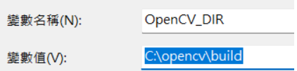

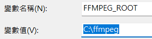

## OPENCV 的CMAKE設置

### OpenCV4.9开发之Window开发环境搭建	

**新增加下图四个环境变量**

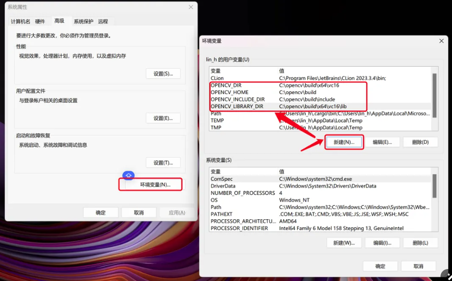

##  禁用VCPKG方式設置

禁用VCPKG方式設置CMAKE PACKAGE

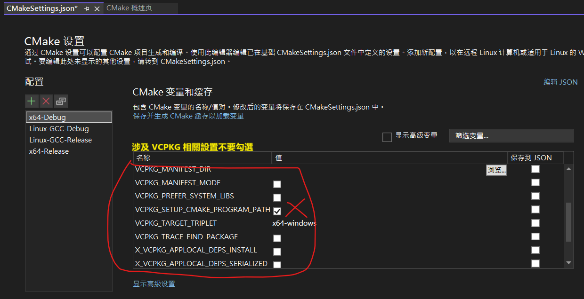

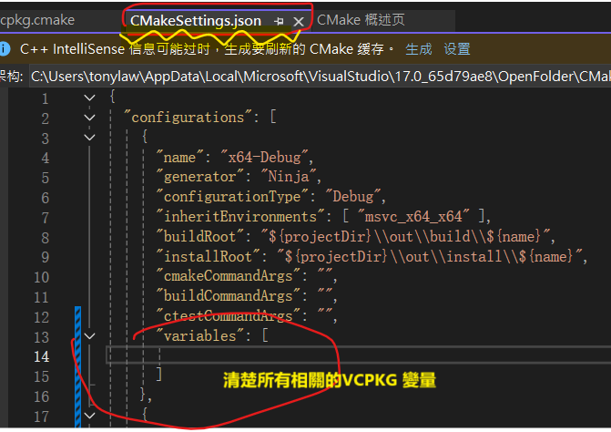

## 完全脫離VCPKG相關 :

​				刪除VCPKG

​				 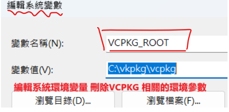

## 方案根目錄

### ./CMakeSettings.json

```
{
  "configurations": [
    {
      "name": "x64-Debug",
      "generator": "Ninja",
      "configurationType": "Debug",
      "inheritEnvironments": [ "msvc_x64_x64" ],
      "buildRoot": "${projectDir}\\out\\build\\${name}",
      "installRoot": "${projectDir}\\out\\install\\${name}",
      "cmakeCommandArgs": "",
      "buildCommandArgs": "",
      "ctestCommandArgs": ""
    },
    {
      "name": "Linux-GCC-Debug",
      "generator": "Ninja",
      "configurationType": "Debug",
      "cmakeExecutable": "cmake",
      "remoteCopySourcesExclusionList": [ ".vs", ".git", "out" ],
      "cmakeCommandArgs": "",
      "buildCommandArgs": "",
      "ctestCommandArgs": "",
      "inheritEnvironments": [ "linux_x64" ],
      "remoteMachineName": "${defaultRemoteMachineName}",
      "remoteCMakeListsRoot": "$HOME/.vs/${projectDirName}/${workspaceHash}/src",
      //遠程調試的輸入生成目標地址 前提是先設置遠程主機
      "remoteBuildRoot": "$HOME/.vs/${projectDirName}/${workspaceHash}/out/build/${name}",
      "remoteInstallRoot": "$HOME/.vs/${projectDirName}/${workspaceHash}/out/install/${name}",
      "remoteCopySources": true,
      "rsyncCommandArgs": "-t --delete",
      "remoteCopyBuildOutput": false,
      "remoteCopySourcesMethod": "rsync",
      "variables": []
    }
  ]
}

```

## 注意清理緩存

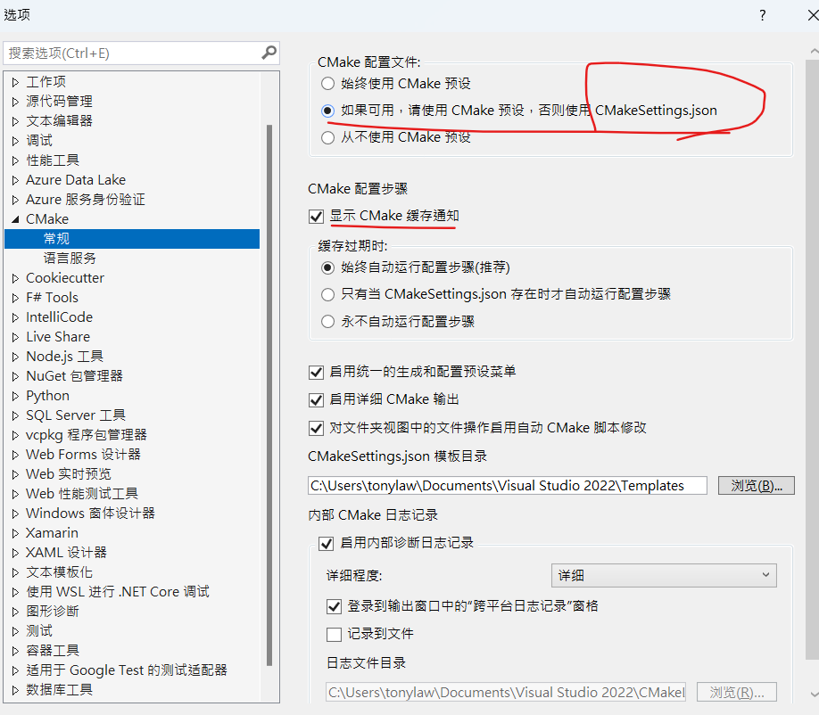

## 管理鏈接

​	**設置Linux遠程主機,root 與 password**

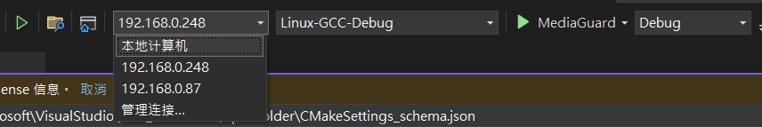

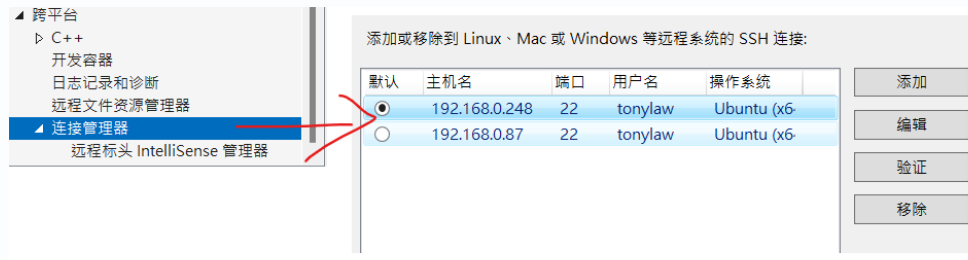

```
 
 

```

## 多次定义了变量 CMAKE_INSTALL_PREFIX

###### 	多次定义了变量 CMAKE_INSTALL_PREFIX。				

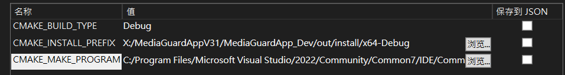

C:\Users\tonylaw\AppData\Local\Microsoft\VisualStudio\17.0_65d79ae8\OpenFolder\CMakeSettings_schema.json


## No CMAKE_C_COMPILER could be found.

​	**设置编译器路径**

```
set(CMAKE_C_COMPILER "C:/Program Files/Microsoft Visual studio/2022/Community/VC/Tools/MSVC/14.42.34433/bin/Hostx64/x64/cl.exe")

set(CMAKE_CXX_COMPILER "C:/Program Files/Microsoft Visual Studio/2022/Community/VC/Tools/MSVC/14.42.34433/bin/Hostx64/x64/cl.exe")
```


# 其他配置...


## FFmpeg 4.2.2的Linux安裝

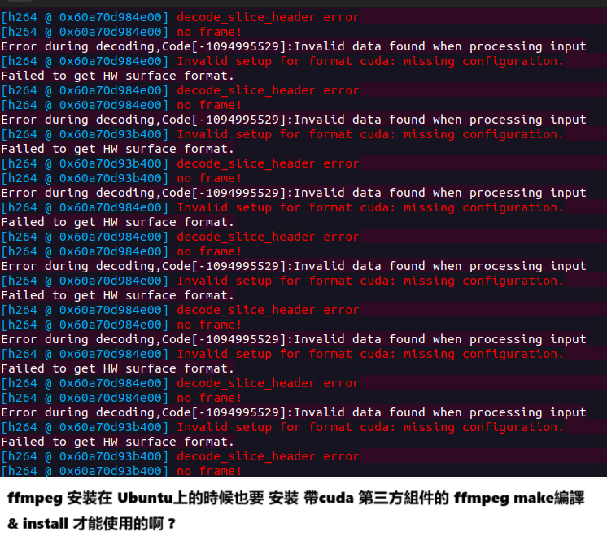
