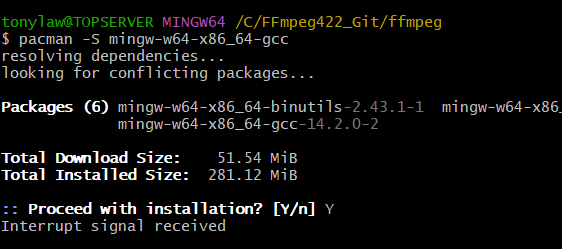
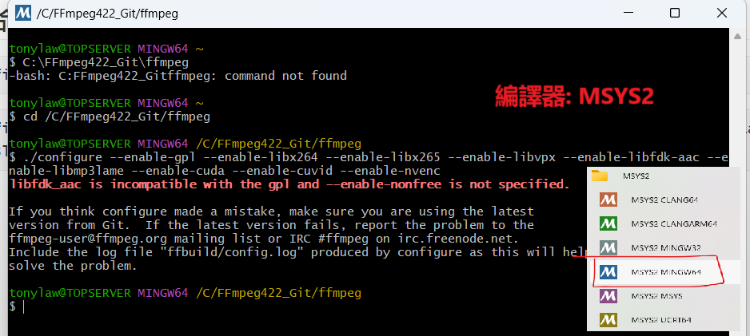
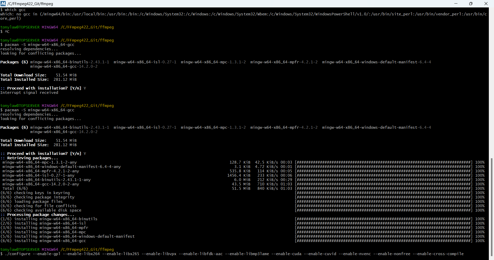
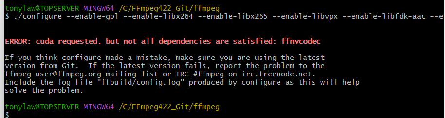

# FFmpeg422_Win編譯_Configure_PARMS


```
./configure --enable-gpl --enable-libx264 --enable-libx265 --enable-libvpx --enable-libfdk-aac --enable-libmp3lame
```

https://cloud.baidu.com/article/3304889

## 配置命令格式

```
./configure [其他选项] --enable-cuda --enable-cuvid --enable-nvenc
```

```
./configure --enable-gpl --enable-libx264 --enable-libx265 --enable-libvpx --enable-libfdk-aac --enable-libmp3lame --enable-cuda --enable-cuvid --enable-nvenc --enable-nonfree --enable-cross-compile
```

## 使用 MYSYS2 編譯器

MSYS2 [1]是[MSYS](https://baike.baidu.com/item/MSYS/0?fromModule=lemma_inlink)的一个升级版,准确的说是集成了[pacman](https://baike.baidu.com/item/pacman/0?fromModule=lemma_inlink)和[Mingw](https://baike.baidu.com/item/Mingw/0?fromModule=lemma_inlink)-w64的[Cygwin](https://baike.baidu.com/item/Cygwin/0?fromModule=lemma_inlink)升级版, 提供了[bash](https://baike.baidu.com/item/bash/0?fromModule=lemma_inlink) shell等[linux](https://baike.baidu.com/item/linux/0?fromModule=lemma_inlink)环境、[版本控制软件](https://baike.baidu.com/item/版本控制软件/0?fromModule=lemma_inlink)（git/hg）和MinGW-w64 工具链。与MSYS最大的区别是移植了 [Arch Linux](https://baike.baidu.com/item/Arch Linux/0?fromModule=lemma_inlink)的软件包管理系统 [Pacman](https://baike.baidu.com/item/Pacman/0?fromModule=lemma_inlink)(其实是与Cygwin的区别)。

如果沒有gcc 編譯器,則需要安裝:

$ pacman -S mingw-w64-x86_64-gcc





## 安裝GCC後,重新編譯:

 

ERROR: cuda requested, but not all dependencies are satisfied: ffnvcodec



## ffnvcodec 組件沒有在CUDA 12.6安裝 

如果您已經安裝了 **CUDA 12.6**，但仍然遇到 `ERROR: cuda requested, but not all dependencies are satisfied: ffnvcodec` 的問題，這表明僅安裝 CUDA Toolkit 並不足以滿足 FFmpeg 的需求，因為 FFmpeg 的 `ffnvcodec` 功能還需要 **NVIDIA Video Codec SDK** 提供的額外頭文件和庫。
**Video_Codec_SDK_12.2.72.zip**

以下是補救步驟：

---

### **1. 安裝 NVIDIA Video Codec SDK**
即使 CUDA 已安裝，`ffnvcodec` 依賴於 NVIDIA Video Codec SDK，因此您需要下載並配置該 SDK。

#### **步驟：**
1. 前往 [NVIDIA Video Codec SDK 官方網站](https://developer.nvidia.com/nvidia-video-codec-sdk)。
2. 登錄 NVIDIA 帳戶（如果沒有帳戶，需要註冊）。
3. 下載與 CUDA 12.6 相容的最新版本的 Video Codec SDK。
4. 解壓縮下載的 SDK，記下解壓路徑（例如 `C:/NVIDIA/Video_Codec_SDK/`）。

---

### **2. 配置 FFmpeg 使用 Video Codec SDK**
解壓後，您需要將 Video Codec SDK 的頭文件和庫文件路徑傳遞給 FFmpeg 的配置腳本。

#### **步驟：**
1. 假設您的 Video Codec SDK 解壓在 `C:/NVIDIA/Video_Codec_SDK/`，則：
   - 頭文件路徑為：`C:/NVIDIA/Video_Codec_SDK/include`
   - 庫文件路徑為：`C:/NVIDIA/Video_Codec_SDK/lib/x64`

2. 修改您的 `./configure` 命令，添加如下選項：
   ```bash
   ./configure --enable-gpl --enable-libx264 --enable-libx265 --enable-libvpx \
   --enable-libfdk-aac --enable-libmp3lame --enable-cuda --enable-cuvid --enable-nvenc \
   --enable-nonfree --extra-cflags=-I"C:/Video_Codec_SDK_12.2.72/Interface" \
   --extra-ldflags=-L"C:/Video_Codec_SDK_12.2.72/Lib/x64"
   ```

---

### **3. 測試配置是否成功**
執行 `./configure` 後，檢查輸出是否顯示以下內容：
- `nvenc` 和 `cuvid` 被正確啟用。
- 沒有出現 `ERROR: cuda requested, but not all dependencies are satisfied: ffnvcodec`。

---

### **4. 確保 CUDA 工具鏈可用**
即使 CUDA 已安裝，您仍需確認以下內容：
- **CUDA 驅動版本**：執行以下命令確認驅動是否支持 CUDA 12.6：
  
  ```bash
  nvidia-smi
  ```
  驅動版本應與 CUDA 12.6 相容。
  
- **nvcc 是否可用**：在 MINGW64 環境中執行：
  ```bash
  nvcc --version
  ```
  應返回 CUDA 編譯器版本信息。如果沒有，請檢查環境變數 `PATH` 是否包含 CUDA 的安裝目錄。

---

### **5. 確保 MINGW64 支持**
MINGW64 編譯器需要能夠訪問 CUDA 和 Video Codec SDK 的頭文件和庫文件。如果仍然有問題，請檢查：
1. **環境變數是否正確**：
   - 確認 `PATH` 包含 CUDA 的 `bin` 路徑，例如：
     ```
     C:\Program Files\NVIDIA GPU Computing Toolkit\CUDA\v12.6\bin
     ```

2. **使用正確的 MINGW64 環境**：
   - 請確保您使用的是 MINGW64（而非 MSYS2 或其他工具鏈），並且已安裝必要的編譯工具（如 `gcc` 和 `make`）。

---

### **6. 如果仍有問題**
如果按照上述步驟仍無法解決問題，可以嘗試：
- 查看 FFmpeg 的配置日誌（通常是 `config.log`），檢查具體的錯誤原因。
- 確認您的 FFmpeg 版本是否對應 CUDA 12.6 和最新的 Video Codec SDK（FFmpeg 4.2.2 是較舊版本，可能需要更新到更高版本）。

---

這些步驟應該可以幫助您解決缺少 `ffnvcodec` 的問題。如果還有其他錯誤提示，可以提供更多細節，我會進一步協助您！