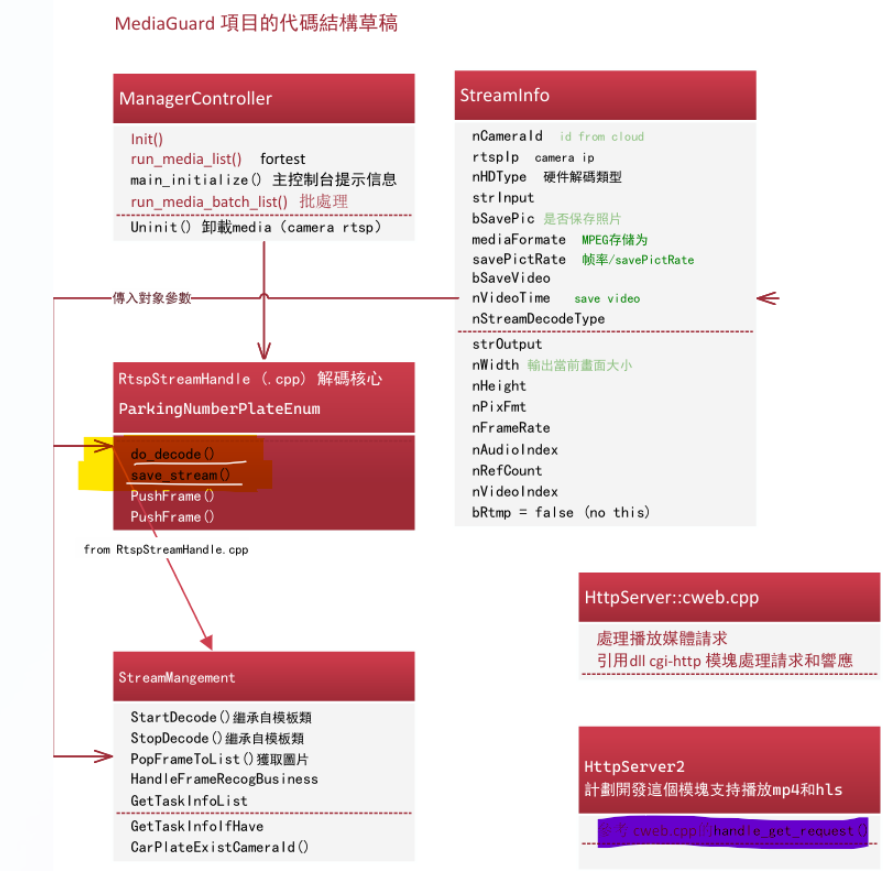
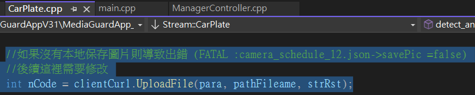
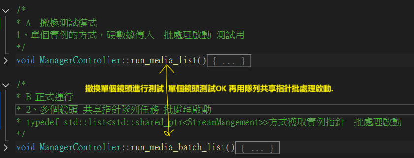
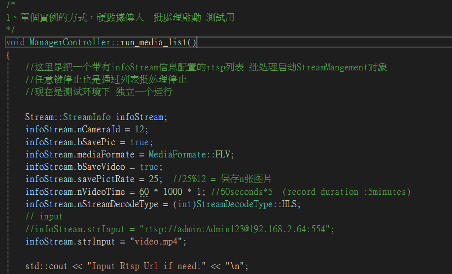
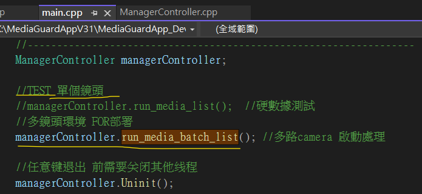

# 開發手冊 DEV MANUAL

#  

## 開發環境 

### 	**安裝組件指導文件 **

​	 **./DEVELOP_LOG/README_組件安裝.md**
​	(備份版本: ./MediaGuardAppV31/MediaGuard_DOC/README_**組件安裝.md 或 README_組件安裝.pdf)

​	包括Windows 與 Linux 的組件安裝.

### 	項目方案結構組成

​		這是一個cmake項目,使用visual studio 2022 以打開文件夾方式打開:


## 功能與業務

### 	項目中的任務常量

```
//用與定義業務功能開發種類
enum class TaskType
{
	/// <summary>
	/// 任務類型: UNDEFINED 未定義的任務
	/// </summary> 
	UNDEFINED = 0,

	///// <summary>
	///// 任務類型:CAMERA_GUARD 桌面人臉識別系統
	///// </summary> 
	//CAMERA_GUARD = 1,

	///// <summary>
	///// 任務類型: CAMERA_DVR 桌面錄像系統
	///// </summary> 
	//CAMERA_DVR = 2,

	///// <summary>
	///// 任務類型: HIK_DATA_RETRIVE 桌面海康設備數據獲取系統
	///// </summary> 
	//DESKTOP_HIK_DATA_RETRIVE = 3,

	///// <summary>
	///// 任務類型: HIK_DATA_ANDROID_RETRIVE  手機版的海康設備數據獲取系統
	///// </summary> 
	//ANDROID_HIK_DATA_RETRIVE = 4,

	///// <summary>
	///// 任務類型: ANDROID_CIC_DATA_RETRIVE  手機版的 CIC的NFC拍卡數據獲取系統
	///// </summary> 
	//ANDROID_CIC_DATA_RETRIVE = 5,

	/// <summary>
	/// 任務類型: 车牌识别 POST到Python处理后返回
	/// </summary> 
	CAR_PLATE_RECOGNITION = 6,

	/// <summary>
	/// 任務類型: 人脸识别
	/// </summary>
	FACE_RECOGNITION = 7,

	/// <summary>
	/// 任務類型: 工程着装识别
	/// </summary> 
	WORK_CLOTHES_RECOGNITION = 8,

	/// <summary>
	/// 任務類型: 佩戴头盔识别
	/// </summary> 
	WEARING_HELMET_RECOGNITION = 9,

	/// <summary>
	/// 任務類型: 有人闖入
	/// </summary> 
	SOMEONE_BROKE_IN_ENABLE = 10
};

```

### LOW LEVEL

### 	

###  車牌號碼識別

```
//如果沒有本地保存圖片則導致出錯 (FATAL :camera_schedule_12.json->savePic =false)
//後續這裡需要修改
int nCode = clientCurl.UploadFile(para, pathFileame, strRst);
```



1. **後續需要修改為 POST BASE64 包括其他業務功能都是通過內存保留的 圖片隊列的PictInfo.frameBase64.**

**而不是通過保存在硬盤上,這樣導致硬盤容易老化和損壞.**

2. **車牌號碼識別 CAR PLATE OCR RECOGNITION 計劃改為OPENCV 的OCR 文字識別。**

相關的技術文章: https://yebd1h.smartapps.cn/pages/blog/index?blogId=138413284

先通過yoloV8 識別圖片含有車牌號碼,再提交給OPENCV 函數去識別 車牌文字。

## 客戶端 HTTP API

​	客戶端 HTTP API : 不是雲端的API, 而是 [MEDIAGUARD] 提供的對外API 與web請求。

​	客戶端 URL : http://192.168.0.128:180/web/index.html


## 測試模式







​			**鏡頭是否停用**

​			增加判斷鏡頭是否停用狀態 StreamInfo.cameraStatus

