# 開發組件安裝

### 相關技術

（1）C++版本（**此开源版本**）使用了如下技术

- C++11

  里面使用了一些C++11以上的新语法，对于老程序员来说，语言只是一种工具，花时间熟悉一下新语法即可，问题不大。

- Boost

  C++跨平台库，C++11中的大部分新特性都是来自Boost准标准库，但是还有很多新特性暂时并未引入到c++中，它可以跨平台编码，开发人员并不需要写一些预编译语法来适应不同平台，只需要一套代码即可实现所有平台，这就是它的优势，也是为什么C++新语法基本都出自它的原因。

- mysql

  系统涉及到的一些模型数据、设备、场景、报警、配置等数据的存储既可以使用mysql存储，也可以使用sqlite存储，根据自己需要，可以通过配置文件配置存储方式，唯一的区别是mysql需要安装数据库而已。

- sqlite

  同上，AI盒子数据存储支持使用sqlite存储，所以需要用到sqlite库。

- oatpp

  一个开源的支持多语言的成熟http库，跨平台，支持DTO数据封装、SSL等，一个非常不错的HTTP协议库。

- spdlog

  一个开源的系统日志库，支持控制台打印、文件日志打印、支持自动清理、按日存储等功能。

- opencv

  一个很关键的一个库了，python使用pt模型，c++使用onnx模型，这里就是基于跨平台opencv来加载onnx模型实现推理的。

- vue2.0

  

- yolov8

  c++版本使用的yolov8的模型，通过yolov8模型或yolov5模型转换的onnx模型实现模型推理和目标识别。

  

## 系統示例


```shell
  WMWare player Ubuntu 22
```

> 注意：
>
> 如果是WMWare Workshop启动的虚拟机，请将主机的摄像头共享给Ubuntu虚拟机，操作步骤如下：
>
> - windows打开服务：ctrl+r输入services.msc,然后找到VM的USB服务，名字为VMware USB Arbitration Service，设置为开机启动，并手动启动该服务。
>
> - 重启WMWare Workshop及Ubuntu虚拟机（如果usb重启的情况下必须重启）
>
> - 启动Ubuntu20.04机器
>
> - 在VM上选择该机器，鼠标右键菜单，选择对应设备，然后连接即可
>
>   
>
> - 使用ubuntu再带的茄子工具cheese打开测试摄像头是否可用


## 测试模型


## 演示效果

###  

（1）ubuntu系统启动

（2）windows系统启动


-  


## 开发环境


### 机器准备

> ubuntu、centos、windows、VMware Workstation Pro

本次开源部分为c++版跨平台服务端，开发技术使用cmake、boost、sqlite、opencv、oatpp（http）、oatpp-websocket、spdlog(项目中已有)，所以必须先安装对应的软件和必要的库，软件和库.

除了必要的软件之外，我们需要准备一台windows开发机和一台linux开发机器（ubuntu或者centos都可以）

### 环境准备

> vs2019、boost、oatpp、oatpp-websocket、opencv、spdlog

本次实际开发环境为vs2019，各位可以使用vs2019或以上都可以，支持跨平台开发调试工具，各个环境和软件安装详细细节如下所示。


#### unix调试环境搭建

这里我们要开发cmake项目，借助的是Visual Studio 2019工具，它通过ssh连接远程服务器的gdbserver进行调试，所以需要再远程服务器上安装ssh和gbd工具库。

1. 安装ssh

  需要安装cmake3.8以上版本，建议cmake在3.25或以上。ubuntu系统安装ssl（默认没有）

  ```shell
  apt-get update
  apt-get install openssh-server
  systemctl start ssh
  systemctl status ssh
  sudo su
  ```

  centos上安装ssh（默认就有）

  ```shell
  yum update
  yum install openssh-server
  #设置启动权限
  vim /etc/ssh/sshd_config
  PermitRootLogin=yes
  RSAAuthentication=yes
  PubkeyAuthentication=yes
  #启动ssh服务
  systemctl start sshd.service
  #开机启动
  systemctl enable sshd.service
  #修改ssh访问权限
  cd ~
  chmod 700 .ssh
  chmod 600 .ssh/*
  ls -la .ssh
  ```

2. 安装gdb

  安装gdb调试工具和gdb服务

  ```shell
  #Ubuntu安装
  sudo apt-get install openssh-server g++ gdb gdbserver -y
  sudo apt-get install ninja-build
  ninja --version
  1.10.0
  
  #centos安装
  sudo yum install -y gcc-c++ gdb gdbserver openssh-server
  sudo yum install epel-release
  sudo yum install ninja-build
  ninja --version
  ```

  

#### 双系统环境搭建


接下来，我们将逐个安装提到的项目依赖库。

##### cmake安装

下载地址：https://cmake.org/files/

（1）windows安装

这里我安装的是cmake-3.25.2-windows-x86_64.msi版本，直接下一步下一步安装即可。安装其他库的时候我们直接使用cmake-gui进行安装即可（与linux区别就是一个使用ui操作，一个使用命令行操作，效果一样）

（2）linux安装

我下载的版本是：cmake-3.25.2.tar.gz，安装过程如下

```shell
#centos安装
#准备好环境
yum update
yum install -y gcc gcc-c++ make automake
# 这步一定要做，不然后续./bootstrap会报错
yum install -y openssl openssl-devel
#查看当前版本
[root@hadoop03 linux01]# cmake --version
cmake version 2.8.12.2
#卸载旧版本
yum remove cmake -y
yum erase cmake
#查看卸载是否成功
[root@hadoop03 linux01]# cmake --version
bash: /usr/bin/cmake: No such file or directory
#bin安装cmake
#tar -zxvf cmake-3.25.2-linux-x86_64.tar.gz
#cd cmake-3.25.2-linux-x86_64.tar/bin
#源码编译
wget https://cmake.org/files/v3.25/cmake-3.25.2.tar.gz
tar -xvzf cmake-3.25.2.tar.gz
cd cmake-3.25.2
./bootstrap
#出现“CMake has bootstrapped.  Now run gmake.”之后可以后续操作
gmake
gmake install
cmake --version
whereis cmake
cp /usr/local/bin/cmake /usr/bin/
cmake --version
```

ubuntu安装cmake

```shell
#使用bash安装（无法指定版本）
sudo apt-update
sudo apt-get install cmake
cmake --version

#二进制包安装
chmod +x cmake-3.25.2-linux-x86_64.sh
sudo ./cmake-3.25.2-linux-x86_64.sh --prefix=/usr --skip-license
cmake --version

#自动编译源码------推荐方式
sudo apt-get install gcc g++ make automake 
sudo apt-get install -y build-essential libssl-dev
#wget https://cmake.org/files/v3.25/cmake-3.25.2.tar.gz
tar -zxvf cmake-3.25.2.tar.gz
cd cmake-3.25.2
./bootstrap && make && sudo make install
whereis cmake
cp /usr/local/bin/cmake /usr/bin/
cmake --version
```


##### opencv安装

参考地址：搜索  win10 opencv gpu编译

下载地址：https://opencv.org/releases/

##### （1）windows安装

windows我们直接下载opencv-4.8.1-windows.exe，然后解压到对应目录即可，我这里解压如下到D:\install\opencv，该目录下结构

```shell
- build
- souces
- license.txt
- license_ffmpeg.txt
- readme.md.txt
```

> 注意：以上版本下载的默认不支持GPU，如果需要安装GPU选项，需要cmake-gui配置GPU选项进行安装(类似于linux系统下的cmake选项)

根据需要是否选择cuda相关选项

新版本 Visual Studio 2022的出來情況

 ./sources/cmake/OpenCVDetectCXXCompiler.cmake 增加一個else if 來判斷是否 vs 1942版 ("^19[34][0-9]$")

```
# 比較新的VS2022 update V12版本無法被opencv4.8.1識別,需要折衝修改如下:
elseif(MSVC_VERSION MATCHES "^193[0-9]$")
    set(OpenCV_RUNTIME vc17)

elseif(MSVC_VERSION MATCHES "^19[34][0-9]$")
    set(OpenCV_RUNTIME vc17)
```

如果不安裝 CUDA DNN

**WITH_CUDNN = false**


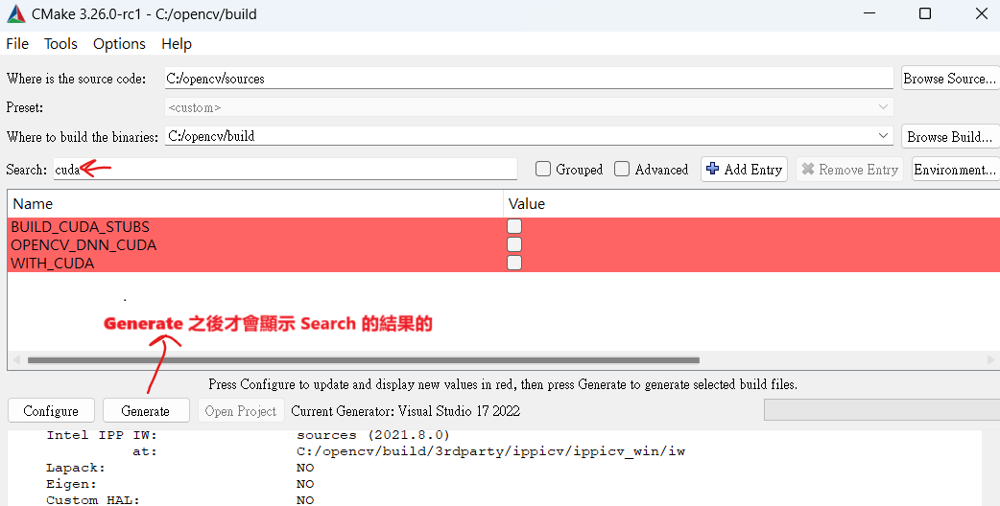

添加 CUDA_TOOLKIT_ROOT_DIR

**本機是 C:/Program Files/NVIDIA GPU Computing Toolkit/CUDA/v12.1** (CUDA 識別不了VS2022 update12版本導致bianyi編譯出錯)

升級為 : C:/Program Files/NVIDIA GPU Computing Toolkit/CUDA/v12.6

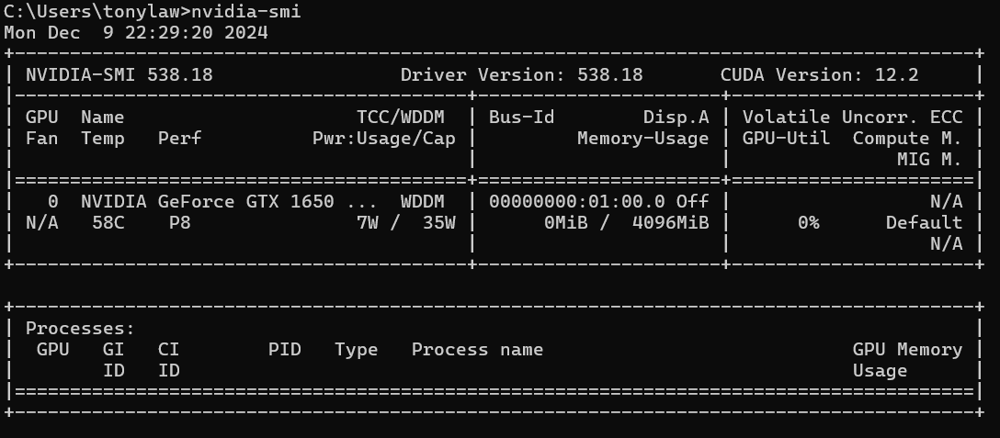


**升級CUDA 12.6的SUMARY如下:**
Installed:

Nsight for Visual Studio 2022
 Nsight Monitor
Not Installed:
- Nsight for Visual Studio 2019
  Reason: VS2019 was not found
- Nsight for Visual Studio 2017
  Reason: VS2017 was not found
- Integrated Graphics Frame Debugger and Profiler
  Reason: see https://developer.nvidia.com/nsight-vstools
- Integrated CUDA Profilers
  Reason: see https://developer.nvidia.com/nsight-vstools

配置扩展模块


**OPENCV_EXTRA_MODULES_PATH = C:/opencv/opencv_contrib/modules**

​	如圖: 	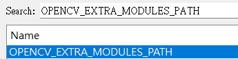

设置生成world, 也可以不勾选，不勾选的会vs生成后 会有很多个lib，勾选了 就只有opencv_world lib 文件


去掉python，test（因为我暂时不需要)。java同理也去掉。然后点击config


勾选math


###### 安裝CUDA

**cuda_12.6.3_561.17_windows**

设置显卡算力 6.1，因为在tensorflow和显卡的版本对应中是找不到Geforce MX250的(通过网络查找到)

**WITH_NVCUVENC**  
环境中缺少Nvidia Video Codec SDK，可以安装NVIDIA Video Codec SDK： [NVIDIA Video Codec SDK下载链接](https://developer.nvidia.com/video-codec-sdk)， 或者cmake中搜索**WITH_NVCUVENC 取消勾选**


显卡算力 查询：https://developer.nvidia.cn/cuda-gpus


```
C:\Users\lixx>nvidia-smi
Thu Mar 21 18:36:43 2024
+-----------------------------------------------------------------------------+
| NVIDIA-SMI 460.89       Driver Version: 460.89       CUDA Version: 11.2     |
|-------------------------------+----------------------+----------------------+
| GPU  Name            TCC/WDDM | Bus-Id        Disp.A | Volatile Uncorr. ECC |
| Fan  Temp  Perf  Pwr:Usage/Cap|         Memory-Usage | GPU-Util  Compute M. |
|                               |                      |               MIG M. |
|===============================+======================+======================|
|   0  GeForce MX250      WDDM  | 00000000:06:00.0 Off |                  N/A |
| N/A   55C    P0    N/A /  N/A |     64MiB /  2048MiB |      3%      Default |
|                               |                      |                  N/A |
+-------------------------------+----------------------+----------------------+
+-----------------------------------------------------------------------------+
| Processes:                                                                  |
|  GPU   GI   CI        PID   Type   Process name                  GPU Memory |
|        ID   ID                                                   Usage      |
|=============================================================================|
|  No running processes found                                                 |
+-----------------------------------------------------------------------------+
========================================================================================================
nvidia-smi 另一款顯卡
========================================================================================================
Mon Dec  9 15:36:37 2024
+---------------------------------------------------------------------------------------+
| NVIDIA-SMI 538.18                 Driver Version: 538.18       CUDA Version: 12.2     |
|-----------------------------------------+----------------------+----------------------+
| GPU  Name                     TCC/WDDM  | Bus-Id        Disp.A | Volatile Uncorr. ECC |
| Fan  Temp   Perf          Pwr:Usage/Cap |         Memory-Usage | GPU-Util  Compute M. |
|                                         |                      |               MIG M. |
|=========================================+======================+======================|
|   0  NVIDIA GeForce GTX 1650 ...  WDDM  | 00000000:01:00.0 Off |                  N/A |
| N/A   56C    P0              14W /  35W |      0MiB /  4096MiB |      3%      Default |
|                                         |                      |                  N/A |
+-----------------------------------------+----------------------+----------------------+
+---------------------------------------------------------------------------------------+
| Processes:                                                                            |
|  GPU   GI   CI        PID   Type   Process name                            GPU Memory |
|        ID   ID                                                             Usage      |
|=======================================================================================|
+---------------------------------------------------------------------------------------+
```

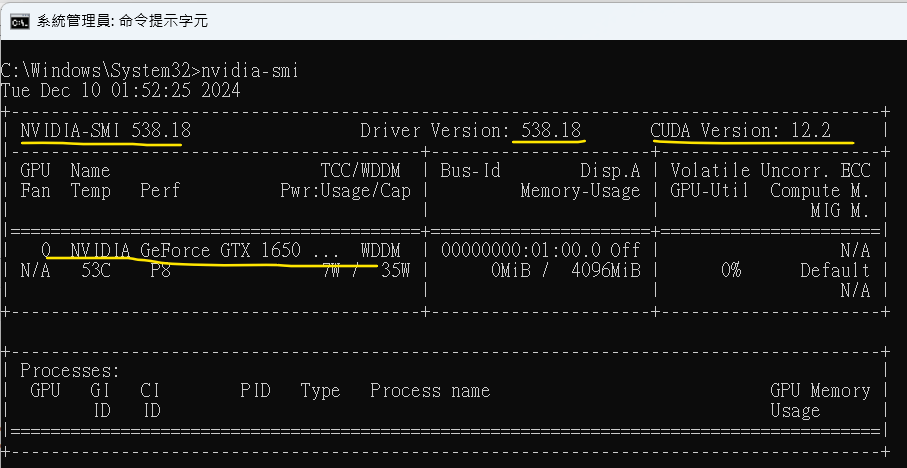

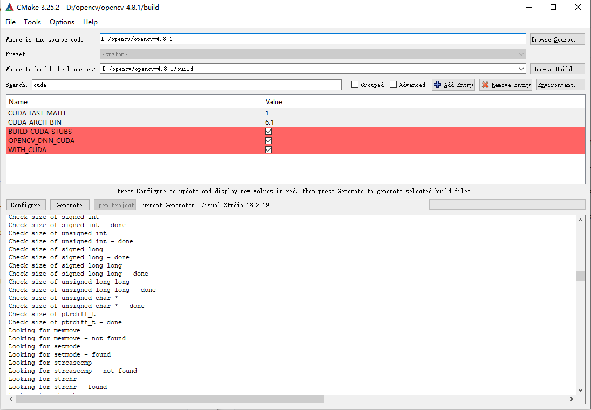

取消勾选setup

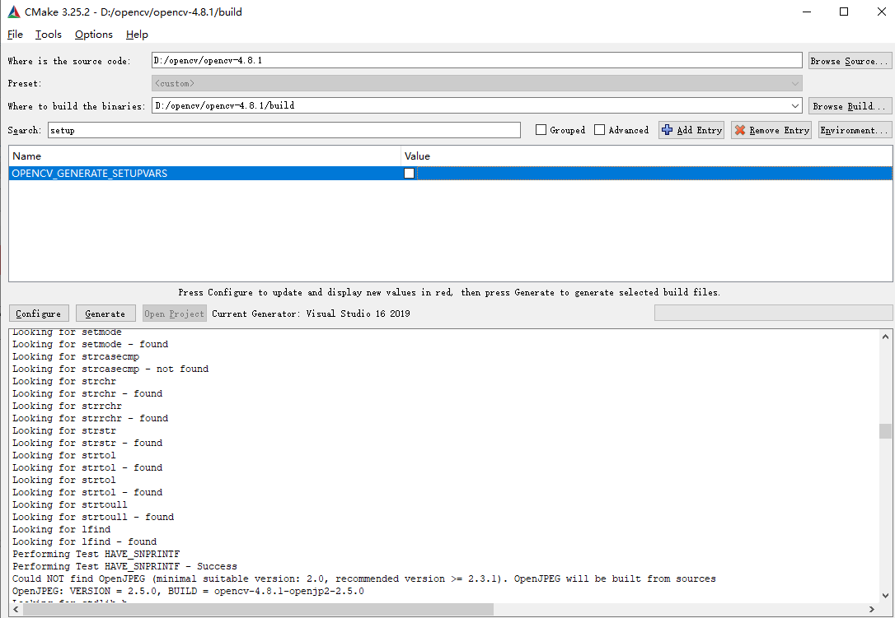

---------------------------------------------------------------------------------------------------------------------------------------------------------------------------------------

###### 安装DNN

WITH_NVCUVID 取消勾選以消除:

 OPENCV_DNN_CUDA=OFF 安装DNN 需要开启 否则关闭（OFF）


上述應該是沒有安裝 cuDNN（CUDA Deep Neural Network Library）,只是安裝CUDA

首先确认CUDA Toolkit和cuDNN是否正确安装。
若正确安装则，勾选Advance选项，搜索cudnn，将CUDNN_LIBRARY项设置为cudnn.lib
位置一般在C:\Program Files\NVIDIA GPU Computing Toolkit\CUDA\v12.6\lib\x64下。

(CUDNN_INCLUDE_DIR = C:\Program Files\NVIDIA GPU Computing Toolkit\CUDA\v12.6\include )

下載對應 cuDNN版本:https://developer.nvidia.com/rdp/cudnn-archive 这里下载： [Download cuDNN v8.8.1 (March 8th, 2023), for CUDA 12.x](https://developer.nvidia.com/rdp/cudnn-archive#a-collapse881-120) (這個12.2cuda版本不能識別 VS2022 17.X 提示12.4以上CUDA,此處下載 cuda_12.6.3_561.17_windows.exe)


**勾选完成后config，再generate.**

错误解决：Can't get model file for face alignment

解决方法：

```shell
#下载face_landmark_model.dat 配置人臉識別
#face_landmark_model.dat 是 OpenCV 中用于面部标记检测的预训练模型文件。这个模型用于检测人脸图像中的特征点，例如眼睛、鼻子、嘴巴、耳朵等2。这些特征点可以用于各种应用，例如人脸识别、面部表情分析、面部替换、面部平均等

https://raw.githubusercontent.com/opencv/opencv_3rdparty/8afa57abc8229d611c4937165d20e2a2d9fc5a12/face_landmark_model.dat
#放到本地文件(file:/E:/nginx-1.18.0/html/)或上传到nginx
http://192.168.8.19:81/face_landmark_model.dat
#修改opencv_contrib/modules/face/CMakeLists.txt中的下载地址目录
ocv_download(
    FILENAME face_landmark_model.dat
    HASH ${__file_hash}
    URL
      "${OPENCV_FACE_ALIGNMENT_URL}"
      "$ENV{OPENCV_FACE_ALIGNMENT_URL}"
	  "file:/E:/nginx-1.18.0/html/"
	  #"http://192.168.8.19:81/"
      #"https://raw.githubusercontent.com/opencv/opencv_3rdparty/${__commit_hash}/"
    DESTINATION_DIR "${CMAKE_BINARY_DIR}/${OPENCV_TEST_DATA_INSTALL_PATH}/cv/face/"
    ID "data"
    RELATIVE_URL
    STATUS res
)
#除此之外发现还有下载https://raw.githubusercontent.com/域名的其他文件,暂时忽略即可
```

安装完成后，运行install解决方案，即可安装到对应build目录的install子目录下

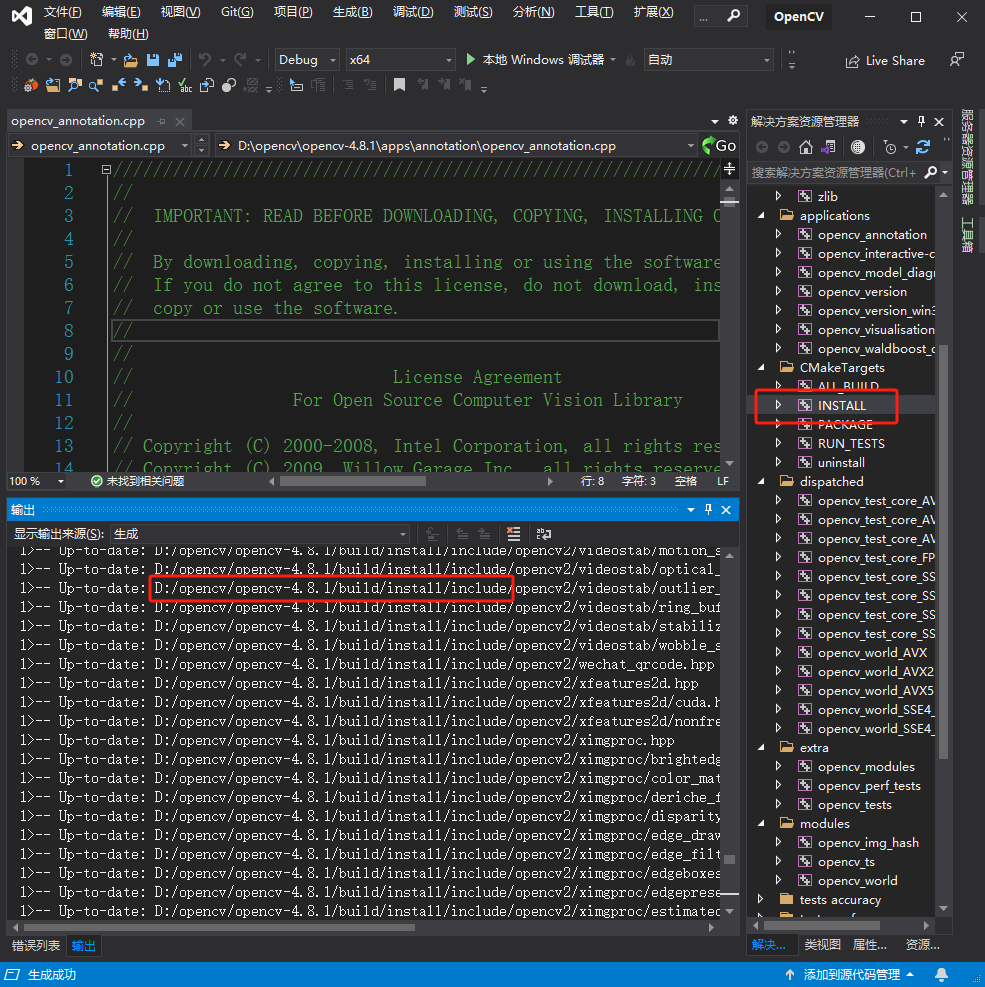

```
C:\opencv\build下找到OPENCV.sln，打开，找到CMakeTargets下的INSTALL，在Debug和Release下分别右键生成即可。
```


修改cmake为GPU版本的安装路径

```cmake
# windows平台
if(WIN32)
	# 设置boost根目录
	set(BOOST_ROOT "E:/boost_1_63_0")
	# 设置boost库目录
	set(BOOST_LIBRARYDIR "E:/boost_1_63_0/stage/64")
	# 设置OpenCV的路径
	set(OpenCV_DIR "D:/opencv/opencv-4.8.1/build/install")
elseif(UNIX)
	# 设置boost根目录
	set(BOOST_ROOT /usr/local)
	# 设置boost库目录
	set(BOOST_LIBRARYDIR /usr/local/lib)
endif()
```

##### （2）linux安装

###### centos下安装过程如下

```shell
#安装相关依赖
#sudo yum install epel-release python37-devel python37-pip git gcc gcc-c++ cmake3 python37 numpy gtk2-devel libpng-devel jasper-devel openexr-devel libwebp-devel libjpeg-turbo-devel libtiff-devel libdc1394-devel tbb-devel eigen3-devel boost boost-thread boost-devel ffmpeg-devel --skip-broken

sudo yum install cmake gcc gcc-c++ gtk+-devel gimp-devel gimp-devel-tools gimp-help-browser zlib-devel libtiff-devel libjpeg-devel libpng-devel gstreamer-devel libavc1394-devel libraw1394-devel libdc1394-devel jasper-devel jasper-utils swig python libtool nasm

#获取OpenCV源码，你可以选择从GitHub克隆或者直接下载预编译的源码包
#下载地址：https://opencv.org/releases/ 这里选择4.8.1
https://codeload.github.com/opencv/opencv/zip/refs/tags/4.8.1
#下载opencv扩展模块opencv_contrib-4.8.1
git clone https://github.com/opencv/opencv_contrib.git
#或者git克隆
#git clone https://github.com/opencv/opencv.git
#上传opencv源码到ubuntu然后解压
unzip opencv_contrib-4.8.1.zip
unzip opencv-4.8.1.zip
cd opencv-4.8.1
mkdir build
cd build
#开始编译（如果需要GPU选项需要添加编译选项，见Ubuntu安装）
cmake -D CMAKE_BUILD_TYPE=RELEASE \
    -D CMAKE_INSTALL_PREFIX=/usr/local \
    -D INSTALL_C_EXAMPLES=ON \
    -D INSTALL_PYTHON_EXAMPLES=ON \
    -D OPENCV_GENERATE_PKGCONFIG=ON \
    -D OPENCV_EXTRA_MODULES_PATH=~/opencv_contrib-4.8.1/modules \
    -D BUILD_EXAMPLES=ON ..
#如果centos编译报错:OPENEXR_VERSION_MAJOR‘ was not declared in this scope
#则添加-D WITH_OPENEXR=0
cmake -D CMAKE_BUILD_TYPE=RELEASE \
    -D CMAKE_INSTALL_PREFIX=/usr/local \
    -D INSTALL_C_EXAMPLES=ON \
    -D INSTALL_PYTHON_EXAMPLES=ON \
    -D OPENCV_GENERATE_PKGCONFIG=ON \
    -D OPENCV_EXTRA_MODULES_PATH=~/opencv_contrib-4.8.1/modules \
    -D BUILD_EXAMPLES=ON ..
#使用所有CPU核心进行编译加速
make -j$(nproc)
make install
#创建符号连接
ln -s /usr/local/lib64/pkgconfig/opencv4.pc /usr/share/pkgconfig/
ldconfig
#验证安装是否成功--显示版本号
pkg-config --modversion opencv4
4.8.1
```

###### Ubuntu下安装过程如下

```shell
#更新系统包索引并升级系统
sudo apt-get update
#sudo apt-get upgrade
#安装必要的依赖包
sudo apt-get install build-essential cmake git pkg-config libgtk-3-dev \
libavcodec-dev libavformat-dev libswscale-dev libv4l-dev \
libxvidcore-dev libx264-dev libjpeg-dev libpng-dev libtiff-dev \
gfortran openexr libatlas-base-dev python3-dev python3-numpy \
libtbb2 libtbb-dev libdc1394-22-dev
#如果libdc1394-22-dev无法安装可以搜索相关库版本后安装
apt-cache search dc1394-dev
libdc1394-dev - high level programming interface for IEEE 1394 digital cameras - development
apt-get install libdc1394-dev

#获取OpenCV源码，你可以选择从GitHub克隆或者直接下载预编译的源码包
#下载地址：https://opencv.org/releases/ 这里选择4.8.1
https://codeload.github.com/opencv/opencv/zip/refs/tags/4.8.1
#或者git克隆
#git clone https://github.com/opencv/opencv.git
#上传opencv源码到ubuntu然后解压
cd Downloads
#要扩展模块: unzip opencv_contrib-4.8.1.zip
unzip opencv-4.8.1.zip
cd opencv-4.8.1
mkdir build
cd build
#OpenCV 默认假设构建类型为 “Release”，安装路径为 “/usr/local”
#启用WITH_CUDA=1表示编译支持GPU的opencv，
#CUDA_ARCH_BIN根据自己的gpu架构填写如GTX1050（1080）Tesla P100，不然GPU还是不能用  本機是 6.1 搜索本文"6.1"見說明
#可以指定自己的版本，加快编译
#GPU架构查询，去查查自己显卡适配的计算架构：https://developer.nvidia.com/cuda-gpus
#如RTX3060推荐的是8.6
#如果网管查不到可通过在本机的ubantu系统运行CUDA-Z软件查出算力，如为：7.5
#还可以通过下文的方法获取opencv的计算能力版本，见下文
#如果需要扩展模块：-D OPENCV_EXTRA_MODULES_PATH=~/opencv_contrib-4.8.1/modules \
cmake -D CMAKE_BUILD_TYPE=RELEASE \
      -D CMAKE_INSTALL_PREFIX=/usr/local \
      -D OPENCV_GENERATE_PKGCONFIG=ON \
      -D OPENCV_EXTRA_MODULES_PATH=~/opencv_contrib-4.8.1/modules \
      ..
#编译GPU版本（不带扩展模块）
cmake -D CMAKE_BUILD_TYPE=RELEASE \
      -D CMAKE_INSTALL_PREFIX=/usr/local \
      -D OPENCV_GENERATE_PKGCONFIG=ON \
      -D WITH_CUDA=1 \
      -D CUDA_ARCH_BIN=7.5 \
      -D ENABLE_FAST_MATH=1 \
      -D CUDA_FAST_MATH=1 \
      ..
#可以添加扩展模块: -D OPENCV_EXTRA_MODULES_PATH=~/opencv_contrib/modules
#make
#使用所有CPU核心进行编译加速
make -j$(nproc)
make install
#配置环境变量--如果配置自定义路径时候：CMAKE_INSTALL_PREFIX=/usr/local/xx(自定义名)
#vim /etc/ld.so.conf.d/opencv.conf
#在文件末尾加上OpenCV的lib路径，保存退出
#/usr/local/xx/lib
sudo ldconfig
#验证安装是否成功--显示版本号
pkg-config --modversion opencv4
4.8.1
```


##### boost安装

下载地址：https://www.boost.org/users/history/

（1）window安装

```shell
#下载boost库
https://www.boost.org/users/history/

#编译成静态库--推荐方式
#可以看到每个文件均有前缀 lib，代表其是静态库
#- vc142 编译器的名称与版本；
#- mt 支持多线程；
#- gd Debug 版，没有的为 Release 版；
#- x32/x64 64位版本还是32位版本；
#- 1_79 boost 版本； 
bootstrap
b2 --prefix=c:\Boost install 

#编译成动态库
#可以看到每个文件均有前缀 lib，代表其是静态库。每个库由4个文件组成，分别代表了不同的编译选项
# - vc142 编译器的名称与版本；
# - mt 支持多线程；
# - gd Debug 版，没有的为 Release 版；
# - x32/x64 64位版本还是32位版本；
# - 1_79 boost 版本；
bootstrap
b2 --layout=system variant=release -j 8 address-model=64 link=static runtime-link=static threading=multi --prefix=c:\Boost install

#其他编译选项
b2 toolset=msvc-14.0 architecture=x86 address-model=64 link=static variant=debug,release threading=multi runtime-link=static --with-coroutine --with-context --with-container --with-graph --with-signals --with-signals --with-iostreams --with-filesystem --with-date_time --with-thread --with-serialization --with-regex --with-system --with-program_options --with-math --with-mpi --with-python --with-wave --with-test --with-atomic --with-chrono --with-exception --with-locale --with-log --with-random --with-timer  --stagedir="E:\boost_1_63_0\64" --build-dir="E:\boost_1_63_0\64\build"
#如果添加--prefix选项且含有install关键字，则还会拷贝头文件！例如
bjam --toolset=msvc-9.0 --prefix=D:\05_Computer\04_3rdPatry\02Boost\boost_1_44_0\output1 --with-regex link=shared  threading=multi variant=release runtime-link=shared  install

#查看boost包含哪些库：
b2  --show-libraries
```

（2）linux安装

centos下安装boost

```shell
#安装boost依赖库
yum install gcc gcc-c++ python-devel bzip2 bzip2-devel mpi mpi-devel -y
#下载boost，boost是c++准标准库，它包含了很多版本，下载地址如下
https://www.boost.org/users/history/
#解压boost库
#yum -y install bzip2
#tar jxvf boost_1_63_0.tar.bz2
tar -zxvf boost_1_63_0.tar.gz
cd boost_1_63_0
#编译boost库，全库编译
./bootstrap.sh --with-toolset=gcc link=static threading=multi runtime-link=static --with-libraries=all
#如果只编译部分指定库，则可以直接制定
#./bootstrap.sh --with-toolset=gcc link=static threading=multi runtime-link=static --with-coroutine --with-context --with-container --with-graph --with-signals --with-signals --with-iostreams --with-filesystem --with-date_time --with-thread --with-serialization --with-regex --with-system --with-program_options --with-math --with-mpi --with-python --with-wave --with-test --with-atomic --with-chrono --with-exception --with-locale --with-log --with-random --with-timer
#开始编译，此步骤大概需要10多分钟，耐心等待
./b2 toolset=gcc
#如果想要让Boost 在支持 C++11 的情況下编译的話，需要手动加入gcc的编译参数
#./b2 cxxflags="--std=c++11"
#安装boost库
./b2 install --prefix=/usr/local
#使boost库生效，还需要执行一下这个命令
ldconfig
#配置环境变量并生效
vim /etc/profile
#导出如下环境变量
export BOOST_ROOT=/usr/local/include
export BOOST_INCLUDE=/usr/local/include/boost
export BOOST_LIB=usr/local/lib
#使得环境变量生效
source  /etc/profile
```

ubuntu安装过程如下

```shell
#安装相关依赖
sudo apt-get update
sudo apt-get install build-essential g++ python-dev autotools-dev libicu-dev build-essential libbz2-dev
#下载boost，boost是c++准标准库，它包含了很多版本，下载地址如下
https://www.boost.org/users/history/
#解压boost库
tar -zxvf boost_1_63_0.tar.gz
cd boost_1_63_0
#编译boost库，全库编译
./bootstrap.sh --with-toolset=gcc link=static threading=multi runtime-link=static --with-libraries=all
#如果只编译部分指定库，则可以直接制定
#./bootstrap.sh --with-toolset=gcc link=static threading=multi runtime-link=static --with-coroutine --with-context --with-container --with-graph --with-signals --with-signals --with-iostreams --with-filesystem --with-date_time --with-thread --with-serialization --with-regex --with-system --with-program_options --with-math --with-mpi --with-python --with-wave --with-test --with-atomic --with-chrono --with-exception --with-locale --with-log --with-random --with-timer
#开始编译，此步骤大概需要10多分钟，耐心等待
./b2 toolset=gcc
#如果想要让Boost 在支持 C++11 的情況下编译的話，需要手动加入gcc的编译参数
#./b2 cxxflags="--std=c++11"
#安装boost库
./b2 install --prefix=/usr/local
#使boost库生效，还需要执行一下这个命令
ldconfig
#配置环境变量并生效
vim /etc/profile
#导出如下环境变量
export BOOST_ROOT=/usr/local/include
export BOOST_INCLUDE=/usr/local/include/boost
export BOOST_LIB=usr/local/lib
#使得环境变量生效
source  /etc/profile
```


##### SQLlite（mysql）

SQLiteCpp是一个C++封装库，用于访问SQLite数据库

sqlite源码：https://github.com/SRombauts/SQLiteCpp

使用find_package能否查找到mysql，确保已经安装MySQL开发环库（libmysqlclient-dev或mysql-devel)

> 注意：
>
> 1、[cmake](https://so.csdn.net/so/search?q=cmake&spm=1001.2101.3001.7020)默认没有提供mysql的`find_package`支持.好在mysql官方是提供了，下载地址如下
>
> ```shell
> https://github.com/mysql/mysql-connector-odbc/blob/master/cmake/FindMySQL.cmake
> ```

>2、将写好的FindXXX.cmake放在cmake软件的Modules目录下即可
>
>```shell
>window: D:\install\CMake\share\cmake-3.25\Modules
>linux: /usr/share/cmake/Modules/
>```
>
>或者在源码目录下建一个cmake文件夹，将FindMySQL.cmake文件放在cmake目录下，然后追加查找路径----- 这是我的做法，将FindMySQL.cmake文件放在/usr/shar/cmake/Modules下测试发现行不通
>
>```cmake
># 追加CMake查找目录
>list(APPEND CMAKE_MODULE_PATH "${CMAKE_CURRENT_SOURCE_DIR}/cmake")
>```
>
>3、配置环境变量(eg windows）：MYSQL_DIR=C:\Program Files\MySQL\MySQL Server 5.7

  

  （1）windows安装

  直接安装mysql服务器即可，安装mysql并选择Connector.C++ 1.1组件即可，我的安装位置如下

  ```
C:\Program Files\MySQL\Connector.C++ 1.1
  ```

  （2）linux安装

  centos中安装mysql

  ```shell
#下载自带的mysql-mariadb版本
[root@cdh1 ~]# rpm -qa|grep mariadb
mariadb-libs-5.5.65-1.el7.x86_64
rpm -e --nodeps mariadb-libs-5.5.65-1.el7.x86_64
rpm -e --nodeps mysql-*
find / -name mysql
#删除所有查询出来的mysql内容
rm -rf /usr/lib64/mysql /usr/local/mysql /usr/local/mysql/bin/mysql /usr/local/mysql/include/mysql /usr/local/mysql/data/mysql
#查询是否删除干净
find / -name mysql
#检查mysql用户是否存在没有创建
cat /etc/group | grep mysql
cat /etc/passwd | grep mysql
groupadd mysql
useradd -r -g mysql mysql

#查询mysql版本
yum list | grep mysql
#安装mysql
#yum -y install mysql mysql-server mysql-devel
#mysql-devel 开发用到的库以及包含文件
#mysql mysql 客户端
#mysql-server 数据库服务器
#安装mysql用到的开发库
sudo yum install mysql-devel
  ```

  ubuntu上安装mysql

  ```shell
sudo apt-get install libmysqlclient-dev
  ```

  sqlite的sqlite源码使用，cmakelist编写

  ```cmake
cmake_minimum_required(VERSION 3.0)
project(MyProject)

# 设置C++标准
set(CMAKE_CXX_STANDARD 11)

# 添加SQLiteCpp子目录
add_subdirectory(path/to/SQLiteCpp)

# 添加你的项目源文件
add_executable(MyProject main.cpp)

# 链接SQLiteCpp库
target_link_libraries(MyProject SQLiteCpp sqlite3)
  ```

  进入目录编译

  ```shell
cmake .
cmake --build .
  ```

  ##### oatpp安装

官网：`https://oatpp.io/`
文档：`https://oatpp.io/docs/start`
github地址：`https://github.com/oatpp/oatpp`

oatpp是一个轻量级高性能的c++ web开源库，支持http协议、websocket协议，这里我们选用oatpp作为跨平台开发库，用于c++支持http(s)和websocket常用协议。

（1）windows安装

下载oatpp-1.3.0，然后解压到磁盘，如下：E:\oatpp-1.3.0，然后打开cmake-gui，选择oatpp和编译目录（build），configure配置x64（64bit系统）


点击Configure按钮开始配置，在生成的配置项目中，**不要**修改静态库连接方式LINK_STATIC_RUNTIME（说白了就是 **/MT and /MTd**，我们没有配置所以是MD，否则一个MT，与AiBox默认的多线程运行模式/MD冲突)

然后开始Generate即可（配置的安装路径为：C:/Program Files/oatpp），然后打开项目：Open Project即可，然后编译debug和release版本

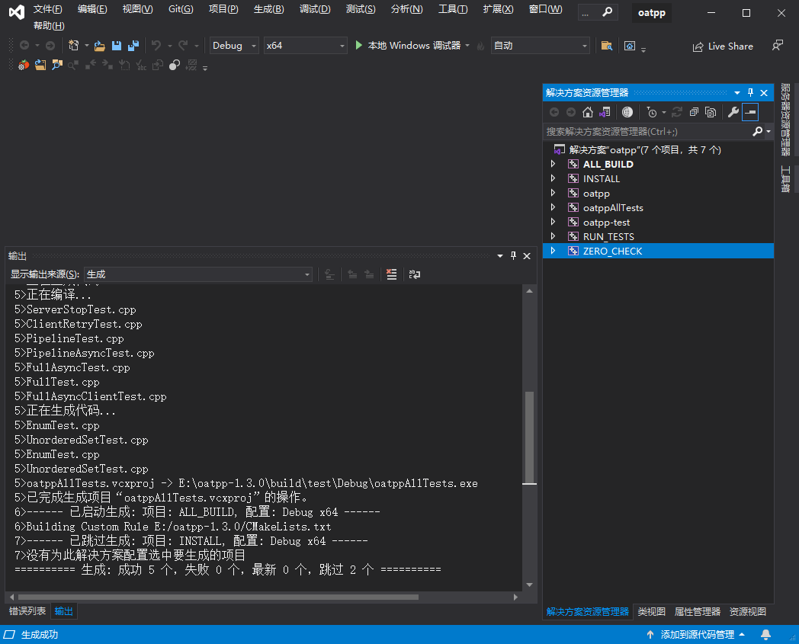

由于第一次打开使用的cmake的“Open Project”打开的，没有使用管理员打开vs2019导致安装失败，关闭以管理员身份重新打开vs2019，然后重新运行该项目的install（debug和release），可以看到安装成功，安装到cmake配置的路径下：


可以看到oatpp还有cmake用到的查找及版本配置

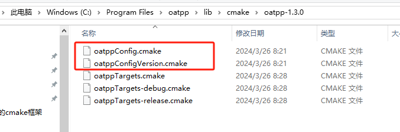

然后修改CMakeList.txt添加查找代码和库链接代码

```cmake
# 查找oatpp依赖
find_package(oatpp REQUIRED)

# 将源代码添加到此项目的可执行文件。
add_executable (AiBox ${LOCAL_SOURCES_DIR} ${LOCAL_INCLUDE_DIR})
    # 目标连接boost库
    target_link_libraries(AiBox PRIVATE
    ${Boost_FILESYSTEM_LIBRARY}
    ${Boost_SYSTEM_LIBRARY}
    ${Boost_REGEX_LIBRARY}
    ${Boost_CHRONO_LIBRARY}
    ${Boost_SERIALIZATION_LIBRARY}
    ${Boost_THREAD_LIBRARY}
    ${Boost_DATE_TIME_LIBRARY}
    ${MYSQL_LIBRARIES}
    SQLiteCpp sqlite3
    oatpp::oatpp
)
```


（2）linux安装

centos安装

```shell
#安装依赖
sudo yum install libatomic

# 下载源码
git clone https://github.com/oatpp/oatpp.git

# 编译
cd oatpp-1.3.0
mkdir build && cd build
#1.3.0需要cmake 3.20以上
cmake ..
#编译安装
sudo make && sudo make install
```

ubuntu安装

```cmake
#安装依赖
sudo apt-get update
sudo apt-get install libatomic1

# 下载源码
git clone https://github.com/oatpp/oatpp.git

# 编译
cd oatpp-1.3.0
mkdir build && cd build
#1.3.0需要cmake 3.20以上
cmake ..
#编译安装
sudo make && sudo make install
```

cmake项目使用

```shell
cmake_minimum_required(VERSION 3.1)

# 项目名称
project(helloworld)
 
set(CMAKE_CXX_STANDARD 11)
set(SOURCE_FILES main.cpp handler.h)
 
# 查找 oatpp 依赖
find_package(oatpp REQUIRED)

# 添加可执行目标
add_executable(${PROJECT_NAME} ${SOURCE_FILES})
 
# 将目标文件与库文件进行链接
target_link_libraries(${PROJECT_NAME} oatpp::oatpp)
```

##### ffmpfg 4.2.2 安裝 

音视频学习之旅：轻松编译32位与64位FFmpeg 4.2.2https://cloud.baidu.com/article/3268628

非標准路徑會導致find_package 錯誤:

```
[CMake]   Could NOT find FFmpeg (missing: FFMPEG_LIBRARIES FFMPEG_INCLUDE_DIRS
```

需要指定設置, 在cmakelists.txt 下運行 :  

```
$ cmake -DFFMPEG_LIBRARIES=C:\ffmpeg\win64\lib -DFFMPEG_INCLUDE_DIRS=C:\ffmpeg\include ..
$ cmake -DAVCODEC_LIBRARIES=C:\ffmpeg\win64\lib\libavcodec.dll.a -DAVCODEC_INCLUDE_DIRS=C:\ffmpeg\include ..


```


要先進行 make ; make install安裝後才是正確的. 

[MinGW-w64 - for 32 and 64 bit Windows](https://sourceforge.net/projects/mingw-w64/)  或者 msys2  - ( msys2-x86_64-20240727.exe )


在 MSYS2 終端中，你就可以使用 make 命令 來安裝 ffmpeg。

git clone https://git.ffmpeg.org/ffmpeg.git ffmpeg
cd ffmpeg

git checkout n4.2.2 撤換到這個FFmpeg 4.2.2 版本 

------------------------------------------------------------------------------------------------------------------------------------------------------------

##### oatpp-websocket

实际使用发现oatpp仅仅包含http服务相关业务，如果需要做websocket客户端则需要其下的oatpp-websocket来实现。所以需要下载编译

源码地址：https://github.com/oatpp/oatpp-websocket

（1）windows

下载解压到磁盘，然后使用cmake-gui进行编译（安装路径：C:/Program Files/oatpp-websocket）


Configure然后Generate，最后管理员权限打开vs2019进行编译安装（install到c盘需要管理员权限）安装后如下所示


（2）linux

下载解压然后编译安装

```cmake
unzip oatpp-websocket-master.zip
cd oatpp-websocket-master
mkdir build
cd build
cmake .. 
make -j && make install
```

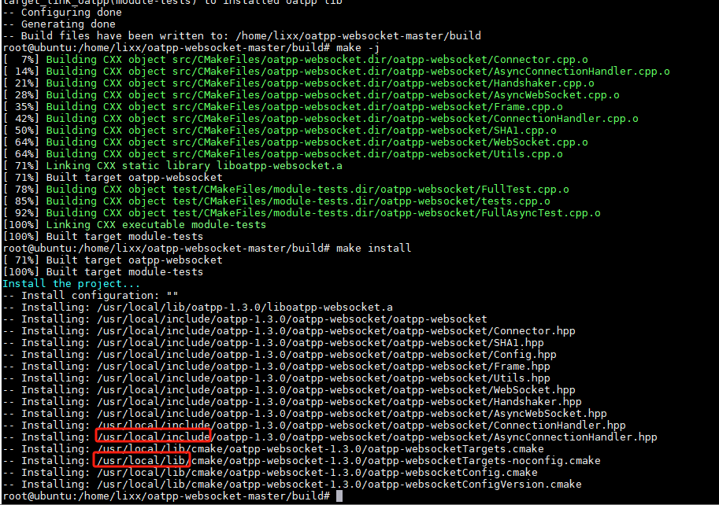


##### spdlog日志

spdlog作为系统的高性能日志库，支持按日期、大小切分，支持同步异步输出等，是一个功能强大、高性能的跨平台库。

> 注意：这里spdlog是不需要编译的，直接添加到cmake包含include文件即可。

（1）windows安装

windows和linux都不要编译

（2）linux安装

```shell
git clone https://github.com/gabime/spdlog.git
# 建议使用spdlog-1.1.0版本，否则编译不通过
unzip spdlog-1.1.0.zip
cd spdlog-1.1.0 && mkdir build && cd build
cmake .. 
make -j && make install
```

centos报错：error: ‘put_time’ is not a member of ‘std’

问题原因：g++编译器版本低，升级高版本就行了（5.0以上）

解决方式：

```shell
yum -y install gcc tcl
yum install centos-release-scl-rh
yum install centos-release-scl
#yum install rh-release
yum install scl-utils


#显示: No package devtoolset-4-gcc-c++ available
#显示: No package devtoolset-4-gcc available.
wget https://copr.fedoraproject.org/coprs/hhorak/devtoolset-4-rebuild-bootstrap/repo/epel-7/hhorak-devtoolset-4-rebuild-bootstrap-epel-7.repo -O /etc/yum.repos.d/devtools-4.repo
yum install devtoolset-4-gcc devtoolset-4-binutils devtoolset-4-gcc-c++

scl enable devtoolset-4 bash
#报错:Unable to open /etc/scl/conf/devtoolset-4!
#rpm -q gcc
#gcc-4.8.5-44.el7.x86_64
#rpm -e gcc-4.8.5-44.el7.x86_64
#sudo yum install devtoolset-7-gcc*
#scl enable devtoolset-7 bash
echo "source /opt/rh/devtoolset-4/enable" >> ~/.bashrc
```

cmake使用案例

```cmake
cmake_minimum_required(VERSION 3.11)
project(spdlog_examples CXX)

if(NOT TARGET spdlog)
    # Stand-alone build
    find_package(spdlog REQUIRED)
endif()


add_executable(example example.cpp)
target_link_libraries(example PRIVATE spdlog::spdlog $<$<BOOL:${MINGW}>:ws2_32>)

if(SPDLOG_BUILD_EXAMPLE_HO)
    add_executable(example_header_only example.cpp)
    target_link_libraries(example_header_only PRIVATE spdlog::spdlog_header_only)
endif()
```

##### OpenSSL 1.1.1q Linux安裝

如果你需要指定使用 OpenSSL 版本 `openssl-1.1.1q`，可以按照以下步驟進行：

1. **下載 OpenSSL 1.1.1q**：
   首先，從 OpenSSL 的官方網站或 GitHub 頁面下載 `openssl-1.1.1q` 的源碼包。

   你可以使用以下命令下載：

   ```bash
   wget https://www.openssl.org/source/openssl-1.1.1q.tar.gz
   ```

   然後解壓縮：

   ```bash
   tar -xzvf openssl-1.1.1q.tar.gz
   ```

2. **編譯與安裝 OpenSSL**：
   進入解壓後的目錄，然後編譯和安裝 OpenSSL：

   ```bash
   cd openssl-1.1.1q
   ./config --prefix=/usr/local/openssl-1.1.1q
   make
   sudo make install
   ```

3. **設置環境變數**：
   安裝完成後，需要設置環境變數，以便編譯時能找到正確的 OpenSSL 版本。可以在你的 `.bashrc` 或 `.bash_profile` 中添加以下內容：

   ```bash
   export LD_LIBRARY_PATH=/usr/local/openssl-1.1.1q/lib:$LD_LIBRARY_PATH
   export PKG_CONFIG_PATH=/usr/local/openssl-1.1.1q/lib/pkgconfig:$PKG_CONFIG_PATH
   ```

   然後執行以下命令使變更生效：

   ```bash
   source ~/.bashrc
   ```

4. **在 CMake 中指定 OpenSSL 路徑**：
   如果你使用 CMake，可以在你的 `CMakeLists.txt` 中添加以下內容來指定 OpenSSL 的路徑：

   ```cmake
   set(OPENSSL_ROOT_DIR /usr/local/openssl-1.1.1q)
   find_package(OpenSSL REQUIRED)
   ```

5. **重新生成 Ninja 文件**：
   在修改 CMake 配置後，重新運行 CMake 來生成 Ninja 文件：

   ```bash
   cmake -S . -B build
   ```

6. **執行 Ninja**：
   最後，使用 Ninja 進行編譯：

   ```bash
   ninja -C build
   ```

這樣應該可以正確指定並使用 OpenSSL 版本 `openssl-1.1.1q`。如果在過程中遇到任何問題，請隨時告訴我！


#### 添加linux远程编译

vs2019默认添加了一个x64-Debug的项目配置，如果需要开发linux的远程调试配置项目，首先需要添加一个ssh远程连接

（1）安装远程环境

首先准备一台ubuntu和centos的机器（实体或虚拟机都可以），安装ssh和GDB调试工具

```shell
#------ubuntu安装ssl和gdb、ninja编译工具------
apt-get update
apt-get install openssh-server
systemctl start ssh
systemctl status ssh
sudo su
#Ubuntu安装gdb
sudo apt-get install openssh-server g++ gdb gdbserver -y
sudo apt-get install ninja-build
ninja --version
1.10.0

#------centos安装ssl和gdb（ssl已经默认有了）-----
yum update
yum install openssh-server
#设置启动权限
vim /etc/ssh/sshd_config
PermitRootLogin=yes
RSAAuthentication=yes
PubkeyAuthentication=yes
#启动ssh服务
systemctl start sshd.service
#开机启动
systemctl enable sshd.service
#修改ssh访问权限
cd ~
chmod 700 .ssh
chmod 600 .ssh/*
ls -la .ssh
#centos安装gdb调试工具、ninja编译工具
sudo yum install -y gcc-c++ gdb gdbserver openssh-server
sudo yum install epel-release
sudo yum install ninja-build
ninja --version
```

确保ssl远程工具已启动。

（2）添加远程连接

点击菜单：工具--选项--跨平台--远程链接器--添加，然后输入ubuntu或centos的机器地址，然后连接即可。

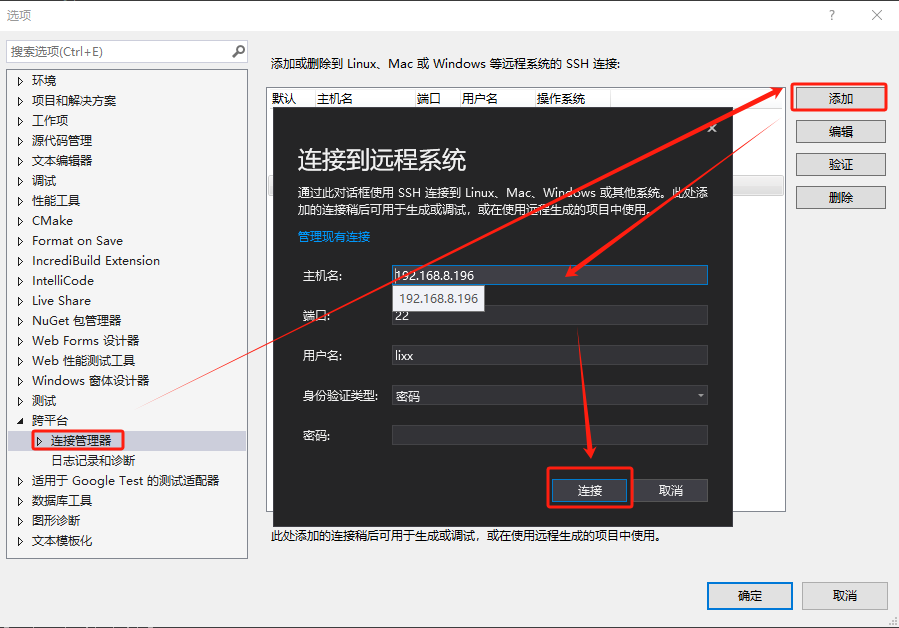


（3）添加项目配置

点击vs的工具栏的项目配置选项：管理配置...，然后在弹出的页面添加linux远程配置

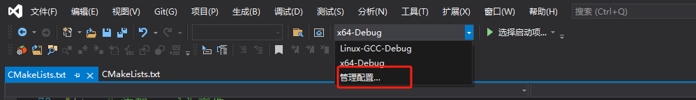

选择Linux-GCC-Debug项目，确定后配置远程计算机，也就是下拉选择我们刚刚创建的远程机器即可

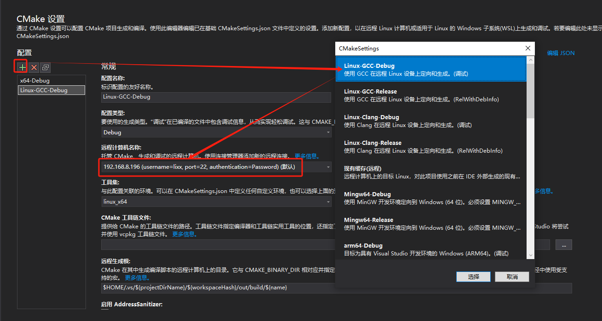

远程机器上确保已经安装完成所有的开发库（见《双系统环境搭建》一节），然后切换刚创建的Linux-GCC-Debug项目，开始生成和调试

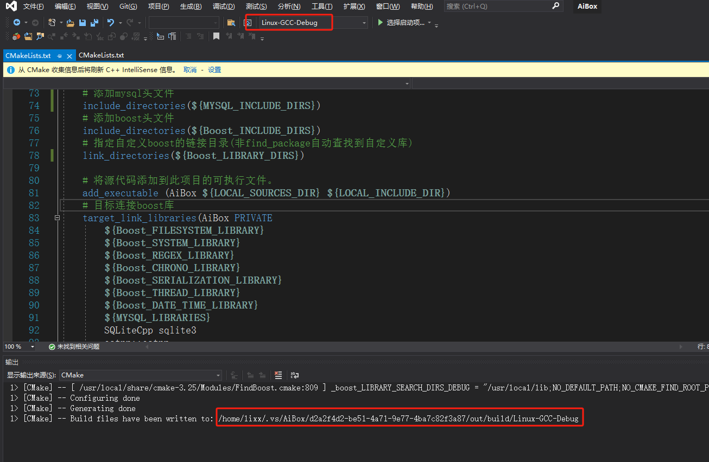

进入到linux对应的打印目录：/home/lixx/.vs/AiBox/d2a2f4d2-be51-4a71-9e77-4ba7c82f3a87/out/build/Linux-GCC-Debug/AiBox

```shell
cd /home/lixx/.vs/AiBox/d2a2f4d2-be51-4a71-9e77-4ba7c82f3a87/out/build/Linux-GCC-Debug/AiBox
ll
drwxrwxr-x 6 lixx lixx     4096 Mar 26 03:00 ./
drwxrwxr-x 5 lixx lixx     4096 Mar 26 03:00 ../
drwxrwxr-x 3 lixx lixx     4096 Mar 26 03:00 3rdparty/
-rwxrwxr-x 1 lixx lixx 19544360 Mar 25 22:59 AiBox*
-rw-r--r-- 1 lixx lixx    12288 Mar 25 07:04 app.db3
-rw-rw-r-- 1 lixx lixx       63 Mar 25 07:04 basic.txt
drwxrwxr-x 3 lixx lixx     4096 Mar 24 22:54 CMakeFiles/
-rw-rw-r-- 1 lixx lixx     1606 Mar 26 03:00 cmake_install.cmake
-rw-rw-r-- 1 lixx lixx      400 Mar 25 05:20 config.xml
drwxrwxr-x 2 lixx lixx     4096 Mar 25 22:59 logs/
drwxrwxr-x 5 lixx lixx     4096 Mar 25 22:58 SQLiteCpp-3.3.1/
```

可以看到vs拷贝到linux的项目文件已经编译生成的AiBox可执行文件，./AiBox即可运行该文件了。


 


## 系统部署


### widnows部署


### linux部署

在Linux中，程序的打包部署通常涉及将程序的可执行文件、依赖库、配置文件、文档等集中在一起，并有时提供一个安装脚本。以下是一个基本的示例，使用`tar`命令创建一个程序的打包归档文件（例如，一个名为`myapp`的简单程序），首先，确保你已经安装了所有必要的依赖。然后，使用`ldd`命令找出程序所需的共享库：

```shell
 # 運行執行文件 executable (application/x-executable) 必須先指定共享文件(如 libswresample.so.4) FOR openssl-1.1.1q 

# 共享文件:
sudo ldconfig
export LD_LIBRARY_PATH=/home/tonylaw/Desktop/MediaGuard_Cmake:$LD_LIBRARY_PATH
./MediaGuard
```

 


 


 

 

 

 
