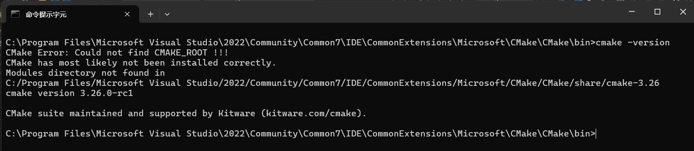

 Visual Studio 2022 中加載 CMake 項目時出現了問題，具體是找不到所需的模組目錄。以下是一些可能的解決方案：



根據錯誤信息：

```plaintext
CMake Error: Could not find CMAKE_ROOT ! ! !
CMake has most likely not been installed correctly.
Modules directory not found in
C:/Program Files/Microsoft Visual Studio/2022/Community/Common7/IDE/CommonExtensions/Microsoft/CMake/CMake/share/cmake-3.26
```

這表明 CMake 的安裝存在問題，特別是 `CMAKE_ROOT`（CMake 的核心模組目錄）無法找到，導致 CMake 無法正常運行。

以下是解決此問題的步驟：

---

### **1. 確認 CMake 安裝是否正確**
- 執行以下命令檢查當前使用的 CMake 版本：
  ```bash
  cmake --version
  ```
  如果版本信息顯示為 `3.26` 或其他錯誤版本，則需要重新安裝正確的版本。

#### **解決方法：**
1. **卸載舊版 CMake**：
   - 如果您之前使用的是 Visual Studio 內置的 CMake，可能會與您手動安裝的新版本衝突。
   - 確保卸載舊版本的 CMake，特別是位於 Visual Studio 路徑中的版本。

2. **重新安裝 CMake**：
   - 從 [CMake 官方網站](https://cmake.org/download/) 下載最新穩定版本（例如 `3.29`）。
   - 在安裝過程中，選擇將 CMake 添加到系統的 `PATH` 環境變數中。

3. **確認安裝目錄**：
   - 確保安裝後的目錄結構完整，特別是 `share/cmake-x.xx` 文件夾存在。

---

### **2. 檢查環境變數**
CMake 的 `CMAKE_ROOT` 路徑依賴於系統的環境變數。如果環境變數配置錯誤，可能導致模組目錄無法找到。

#### **檢查步驟：**
1. 打開 Windows 的環境變數設置：
   - 按下 `Win + S`，輸入「環境變數」，然後選擇「編輯系統環境變數」。
   - 點擊「環境變數」。

2. 檢查以下變數：
   - **`PATH`**：確保包含正確的 CMake 安裝目錄，例如：
     ```
     C:\Program Files\CMake\bin
     ```
   - **`CMAKE_ROOT`（如果存在）：應指向 CMake 的 `share/cmake-x.xx` 目錄，例如：**
     
     ```
     C:\Program Files\CMake\share\cmake-3.29    ### 關鍵這裡
     ```
   
3. 如果環境變數中仍然包含 Visual Studio 自帶的 CMake 路徑（例如 `C:/Program Files/Microsoft Visual Studio/2022/...`），請將其刪除或移到手動安裝的 CMake 路徑之後。

---

### **3. 使用正確的 CMake 路徑**
在命令提示符下，執行以下命令以指定正確的 CMake 可執行文件路徑：
```bash
"C:\Program Files\CMake\bin\cmake.exe" --version
```
確認輸出顯示的是您安裝的新版本，而不是 Visual Studio 自帶的舊版本。

---

### **4. 修復 Visual Studio 的 CMake 配置**
如果您希望繼續使用 Visual Studio 內置的 CMake，但模組目錄缺失，則需要修復 Visual Studio 的安裝。

#### **步驟：**
1. 打開 Visual Studio 安裝程序。
2. 選擇您的 Visual Studio 2022 實例，點擊「修改」。
3. 在「單個組件」選項卡中，搜索並重新安裝以下組件：
   - **C++ CMake 工具**
   - **C++ CMake 支持**

---

### **5. 測試修復後效果**
在命令提示符或 MINGW64 終端中再次運行以下命令：
```bash
cmake --version
```
確認是否正確顯示新版本，以及是否能正常運行。

---

### **總結**
這個問題通常是由於多個版本的 CMake 衝突或環境變數配置錯誤引起的。建議卸載舊版 CMake，重新安裝最新版本，並確保系統環境變數中指向正確的路徑。如果問題仍未解決，可以嘗試完全清除 Visual Studio 的內置 CMake 配置並重新安裝。