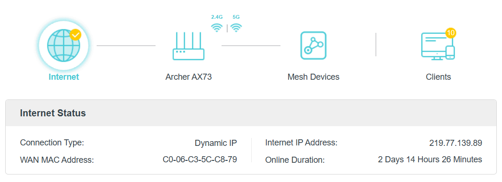
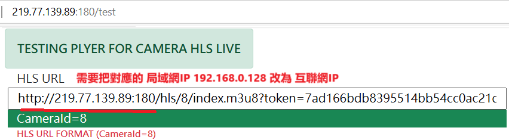
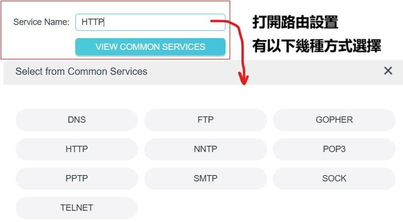
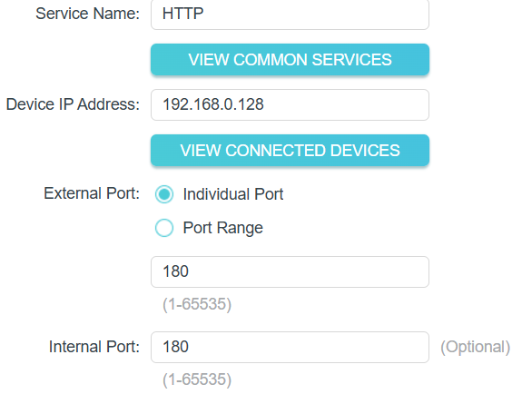

# 如何解決PNA私有網絡訪問問題


### 獲取外網IP

### 	1. 通過路由器獲得



​				**Internet Dynamic IP : 219.77.139.89**

​				WAN MAC Address : C0-06-C3-5C-C8-79   Internet IP Address: 219.77.139.89

​				**測試效果:**

 				http://219.77.139.89:180/test
				 http://192.168.0.128:180/test	

​					

​				**對應 的 192.168.0.128:180 改為 219.77.139.89:180**

### 	2. C++ STUN 網絡穿透技術


### 	3. 命令工具 curl 獲取外網IP

		要使用 `curl` 命令獲取 ISP 分配的互聯網 IP 地址，可以通過訪問一些提供此服務的公共 API 來實現。以下是幾個常用的 API 和相應的 `curl` 命令：

1. **使用 `ipinfo.io`**：

   ```bash
   curl ipinfo.io/ip
   ```

2. **使用 `ifconfig.me`**：

   ```bash
   curl ifconfig.me
   ```

3. **使用 `api.ipify.org`**：

   ```bash
   curl api.ipify.org
   ```

 


### 第一種 NAT HTTP轉發

​	

### **Port Forwarding**



### 第二種 NAT SOCKET轉發