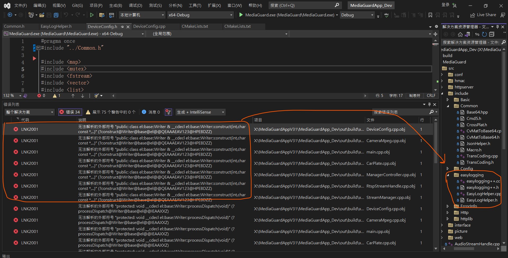
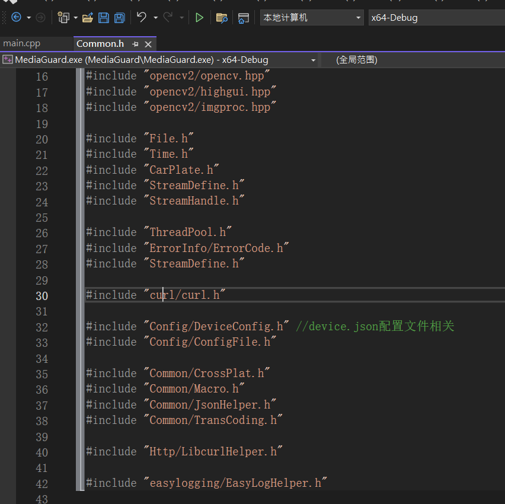
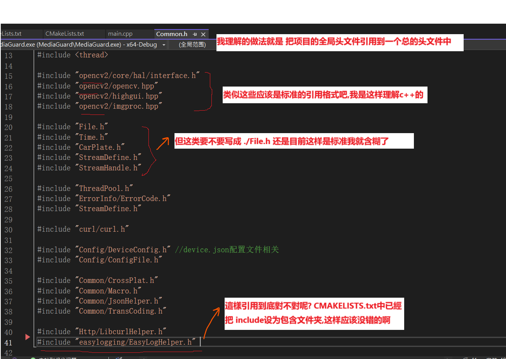
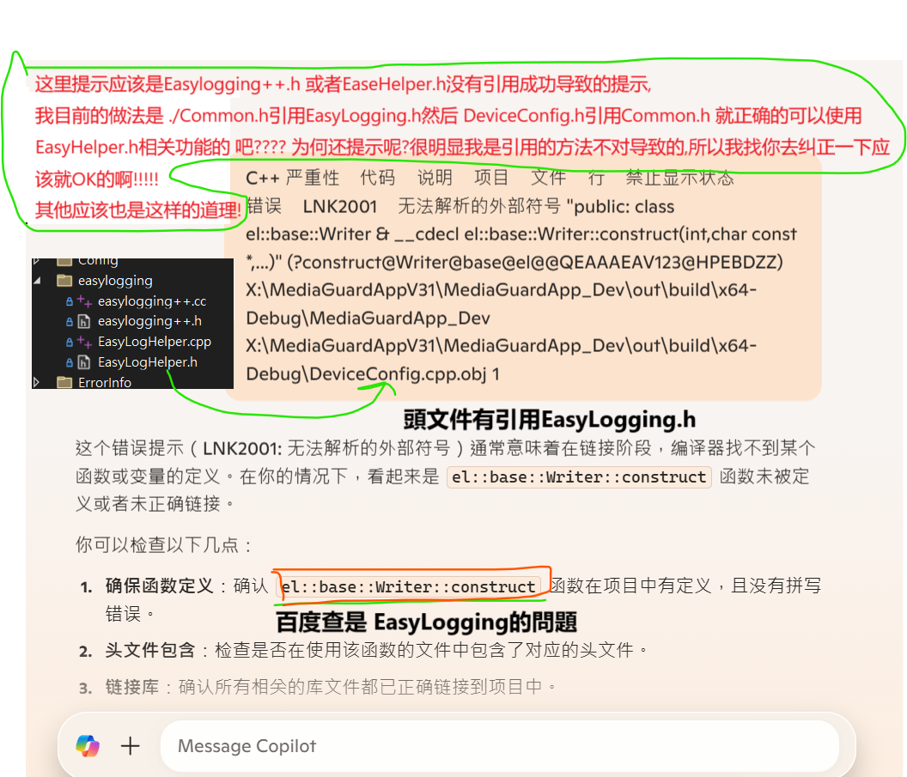
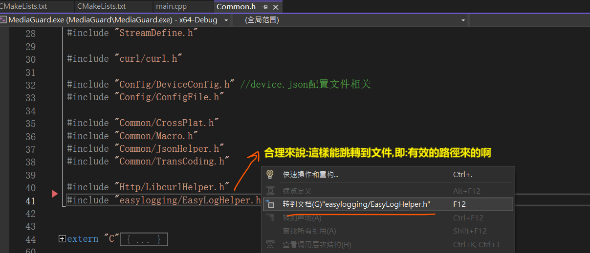

# Common.h 的頭文件改動和其他引用 

# 不知道是不是導致問題







## 項目的 CMAKELISTS.TXT

```
#####################################################################
#
# @brief	CMakeLists of project 
# cmake ../ -G "Visual Studio 17 2022"
# cmake ../ -G "Unix Makefiles"
# 
#####################################################################
cmake_minimum_required (VERSION 3.8)
 
# HEADER START ------------------------------------------------------------------

message("MediaGuard----------------------------------------------------------------------------------------------")
message("CMAKE_CURRENT_SOURCE_DIR = " ${CMAKE_CURRENT_SOURCE_DIR})  
message("MediaGuard----------------------------------------------------------------------------------------------")
   
set(CMAKE_CXX_STANDARD 17)
set(CMAKE_C_STANDARD 11)
set(CMAKE_CXX_STANDARD_REQUIRED ON)
 
#set project name
set(PROJECT_NAME MediaGuard)
project(${PROJECT_NAME})

set(CMAKE_CURRENT_SOURCE_DIR ${CMAKE_SOURCE_DIR})
 
# ws2def.h重定义
if(WIN32)
	set(CMAKE_CXX_FLAGS "${CMAKE_CXX_FLAGS}  /DWIN32_LEAN_AND_MEAN")
endif()

# 追加CMake查找目录
list(APPEND CMAKE_MODULE_PATH "${CMAKE_CURRENT_SOURCE_DIR}/3rdparty/cmake")

# 獲取項目的根路徑
message(STATUS "CMAKE ROOT: ${CMAKE_SOURCE_DIR}")
 
set(PROJECT_INCLUDE_DIR ${CMAKE_CURRENT_SOURCE_DIR}/${PROJECT_NAME}/src/include/)
message(${PROJECT_NAME} "PROJECT_INCLUDE_DIR: ${PROJECT_INCLUDE_DIR}")

set(PROJECT_SOURCE_DIR ${CMAKE_CURRENT_SOURCE_DIR}/src)  

set(3RDPARTY_INCLUDE ${CMAKE_CURRENT_SOURCE_DIR}/3rdparty/include)  

# HEADER END --------------------------------------------------------------------
  
# include local header files
include_directories(${SDK_INCLUDE_PATH}) 
message(${PROJECT_NAME} "SDK_INCLUDE_PATH: ${SDK_INCLUDE_PATH}")

 
# FFMPEG 4.2.2 設置 路徑和引用系統參數 FFMPEG_ROOT(不優先需要)
IF(WIN32)
    set(FFMPEG_INCLUDE_DIRS ${CMAKE_CURRENT_SOURCE_DIR}/3rdparty/windows/x64/ffmpeg/include) 
	set(FFMPEG_LIBRARIES ${CMAKE_CURRENT_SOURCE_DIR}/3rdparty/windows/x64/ffmpeg/lib)  
	set(FFMPEG_LIBRARY_DIRS ${CMAKE_CURRENT_SOURCE_DIR}/3rdparty/windows/x64/ffmpeg/lib)  

    # openssl 已經編譯版本 openssl1.1.1b
    set(OPENSSL_INCLUDE_DIR ${CMAKE_SOURCE_DIR}/3rdparty/windows/x64/openssl1.1.1b/include)
    set(OPENSSL_LIBRARIES ${CMAKE_SOURCE_DIR}/3rdparty/windows/x64/openssl1.1.1b/lib)

     # rapidjson
    set(RAPIDJSON_INCLUDE_DIR ${CMAKE_CURRENT_SOURCE_DIR}/3rdparty/windows/x64/rapidjson/include)
    

elseif(APPLE)
    set(FFMPEG_INCLUDE_DIRS ${CMAKE_CURRENT_SOURCE_DIR}/3rdparty/unix/x64/ffmpeg/include) 
	set(FFMPEG_LIBRARIES ${CMAKE_CURRENT_SOURCE_DIR}/3rdparty/unix/x64/ffmpeg/lib)  
	set(FFMPEG_LIBRARY_DIRS ${CMAKE_CURRENT_SOURCE_DIR}/3rdparty/unix/x64/ffmpeg/lib) 

    # 需要openssl編譯版本
    set(OPENSSL_INCLUDE_DIR ${CMAKE_SOURCE_DIR}/3rdparty/unix/x64/openssl.1.1.1qqqqqqq/include)
    set(OPENSSL_LIBRARIES ${CMAKE_SOURCE_DIR}/3rdparty/unix/x64/openssl.1.1.1qqqqqq/lib)

elseif(UNIX)
    set(FFMPEG_INCLUDE_DIRS ${CMAKE_CURRENT_SOURCE_DIR}/3rdparty/linux/x64/ffmpeg/include)
	set(FFMPEG_LIBRARIES ${CMAKE_CURRENT_SOURCE_DIR}/3rdparty/linux/x64/ffmpeg/lib) 
	set(FFMPEG_LIBRARY_DIRS ${CMAKE_CURRENT_SOURCE_DIR}/3rdparty/linux/x64/ffmpeg/lib) 

    # 需要openssl編譯版本
    set(OPENSSL_INCLUDE_DIR ${CMAKE_SOURCE_DIR}/3rdparty/linux/x64/openssl.1.1.1qqqqqq/include)
    set(OPENSSL_LIBRARIES ${CMAKE_SOURCE_DIR}/3rdparty/linux/x64/openssl.1.1.1qqqqqq/lib)

    # rapidjson_include X:\MediaGuardAppV31\MediaGuardApp_Dev\3rdparty\linux\x64\rapidjson
    set(RAPIDJSON_INCLUDE_DIR ${CMAKE_CURRENT_SOURCE_DIR}/3rdparty/linux/x64)

endif()

message(STATUS "\n================ OPENSSL_INCLUDE_DIR ============\n")
message(STATUS "======= OPENSSL_INCLUDE_DIR VALIDATE MSG: ${OPENSSL_INCLUDE_DIR} ========") 
execute_process(COMMAND ${CMAKE_COMMAND} -E chdir ${OPENSSL_INCLUDE_DIR} ${CMAKE_COMMAND} -E dir .)

message(STATUS "======= OPENSSL_LIBRARIES VALIDATE MSG: ${OPENSSL_LIBRARIES} ========") 
execute_process(COMMAND ${CMAKE_COMMAND} -E chdir ${OPENSSL_LIBRARIES} ${CMAKE_COMMAND} -E dir .)

message(STATUS "======= FFMPEG_INCLUDE_DIRS VALIDATE MSG: ${FFMPEG_INCLUDE_DIRS} ========") 
execute_process(COMMAND ${CMAKE_COMMAND} -E chdir ${FFMPEG_INCLUDE_DIRS} ${CMAKE_COMMAND} -E dir .)

message(STATUS "======= FFMPEG_LIBRARIES VALIDATE MSG: ${FFMPEG_INCLUDE_DIRS} ========") 
execute_process(COMMAND ${CMAKE_COMMAND} -E chdir ${FFMPEG_LIBRARIES} ${CMAKE_COMMAND} -E dir .)

message(STATUS "======= FFMPEG_LIBRARY_DIRS VALIDATE MSG: ${FFMPEG_INCLUDE_DIRS} ========") 
execute_process(COMMAND ${CMAKE_COMMAND} -E chdir ${FFMPEG_LIBRARY_DIRS} ${CMAKE_COMMAND} -E dir .)
 
include_directories(${FFMPEG_INCLUDE_DIRS}) 
# 打印找到的 FFmpeg 路徑（可選） 
message(STATUS "FFmpeg includes: ${FFMPEG_INCLUDE_DIRS}") 
message(STATUS "FFmpeg libraries: ${FFMPEG_LIBRARIES}") 
 
# 查找 OpenCV 包 
find_package(OpenCV REQUIRED)  
include_directories(${OpenCV_INCLUDE_DIRS}) 

# 打印找到的 OpenCV 路徑（可選） 
message(STATUS "OpenCV includes: ${OpenCV_INCLUDE_DIRS}") 
message(STATUS "OpenCV libraries: ${OpenCV_LIBRARIES}")

IF(WIN32)
    message("11111111111111111 -  WIN32 | MSVC")
elseif(APPLE)
     message("11111111111111111 - APPLE") 
elseif(UNIX)
     message("11111111111111111 - UNIX") 
endif()

# Include directories LOCAL_SOURCES_DIR 
file(GLOB  LOCAL_SOURCES_DIR
    "./src/*.cpp"
    "./src/hmac/*.cpp"
    "./src/httpserver/*.cpp"
    "./src/httpserver/*.cc"
    "./src/interface/*.cpp"
    "./src/include/Basic/*.cpp"
    "./src/include/Common/*.cpp"
    "./src/include/Config/*.cpp"
    "./src/include/easylogging/*.cpp"
    "./src/include/ErrorInfo/*.cpp"
    "./src/include/Http/*.cpp"
    "./src/include/Httplib/*.cpp"  
)
  
message(STATUS "\n================ LOCAL_SOURCES_DIR ============\n")
foreach(file ${LOCAL_SOURCES_DIR})
   message(${PROJECT_NAME} "*** LOCAL_SOURCES_DIR ***: ${file}") 
endforeach() 

file(GLOB LOCAL_HEADER_DIR 
    "./src/*.h"
    "./src//hmac/*.h"
    "./src//httpserver/*.h"
    "./src//include/Basic/*.h"
    "./src//include/Common/*.h"
    "./src//include/Config/*.h"
    "./src//include/easylogging/*.h"
    "./src//include/ErrorInfo/*.h"
    "./src//include/Http/*.h"
    "./src//include/Httplib/*.h"
    "./src//interface/*.h"
) 
message(STATUS "\n================ LOCAL_HEADER_DIR ============\n")
foreach(file ${LOCAL_HEADER_DIR})
   message(${PROJECT_NAME} "*** GLOB  LOCAL_HEADER_DIR ***:: ${file}") 
endforeach()

# 和下面的重複
# include_directories(
# 	  ${CMAKE_CURRENT_SOURCE_DIR} 
#     ${3RDPARTY_INCLUDE}
#     ${OPENSSL_INCLUDE_DIR}  
# ) 
 
# 将源代码添加到此项目的可执行文件
add_executable(${PROJECT_NAME} ${LOCAL_SOURCES_DIR} ${LOCAL_HEADER_DIR})

# 以下的引用需要放在 add_executable 函數後面

# 設置包含 PROJECT_INCLUDE_DIR 目錄  
target_include_directories(${PROJECT_NAME} PRIVATE ${PROJECT_INCLUDE_DIR})

# 設置包含 3RDPARTY_INCLUDE 目錄 
target_include_directories(${PROJECT_NAME} PRIVATE  ${3RDPARTY_INCLUDE} )
 
# 設置包含 FFmpeg 目錄 
target_include_directories(${PROJECT_NAME} PRIVATE ${FFMPEG_INCLUDE_DIRS})
 
# 設置包含 OpenCV 目錄 
target_include_directories(${PROJECT_NAME} PRIVATE  ${OpenCV_INCLUDE_DIRS})

# 設置包含 openssl 目錄 
target_include_directories(${PROJECT_NAME} PRIVATE  ${OPENSSL_INCLUDE_DIR})

# 设置包含 rapidjson目录 X:\MediaGuardAppV31\MediaGuardApp_Dev\3rdparty\linux\x64\
target_include_directories(${PROJECT_NAME} PRIVATE ${RAPIDJSON_INCLUDE_DIR})

# 设置包含目录，确保项目中可以找到头文件
target_include_directories(${PROJECT_NAME} PRIVATE ${LOCAL_INCLUDE_DIR})


# 連結 FFmpeg 庫 和 OpenCV 庫  openssl-1.1.1q(OPENSSL_LIBRARIES) 
target_link_libraries(${PROJECT_NAME} PRIVATE
 ${FFMPEG_LIBRARIES}
 ${OpenCV_LIBS} 
${FFMPEG_LIBRARIES}/avcodec.lib 
${FFMPEG_LIBRARIES}/avformat.lib 
${FFMPEG_LIBRARIES}/avutil.lib 
${FFMPEG_LIBRARIES}/swscale.lib 
${FFMPEG_LIBRARIES}/avdevice.lib 
${FFMPEG_LIBRARIES}/avfilter.lib 
${FFMPEG_LIBRARIES}/swresample.lib 
${FFMPEG_LIBRARIES}/postproc.lib)

# 鏈接 OpenSSL 庫 

IF(WIN32)
    message(STATUS "\n================ OPENSSL LINK FOR MD5 ============\n" ${OPENSSL_LIBRARIES}/libssl.lib )
    message(STATUS "\n================ OPENSSL LINK FOR MD5 ============\n" ${OPENSSL_LIBRARIES}/libcrypto.lib )
    # WIN版本已編譯 OPENSSL 1.1b  
    target_link_libraries(${PROJECT_NAME} PRIVATE 
       ${OPENSSL_LIBRARIES}/libssl.lib 
       ${OPENSSL_LIBRARIES}/libcrypto.lib)
elseif(APPLE)
     # 未測試驗證 需要編譯 OPENSSL 1.1b
     target_link_libraries(${PROJECT_NAME} PRIVATE 
       ${OPENSSL_LIBRARIES}/libssl.so
       ${OPENSSL_LIBRARIES}/libcrypto.so)
elseif(UNIX)
     # 未測試驗證 需要編譯 OPENSSL 1.1b
     target_link_libraries(${PROJECT_NAME} PRIVATE 
       ${OPENSSL_LIBRARIES}/libssl.so
       ${OPENSSL_LIBRARIES}/libcrypto.so)
endif()

message("=================== ${PROJECT_NAME} =======CMAKE SETTING BUILD END")

```

## 總方案的 CMAKELISTS.txt

```
#####################################################################
#
# @brief	CMakeLists of root project
#
#####################################################################

# cmake ../ -G "Visual Studio 17 2022"
# cmake ../ -G "Unix Makefiles"

# version of cmake required at least
# cmake_minimum_required(VERSION 3.14)
cmake_minimum_required(VERSION 3.8)
 
# project name
set(PROJECT_NAME MediaGuardApp)

project(${PROJECT_NAME})

 message("-------------------------------------------------------------------------------------------")
 message("PROJECT ROOT | CMAKE_CURRENT_SOURCE_DIR : "  ${CMAKE_CURRENT_SOURCE_DIR})
 message("-------------------------------------------------------------------------------------------")

# MediaGuard 运行库
add_subdirectory ("MediaGuard")
 

```


頭文件的引用問題




## EasyHelper.h 舉個例子




