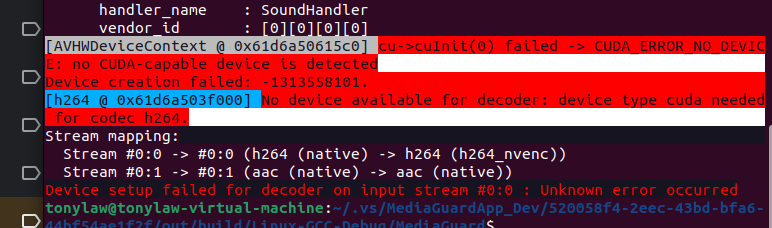

# 關於 WIN_LINUX CUDA_FFmpeg 驗證硬件解碼環境

**沒有安裝CUDA導致:**

Invalid setup for format cuda: missing configuration.Failed to get HW surface format.-[h264 @ 0x5ff99a70d780] decode slice header error[h264 @ 0x5ff99a70d780] no frame!Error during decoding,

code[-1094995529]:Invalid data found when processing input[h264 0 0x5ff99a70d780] Invalid setup for format cuda: missing configuration.

---------------------------------------------------------------------------------------------------------------------------------

 **FFmpeg 沒有配置CUDA導致如下錯誤:**
[h264 @ 0x60a70d984e00] Invalid setup for format cuda: missing configuration.

## 測試硬件解碼

$ ffmpeg -hwaccel cuda -i X:/MediaGuardAppV31/MediaGuardApp_Dev/Output/video/input1.mp4 -c:v h264_nvenc  input_h264.mp4 

$ ffmpeg -hwaccel cuda -i ./video/input1.mp4 -c:v h264_nvenc  input_h264.mp4 



```
[AVHWDeviceContext @ 0x61d6a50615c0] cu->cuInit(0) failed -> CUDA_ERROR_NO_DEVICE: no CUDA-capable device is detected
Device creation failed: -1313558101.
[h264 @ 0x61d6a503f000] No device available for decoder: device type cuda needed for codec h264.
```
