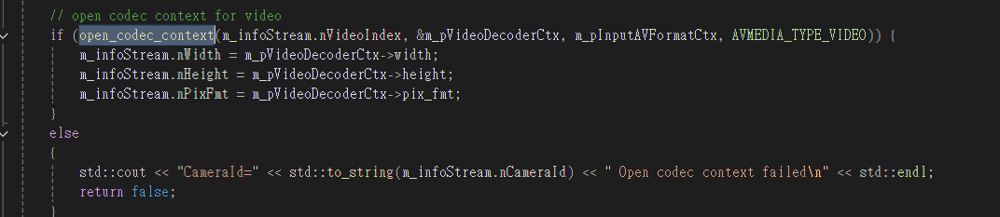

# NVIDIA CUDA硬解碼函數

## 設置硬件解碼方式

設置CUDA解碼必須 nHDType = kHWDeviceTypeCUDA


StreamInfo 這個對象是 混合device.json 和 api 的 camera_list 一起組合而成的.


## 引用函數open_codec_context



```
/*
* 打開解碼器
*參考技術文庫
* https://ffmpeg.xianwaizhiyin.net/api-ffmpeg/decode.html 
* https ://blog.csdn.net/weixin_43147845/article/details/136834165
* avMediaType 是傳入確定是 VIDEO 還是AUDIO 
*/
/** 
 * enum AVHWDeviceType {
 *     AV_HWDEVICE_TYPE_NONE,
 *     AV_HWDEVICE_TYPE_VDPAU,
 *     AV_HWDEVICE_TYPE_CUDA,
 *     AV_HWDEVICE_TYPE_VAAPI,
 *     AV_HWDEVICE_TYPE_DXVA2,
 *     AV_HWDEVICE_TYPE_QSV,
 *     AV_HWDEVICE_TYPE_VIDEOTOOLBOX,
 *     AV_HWDEVICE_TYPE_D3D11VA,
 *     AV_HWDEVICE_TYPE_DRM,
 *     AV_HWDEVICE_TYPE_OPENCL,
 *     AV_HWDEVICE_TYPE_MEDIACODEC,
 *     AV_HWDEVICE_TYPE_VULKAN,
 * }
 * 通过 av_hwdevice_get_type_name  
 *   hw_type_names[] = {
 *     [AV_HWDEVICE_TYPE_CUDA]   = "cuda",
 *     [AV_HWDEVICE_TYPE_DRM]    = "drm",
 *     [AV_HWDEVICE_TYPE_DXVA2]  = "dxva2",
 *     [AV_HWDEVICE_TYPE_D3D11VA] = "d3d11va",
 *     [AV_HWDEVICE_TYPE_OPENCL] = "opencl",
 *     [AV_HWDEVICE_TYPE_QSV]    = "qsv",
 *     [AV_HWDEVICE_TYPE_VAAPI]  = "vaapi",
 *     [AV_HWDEVICE_TYPE_VDPAU]  = "vdpau",
 *     [AV_HWDEVICE_TYPE_VIDEOTOOLBOX] = "videotoolbox",
 *     [AV_HWDEVICE_TYPE_MEDIACODEC] = "mediacodec",
 *     [AV_HWDEVICE_TYPE_VULKAN] = "vulkan",
 * }
 * 
 * AV_PIX_FMT_QSV 英特尔的qsv
 * AV_PIX_FMT_CUDA 英伟达cuda
 * 
 * 之前的版本: https://github.com/lawtatfaitony/MediaGuardCmakeV3/blob/main/MediaGuard_Cmake/MediaGuard/src/RtspStreamHandle.cpp
 */
bool RtspStreamHandle::open_codec_context(int& nStreamIndex, AVCodecContext** pDecoderCtx, AVFormatContext* pFmtCtx, enum AVMediaType avMediaType)
{
	AVStream* pStream = nullptr;
	AVCodec* pDecoder = nullptr;
	AVDictionary* pOptions = nullptr;

#ifdef _WIN32
	int stream_index = av_find_best_stream(pFmtCtx, avMediaType, -1, -1, (AVCodec**)&pDecoder, 0);  //據說可以 把參數 AVCodec **decoder_ret 傳入 null
#endif 

#ifdef __linux__
	int stream_index = av_find_best_stream(pFmtCtx, avMediaType, -1, -1, (const AVCodec**)&pDecoder, 0);
#endif 


	if (stream_index < 0)
	{
		fprintf(stderr, "Couldn't find %s stream in input\n", av_get_media_type_string(avMediaType));
		return false;
	}
	nStreamIndex = stream_index;

	//初始化像素格式的值
	//nPixeFmt 獲得像素格式格式 CUDA的像素格式 : AV_PIX_FMT_CUDA 
	AVPixelFormat nPixeFmt = AV_PIX_FMT_NONE;
	
	//if (AVMEDIA_TYPE_VIDEO == avMediaType && m_infoStream.nHDType > AV_HWDEVICE_TYPE_NONE)
	if (AVMEDIA_TYPE_VIDEO == avMediaType)
	{
		// 是否存在 NVIDIA CUDA 硬件支持 如果存在 則 nPixeFmt 賦值為支持的像素格式 
		for (int i = 0;; i++)
		{
			try {
				const AVCodecHWConfig* pConfig = avcodec_get_hw_config(pDecoder, i);
				if (nullptr == pConfig)
				{
					break;
				}

				if (!pConfig)
				{ 
					fprintf(stderr, "Decoder %s does not support device type %s.\n",
						pDecoder->name, av_hwdevice_get_type_name((AVHWDeviceType)m_infoStream.nHDType));
					//打印解码器类型
					av_log(NULL, AV_LOG_INFO, "Decoder %s does support device type %s.\n", pDecoder->name, av_hwdevice_get_type_name((AVHWDeviceType)m_infoStream.nHDType));
					std::cout << "\nDecoder " << pDecoder->name << " does support device type" << "av_hwdevice_get_type_name = " << av_hwdevice_get_type_name((AVHWDeviceType)m_infoStream.nHDType) << "\n" << std::endl;
					return false;
				}

				// 檢查當前硬件配置是否支持通過硬件設備上下文（HW_DEVICE_CTX）的方式進行硬件加速。  
				// AV_CODEC_HW_CONFIG_METHOD_HW_DEVICE_CTX 是一個常量，表示硬件設備上下文方法。
				// 如果 硬件類型為 AV_HWDEVICE_TYPE_CUDA (NVIDIA CUDA)   m_infoStream.nHDType = kHWDeviceTypeCUDA
				//if (pConfig->methods & AV_CODEC_HW_CONFIG_METHOD_HW_DEVICE_CTX && pConfig->device_type == m_infoStream.nHDType)
  
				if (pConfig->methods & AV_CODEC_HW_CONFIG_METHOD_HW_DEVICE_CTX && pConfig->device_type == m_infoStream.nHDType) {

					nPixeFmt = pConfig->pix_fmt;

					fprintf(stderr, "Decoder %s does support device type %s.\n", pDecoder->name, av_hwdevice_get_type_name((AVHWDeviceType)pConfig->device_type));  //打印解码器类型
					av_log(NULL, AV_LOG_INFO, "Decoder %s does support device type %s.\n", pDecoder->name, av_hwdevice_get_type_name((AVHWDeviceType)m_infoStream.nHDType));
					break;
				}
			}
			catch (...)
			{
				fprintf(stderr, "get AVCodecHWConfig fail %s \n", av_get_media_type_string(avMediaType));
				av_log(NULL, AV_LOG_INFO, "hw_decoder_init fail %s \n", av_get_media_type_string(avMediaType));
			}
		}
	}
	 

	/* Allocate a codec context for the decoder */
	*pDecoderCtx = avcodec_alloc_context3(pDecoder);
	if (!*pDecoderCtx)
	{
		fprintf(stderr, "Failed to allocate the %s codec context\n",av_get_media_type_string(avMediaType));
		return false;
	}

	/* Copy codec parameters from input stream to output codec context */
	pStream = m_pInputAVFormatCtx->streams[nStreamIndex];
	if ((stream_index = avcodec_parameters_to_context(*pDecoderCtx, pStream->codecpar)) < 0)
	{
		fprintf(stderr, "Failed to copy %s codec parameters to decoder context\n", av_get_media_type_string(avMediaType));
		return false;
	}

	// VIDEO ------------------------------------------------------------------------------------------------------------------------ 
	// init the hard device decoder
	if (AVMEDIA_TYPE_VIDEO == avMediaType && nPixeFmt != AV_PIX_FMT_NONE)
	{ 
		try {
			(*pDecoderCtx)->get_format = get_hw_format;
			(*pDecoderCtx)->pix_fmt = nPixeFmt;
			hw_decoder_init(*pDecoderCtx, (AVHWDeviceType)m_infoStream.nHDType);
			//hw_decoder_init(*pDecoderCtx, (AVHWDeviceType)kHWDeviceTypeCUDA); //原版本來自 m_infoStream.nHDType 現在硬性規定只有一種硬件解碼 CUDA

			fprintf(stderr, "hw_decoder_init success %s \n", av_get_media_type_string(avMediaType));
			av_log(NULL, AV_LOG_INFO, "hw_decoder_init success %s \n", av_get_media_type_string(avMediaType));
		}
		catch (...)
		{
			fprintf(stderr, "hw_decoder_init fail!!! %s \n", av_get_media_type_string(avMediaType));
			av_log(NULL, AV_LOG_INFO, "hw_decoder_init success %s \n", av_get_media_type_string(avMediaType));
		}
	}
	else {
		fprintf(stderr, "init the hard device decoder fail!! : %s \n", av_get_media_type_string(avMediaType));
	}


	// AUDIO ------------------------------------------------------------------------------------------------------------------------
	//初始化音频 的硬件解码 以下的没法测试 ,补充于2023年1月28日
	if (AVMEDIA_TYPE_AUDIO == avMediaType && nPixeFmt != AV_PIX_FMT_NONE && nStreamIndex != -1)
	{
		try {
			(*pDecoderCtx)->get_format = get_hw_format;
			(*pDecoderCtx)->pix_fmt = nPixeFmt;
			hw_decoder_init(*pDecoderCtx, (AVHWDeviceType)kHWDeviceTypeCUDA); //原版本來自 m_infoStream.nHDType 現在硬性規定只有一種硬件解碼 CUDA
		}
		catch (...)
		{
			fprintf(stderr, "audio decode hw_decoder_init fail!!! %s \n", av_get_media_type_string(avMediaType));
			av_log(NULL, AV_LOG_INFO, "audio decode hw_decoder_init fail %s \n", av_get_media_type_string(avMediaType));
		}
	}
	else {
		fprintf(stderr, "No AVMEDIA_TYPE_AUDIO (line 351): %s \n", av_get_media_type_string(avMediaType));
	}

	/* 
	* Init the decoders, with or without reference counting
	* 重新計算幀的數量 
	*/
	av_dict_set(&pOptions, "refcounted_frames", m_infoStream.nRefCount ? "1" : "0", 0);
	if ((stream_index = avcodec_open2(*pDecoderCtx, pDecoder, &pOptions)) < 0)
	{
		fprintf(stderr, "Failed to open %s codec\n",
			av_get_media_type_string(avMediaType));
		return false;
	}
	
	return true;
}
```

