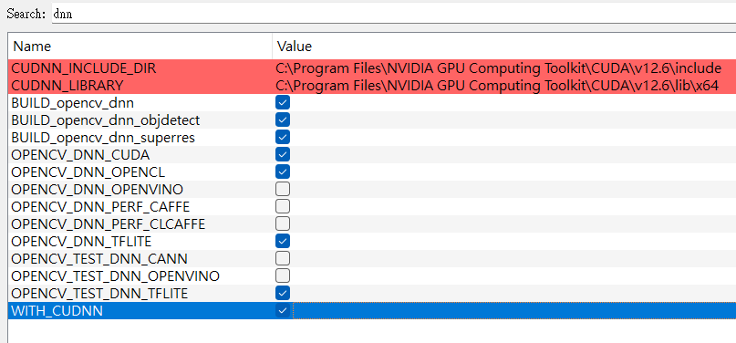
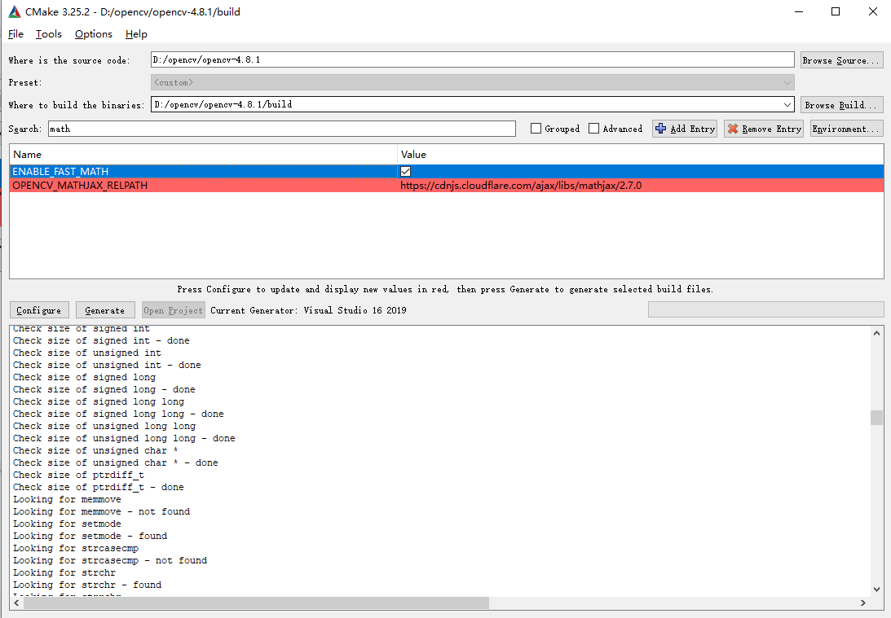
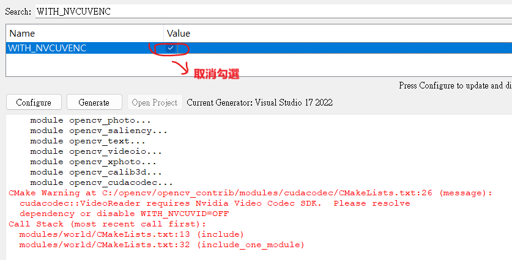
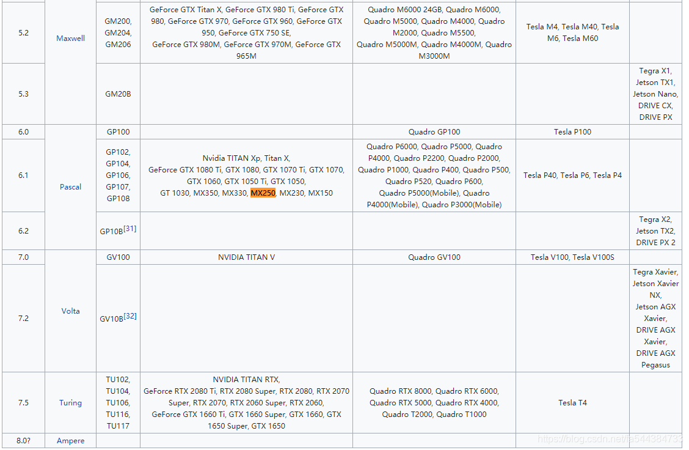
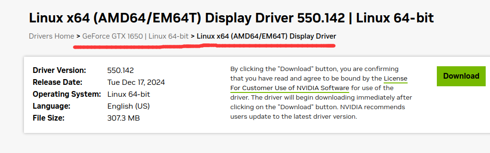
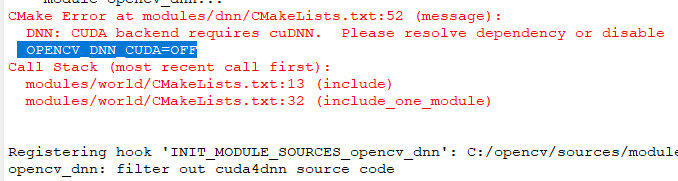
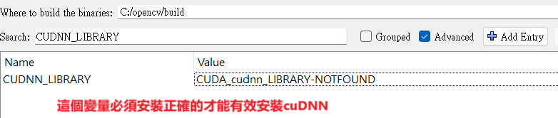
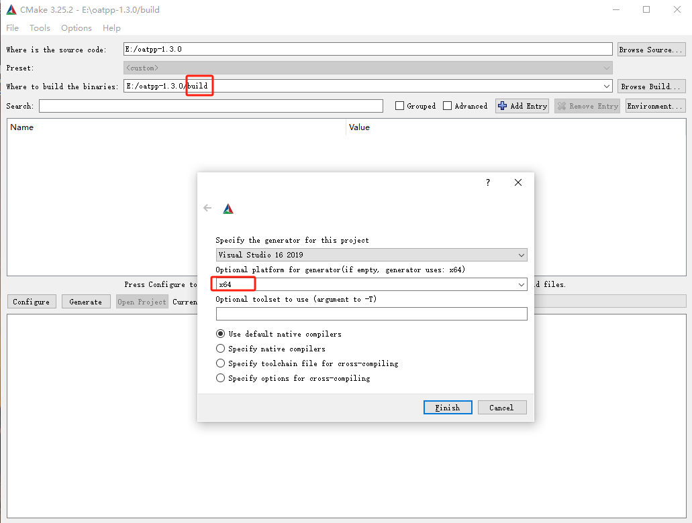
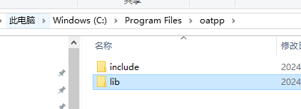
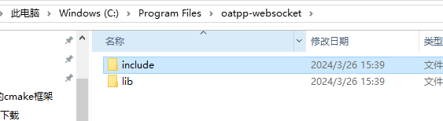

# 基于YOLOV8的跨平台AI盒子

> c++跨平台版本的服务端(cmake)，支持windows和linux系统

基于python版本的AI智能盒子很早已经研发完成，且提供了较为完善的产品生态链(包括AI盒子web端、AI盒子python端、AI预警sass云平台、AI盒子移动终端等，有需要的可以私下联系)，但由于python是解释型语言，需要源码级部署且安装部署相对复杂，所以不便做demon或演示案例给客户，为此特意开发了一个基于c++/cmake版本的跨平台版本，贡献出来给各位网友，希望能给各位网友带来实实在在的帮助，提升各位的技术能力和公司产品化的能力，一起实现共赢！

> 说明：本文提供的开源版本是跨平台版本，但仅适配CPU，适配了国产华为昇腾硬件OrangePI AI Pro，只有python版本的不仅跨平台，而且可以兼容GPU和CPU且已经适配多款边缘硬件，包括jetson nano B01、jetson nano nx等型号，python版本暂不开原，有需要私聊。


## 开发背景

市面上已经有很多关于yolov5或yolov8等不同版本的目标识别产品的案例和应用，大多数产品或应用都有如下特点：

（1）基本上都是基于python语言开发，无C++版本开发语言，对于python陌生的小伙伴是一个难题

这里顺便提一下，关于深度学习相关的技术研发基本都是python开发的，一个是跨平台的，另外原因是大多数深度学习算法或组件都是python开发，使用python语言开发能更大程序上利用现有的一些算法组件或资源来实现更高级的应用。（其实一开始作者也不太熟悉python，花了一周边边琢磨边开发，慢慢发现python其实是一个很简答，类库或组件很丰富的脚本语言，不论做什么应用，使用python语言会使得开发难度大大降低，多掌握一门跨平台语言也不错！）

（2）市面上的产品或技术资料不是很全，需要长时间的技术积累才能走通整个流程

新手司机很难，特别是一开始对机器学习概念都不太了解的入门级选手，不清楚yolo框架学习、部署及应用整个流程，其实大概流程是从数据采集（手动采集、爬虫、下载）、标注（手动、自动标注）、数据转换、模型训练、模型导入到模型应用等整个流程，当然我这里提供的也不一定非常全面，但是最起码的就是告诉你怎么应用模型，如何将模型应用封装为一个完整的C++跨平台应用（其他的从数据采集到模型训练过程到边缘部署到硬件适配等一些列文档、资料、源码、GPU硬件适配等需要有采购python商用版本解决方案，有意私聊）。

> **yolo框架的基本应用流程**：
>
> 数据采集 --> 数据标注 --> 数据转换 --> 数据训练 --> 模型加载 --> 模型推理 --> 高级业务应用

（3）未提供框架性的AI应用封装

大多数都是表层的技术应用，没有提供与模型无关的框架性封装，本项目涉及的C++跨平台版本提供了模型管理、设备管理（网络设备、本地摄像机）、分析场景（算法）管理、报警管理、录像管理、系统配置等多项功能，用户只需关注训练自己的模型，然后将自己的模型通过自带的web端或者HTTP接口或者websocket接口将模型、设备、场景等数据推送给AI盒子即可实现数据的推理、识别、预警、推送等整个流程。

（4）非跨平台的技术应用

本文涉及的是技术基于CMake开发的，使用C++准标准库Boost和一些开源的日志库、HTTP库、websocket库等，都是稳定且跨平台的，既可以编译到windows版本、也可以编译到Linux版本（Ubuntu、centos等），既可以适配x64架构也可以适配arm64芯片架构（已经测试通过windows、centos、Ubuntu（x64和arm64）等系统和硬件《jetson nano、orangePI等》）


## 技术架构

> - AI盒子端
>
>   使用CMake跨平台或使用python开发的跨平台版本
>
> - 盒子后台
>
>   vue2.0全家桶
>
> - AI预警云
>
>   springcloud alibba为服务版，shardingsphere分库分表，mysql数据库
>
> - AI预警端
>
>   vue2.0全家桶
>
> - AI移动端
>
>   uniapp框架

### 开发技术

（1）C++版本（**此开源版本**）使用了如下技术

- C++11

  里面使用了一些C++11以上的新语法，对于老程序员来说，语言只是一种工具，花时间熟悉一下新语法即可，问题不大。

- Boost

  C++跨平台库，C++11中的大部分新特性都是来自Boost准标准库，但是还有很多新特性暂时并未引入到c++中，它可以跨平台编码，开发人员并不需要写一些预编译语法来适应不同平台，只需要一套代码即可实现所有平台，这就是它的优势，也是为什么C++新语法基本都出自它的原因。

- mysql

  系统涉及到的一些模型数据、设备、场景、报警、配置等数据的存储既可以使用mysql存储，也可以使用sqlite存储，根据自己需要，可以通过配置文件配置存储方式，唯一的区别是mysql需要安装数据库而已。

- sqlite

  同上，AI盒子数据存储支持使用sqlite存储，所以需要用到sqlite库。

- oatpp

  一个开源的支持多语言的成熟http库，跨平台，支持DTO数据封装、SSL等，一个非常不错的HTTP协议库。

- spdlog

  一个开源的系统日志库，支持控制台打印、文件日志打印、支持自动清理、按日存储等功能。

- opencv

  一个很关键的一个库了，python使用pt模型，c++使用onnx模型，这里就是基于跨平台opencv来加载onnx模型实现推理的。

- vue2.0

  AI盒子提供了一个web管理端，通过其实现模型管理、设备管理、场景管理、报警管理、录像管理、系统配置、预警监控等功能。

  > 注：此开源版本提供基于vue2.0开发的web管理端，提供与AI盒子内部通信的交互操作控制台，如果需要定制自己的模型、设备、场景、配置等，可能需要修改web后台管理端源码，需要此部分的源码，需联系作者付费采购，感谢理解。

- yolov8

  c++版本使用的yolov8的模型，通过yolov8模型或yolov5模型转换的onnx模型实现模型推理和目标识别。


（2）Python版本（**商用版**）使用了如下技术

顺便介绍一下商用的python版本使用的相关技术（支持GPU，适配多款边缘硬件）

- python3

  开发语言为python语言，版本为3.8或以上。

- flask

  使用flask提供http相关接口或协议，web管理端操作接口，适用于通过浏览器端实现与AI盒子交互，包括模型、设备、场景等管理。

- yolov5

  模型基于yolov5相关技术架构实现模型的加载、推理。

- pytorch

  python深度学习库，yolov5实际使用的底层库

- vision

  python深度学习库，yolov5实际使用的底层库

- CUDA

  支持GPU和CPU的驱动和图形图像库CUDNN。一张图识别能加速到30ms左右（具体看硬件配置，高配可能10ms甚至更低）

- pymysql

  基于mysql存储，使用pymysql提供接口实现与底层mysql数据库的数据交互存储。

- websocket-client

  提供websocket长连接协议，AI盒子实现与云平台的信令交互和指令下发（私网和公网支持），适用于AI盒子在内网，第三方平台在云端（云不能直接通过http接口操作AI盒子）的应用。

- pyserial

  支持jetson nano、jetson nano nx等设备的串口通信，如读取io控制器引脚的高低电平实现AI盒子关联的摄摄像机的实时录像、停止录像、抓拍等功能，这种情况一般应用于边缘计算盒硬件（也就是说AI盒子源码部署在靠近摄像机端的边缘节点情况，AI盒子的硬件使用英文大的jetson nano、树莓派等硬件，这些硬件一般有GPIO引脚或USB串口）中。


（3）AI预警sass云平台

这里顺便提一下与AI盒子集成的sass云使用的技术，如果仅仅需要了解C++盒子的，此处可以忽略

- java

  AI预警平台是一个sass云平台，适用于云部署，多租户隔离模式，每个租户都可以看到自己的模型、设备、视频、预警等数据，开发语言为java跨平台，能否在widnows、linux下部署，可以脚本简单启动、也可以通过docker（kubernates）部署启动。

- vue2.0

  AI预警平台提供了一个后台管理应用，基于vue2.0技术框架开发。

- uniapp

  移动端应用基于uniapp开发、可以编译为H5（公众号后台）、app（android或苹果）、小程序等不同形式应用。

- springcloudAlibaba

  后台采用alibaba的微服务架构，包括nacos配置注册中心、seata（分布式事务）、rocketmq（消息中间件）、sentinel限流控制、SpringCloud gateway网关等组件。

- oauth2

  认证授权采用基于oauth2协议的用户认证服务，支持用户认证、授权，支持认证及资源服务分离，支持oss单点登录等功能。

- mysql

  底层数据库采用mysql存储。

- mybatis

  mysql脚本中间库使用mybatis中间件

- shardingsphere

  考虑数据库，sass云平台采用数据库分库分表机制，将大量的数据通过分库分表的机制均匀的分布到不同的数据库的不同表中，大大提高数据存储量和查询效率。

- sockjs

  web端能实时订阅自己感兴趣的消息，这里通过sockjs协议来实现，这里主要是消息推送服务使用技术，对接消息中间件，将消息推送到各个web终端。

- docker

  服务端可以单机部署、可以基于docker部署，系统已经生成单机部署启动脚本、docker指令编排脚本、k8s资源部署清单等，只需用户部署k8s环境即可实现服务的自动化伸缩部署。

- k8s

  在docker基础上的k8s容器控制服务。


### 系统架构

系统总体架构图如下所示：


这里从下至上进行一一说明

- 设备层

  AI盒子接入的设备为网络摄像机，当然也支持本地摄像头的采集和分析（一般用于做demon），AI盒子作为边缘计算盒，一般部署在与网络摄像机相同的局域网内，通过标准的RTSP协议采样抽帧的方式分析摄像机的视频流，然后对采样的图像帧使用yolov8模型库进行一一分析，这里的摄像头采用标准的rtsp协议，可以是任意厂家的摄像头，包括常见的海康、大华、安士讯等。

- 接入层

  接入层其实就只我们本文介绍的主角，也就是AI智能盒子，它作为边缘计算盒子，与摄像机同属一个局域网（当然排除服务云端化后提供云识别接口之外），它通过局域网与摄像机相连，通过USB或Lane接口连接，通过USB连接IO控制器（如果AI盒子需要控制IO开关如信号灯、语音喊话、硬件信号输入到其他系统等），AI盒子通过分析网络摄像机视频流，当分析到检测预警时，记录报警信息（时间、设备、类型、报警图片、报警前后n秒录像片段），实时存储到AI盒子本地，并异步将报警信息推送到第三方平台。

- 服务层

  sass云服务时一个多租户平台，主要功能就是提供基于AI盒子的高级应用，包括预警推送（手机、短信、公众号等）、预警处理、视频播放、预警统计、设备管理、云模型管理、策略管理、第三方数据对接、数据推送等功能应用。

- 应用层

  基于sass云的移动端应用和管理，用户可以通过手机端接收系统预警信息、处理预警、处理各自的任务、实时查看预警和视频等功能。


## 功能介绍

智能AI盒子提供了如下功能（部分c++版本功能可能没有，python版本有，后面会指出来，感兴趣的各位网友，也希望可以私下联系共同开发新增）

### web管理端

> web管理端指AI盒子的启动后台的交互网页终端，它基于AI盒子提供的HTTP接口实现AI盒子的数据管理、配置等功能。

- 资源国际化

  为适应不同用户的需求，AI盒子web管理端提供了中文简体、中文繁体、英文3种语言的切换。

- 模型管理

  管理端提供模型管理功能，包括模型上传、模型添加、模型修改、模型删除、模型更新等功能，具体见演示效果。

- 设备管理

  管理端提供了设备管理功能，包括设备添加、更新、移除、查询、设备区域范围配置、图片预览等功能。

- 场景管理

  管理端提供指定设备的多场景管理，包括一个设备添加多个场景、查询设备场景、更新设备场景、移除设备场景功能。

- 系统配置

  可以通过web端动态配置AI盒子的常用配置，包括盒子编码（对接第三方唯一id）、盒子保存数据天数、是否展示识别标签、第三方平台推送地址等。

- 重启盒子

  如果有必要，可以通过web端重启AI盒子（linux下部署时候需要root权限部署才能正常重启，启动后自动启动AI盒子服务程序）


### AI盒子端

- HTTP、websocket协议

  AI盒子支持通过Http协议管理AI盒子配置、模型、设备、场景等（如AI的WEB端），也可以通过websocket协议下发和操作AI盒子，实现与AI和的多协议交互。

- 模型热加载

  模型可以在系统启动后随时进行更新，盒子自动检测变化重新加载模型信息。

- 设备热加载

  被检测的设备更新后，AI盒子自动侦测信息变化，自动重新加载分析设备（如分析时间段、分析帧率等）

- 场景热加载

  一个分析视频设备，可以叠加多种分析场景算法，当某一算法发生变化后，AI盒子自动更新加载对应场景。

- 配置热加载

  系统配置会实时更新到内存中，实时更改对应系统配置（如保存时长、是否显示label、是否自动重启等）

- 抽帧采样分析

  AI盒子可以根据用户配置动态分析设备抽帧采样帧率，如25帧分析一张（1秒一张）

- 多算法分析

  一个分析设备，可以叠加多种分析场景算法，也就是分析的某张图可以叠加n种分析算法（串行叠加分析）

- 分析时段控制

  可以根据用户需要配置不同时间段进行分析，如晚上18:00-23:00时间段内进行分析，不在改时间段则停止分析。

- 分析区域配置

  python版本支持划定的多边形内的目标进行分析，也支持多个线段进行越界侦测分析。

- 模型推理分析

  支持yolov5、yolov8的模型进行推理分析，其中python版本使用yolov5的pt模型，yolov8使用的是onnx模型

- 报警存储

  当AI盒子检测到对应预警类型的目标后，将指定时间、设备、预警类型、预警图片、预警前后5秒（预录前5秒）的录像临时保存下来，然后异步推送到第三方平台。

- 报警录像

  当AI盒子检测到预警类型的目标后，AI盒子根据用户配置进行是否录像，录制事件发生前5秒和后5秒的录像（mp4格式或flv）

- GPIO录像

  AI盒子支持抓取GPIO信号，进行联动，开启或停止录像。

- GPIO抓拍

  AI盒子支持抓取GPIO信号，进行联动，开启关联摄像机的图片抓拍。

- 报警推送

  AI盒子可以配置报警推送http地址（https），然后将报警信息（设备、报警类型、时间、图片、录像）推送至第三方平台。

- 报警广播

  AI盒子自带的web端具有报警预览功能，当进入AI盒子报警预览页面后，发现报警会自动推送到web端，并使用tts语音播报方式将对应的报警内容以语音的形式播放出来。

- 报警清理

  AI盒子sd卡存储能力有限，为了保证AI盒子能够持续工作，AI盒子会自动覆盖最老的报警信息（主要包括数据和录像清理）

- 视频播放

  AI盒子与IPC摄像机一般处于同一个局域网，所以AI盒子具有能直接访问摄像机的条件，而云端要看摄像机的视频必须通过盒子（或其他第三方视频云平台）转发，AI盒子正好集成了改功能，它通过websocket下发指令启动视频的开始、停止播放（rtmp推送到服务端），启动远程抓拍功能。

- 远程抓拍

  如上说，AI盒子既具备视频转发能力，也具备远程控制抓拍功能。

- 远程录像

  AI盒子及支持关联摄像机（或非关联但是与其摄像机在同一张局域网内）的实时视频转发，也具有开启远程录像、停止远程录像的手动录像功能，录像完成后AI盒子会立即将录像信息推送到第三方云平台中（mp4格式-可以在web端播放）。

- 自动重启

  如果有必要，可以配置AI盒子自动重启（每晚12点），但是一般情况下不会这么做，除非网络有问题。

- 自动校时

  AI盒子会定时与第三方云平台进行心跳，为了保证AI盒子时间与云平台保持一致，在心跳的时候云平台如果返回服务器时间则AI盒子会自动将服务器时间设置为本地时间，以便与服务器进行时间对齐。

- 分析接口

  AI盒子具有自己抓取摄像头图片进行分析的能力，此外，AI盒子也提供的对外的http接口，用户可以通过接口将推送推送给AI盒子，然后进行识别，最后将结果以接口结果形式返回的第三方平台（不推荐使用）


## 示例下载

### windows

> 如果windows是win7或者xp系统，可能运行demon报缺少ucrtbase.dll，该文件可以在源码路径中找到，找到后放exe所在目录即可
>
> ```
> AiBox\3rdparty\lib\win32
> ```


（1）默认80分类检测模型demon

（2）安全帽反光衣检测模型demon


### ubuntu

（1）默认80分类检测模型demon

x64_86架构的，系统为ubuntu20.04版本编译的demon 

使用

```shell
tar -zxvf ai_box_ubuntu20.04.tar.gz
cd ai_box/
./AiBox
```

> 注意：
>
> 如果是WMWare Workshop启动的虚拟机，请将主机的摄像头共享给Ubuntu虚拟机，操作步骤如下：
>
> - windows打开服务：ctrl+r输入services.msc,然后找到VM的USB服务，名字为VMware USB Arbitration Service，设置为开机启动，并手动启动该服务。
>
> - 重启WMWare Workshop及Ubuntu虚拟机（如果usb重启的情况下必须重启）
>
> - 启动Ubuntu20.04机器
>
> - 在VM上选择该机器，鼠标右键菜单，选择对应设备，然后连接即可
>
>   
>
> - 使用ubuntu再带的茄子工具cheese打开测试摄像头是否可用


### orangePI

（1）默认80分类检测模型demon

国产华为升腾芯片（主要跑NPU，还没空适配NPU，目前也是跑CPU） 

上传到orangePI中，解压运行即可

```shell
tar -zxvf ai_box_ubuntu20.04.tar.gz
cd ai_box/
./AiBox
```


### jetson Nano

jetson nano是跑python、GPU版本的，不是跑C++的，追求实时性、识别速度和高性能的请私下联系我采购商业python版本，功能比cpp版本更强，所以这里就没有CPU版本的适配demon，见谅！


### VOC2YOLO

VOC格式数据是一种标准格式数据，而在yolo中有自己的格式数据，它是txt格式的，每一行表示一个对象的基本信息，所以我们需要将VOC格式的数据转换为YOLO格式数据之后，才能拿到yolo中进行训练，当然，我们可以一开始的时候就标注yolo格式数据，这里我不太推荐，原因如下

- VOC是通用格式数据，记录信息非常详细，yolo格式不是通用格式数据，信息损失大

- VOC格式数据兼容性和移植性较好，可以较好的与其他平台对接，如paddle飞桨、阿里天池等

- 开源工具基本都支持VOC格式标注

  这里我们使用的是labeling标注工具标注，它支持voc和yolo格式数据。

所以，我们在数据标注的时候，首先选择VOC格式，标注完成后自己协议个python脚本实现VOC格式数据到YOLO格式数据转换即可，这里我已经写好了python脚本，各种问题已经考虑好了，你拿过去用就好了

```python
"""
注意：
1、首先更改VOC格式根目录路径，然后将生成的images和labels目录
拷贝到训练数据集目录下(名字自定义)即可
2、修改classes类别名称列表
3、配置是否进行文件重命名：batch_rename_voc_samples
"""
import xml.etree.ElementTree as ET
import os
import uuid
import shutil
import random
from PIL import Image

# voc中的类别名对应yolo的类别下标
# 改成自己的类别名称，注意类别顺序
classes = ["person", "hat", "reflective_clothes", "other_clothes"]

# 转成yolov5-txt格式图片大小
# yolov5长宽必须是32像素整倍
# yolov5默认大小为640x640
# 为了提高精度建议放大1280x1280
# 摄像机分辨率1280x720
glob_resize_img = False
global_img_size = (1280, 1280)

# 是否对原来的样本文件进行重命名
# 如果文件名为非uuid的文件，建议重命名
# 以免与其他数据文件名相同覆盖(不同分类训练样本粘贴的时候)
batch_rename_voc_samples = False

# VOC图片格式目录根路径
# VOC满足其约定的目录结构
# ROOT(dir)
# --Annotations(存放标注的标签文件(目标真值标注数据，xml格式))
# --ImageSets(类别标签其中包含4个文件夹Action|Layout|Main|Segmentation,识别任务必须有Main)
# --JPEGImages(存放需要打标签的图片文件(图像jpg格式))
voc_root_path = 'D:/datasets/per_hat'
# 添加后斜杠
if not voc_root_path.endswith('\\') and not voc_root_path.endswith('/'):
    voc_root_path += '/'

# voc格式标签文件路径
xml_file_path = voc_root_path + 'Annotations/'

# voc格式标注图片目录
# 最好不要用"images"作文件夹名字，
# 后续会对图片进行划分，命名的新文件夹叫"images"
images_file_path = voc_root_path + 'JPEGImages/'

# 数据集划分比例建议：训练集80%，验证集10%，测试集10%（标准的8:1:1）
train_percent = 0.9
val_percent = 0.1
test_percent = 0.0


# 批量重命名图片(uuid名称)
def rename_images(xml_dir, images_dir):
    # 获取xml文件列表
    xml_file_list = os.listdir(xml_dir)
    # 处理所有xml文件
    for index, fn in enumerate(xml_file_list):
        print(f'正在重命名第{index}个文件:{fn}')
        # 新文件的文件名
        new_name = str(uuid.uuid1()).replace('-', '')
        # 老文件的文件名
        old_name = fn[:-4]
        # xml原文件路径
        xml_oldname = xml_dir + fn
        # xml新文件路径
        xml_newname = xml_dir + new_name + '.xml'
        # 重命名新文件名
        os.rename(xml_oldname, xml_newname)
        # 对应jpeg图片
        jpg_oldname = images_dir + old_name + '.jpg'
        # 对应的jpg图片存在
        if os.path.exists(jpg_oldname):
            # jpg新文件路径
            jpg_newname = images_dir + new_name + '.jpg'
            # 删除老的图片
            os.rename(jpg_oldname, jpg_newname)


# voc盒子型=>中点+宽高
def convert(size, box):
    dw = 1. / size[0]
    dh = 1. / size[1]
    x = (box[0] + box[1]) / 2.0
    y = (box[2] + box[3]) / 2.0
    w = box[1] - box[0]
    h = box[3] - box[2]
    x = x * dw
    w = w * dw
    y = y * dh
    h = h * dh
    return x, y, w, h


# 转换标签文件
def convert_annotations(source_file, dest_file):
    print(f'正在转换文件:{source_file}')
    in_file = open(source_file, encoding='UTF-8')
    out_file = open(dest_file, 'w', encoding='UTF-8')
    tree = ET.parse(in_file)
    root = tree.getroot()
    size = root.find('size')
    w = 0
    h = 0
    if size is not None:
        w = int(size.find('width').text)
        h = int(size.find('height').text)
    # 图片尺寸为0处理
    if 0 == w or 0 == h:
        # xxx.jpg
        name = os.path.basename(source_file)
        name = name[:-4]
        # 获取jpg文件
        image_file = images_file_path + name + '.jpg'
        if not os.path.exists(image_file):
            image_file = images_file_path + name + '.png'
        # 只有xml没有图片
        if not os.path.exists(image_file):
            in_file.close()
            out_file.close()
            os.remove(source_file)
            os.remove(dest_file)
            return
        # 获取图片宽高
        img = Image.open(image_file)
        w, h = img.size
        img.close()

    for obj in root.iter('object'):
        # difficult = obj.find('difficult').text
        cls = obj.find('name').text
        # if cls not in classes or int(difficult) == 1:
        #     continue
        if cls not in classes:
            print(f'class {cls} not in config list')
            continue
        # 类别名转为yolov5的类别索引下标
        cls_id = classes.index(cls)
        # 读取物体识别位置
        xmlbox = obj.find('bndbox')
        b = (float(xmlbox.find('xmin').text), float(xmlbox.find('xmax').text),
             float(xmlbox.find('ymin').text), float(xmlbox.find('ymax').text))
        bb = convert((w, h), b)
        out_file.write(str(cls_id) + " " + " ".join([str(a) for a in bb]) + '\n')


# *********************************************** #
#  parent folder
#  --data
#  ----images
#       ----train
#       ----val
#       ----test
#  ----labels
#       ----train
#       ----val
#       ----test
# *********************************************** #
# 创建yolov5格式目录
def create_dir():
    if not os.path.exists(voc_root_path + 'images/'):
        os.makedirs(voc_root_path + 'images/')
    if not os.path.exists(voc_root_path + 'labels/'):
        os.makedirs(voc_root_path + 'labels/')

    if not os.path.exists(voc_root_path + 'images/train/'):
        os.makedirs(voc_root_path + 'images/train')
    if not os.path.exists(voc_root_path + 'images/val/'):
        os.makedirs(voc_root_path + 'images/val/')
    if not os.path.exists(voc_root_path + 'images/test/'):
        os.makedirs(voc_root_path + 'images/test/')

    if not os.path.exists(voc_root_path + 'labels/train/'):
        os.makedirs(voc_root_path + 'labels/train/')
    if not os.path.exists(voc_root_path + 'labels/val/'):
        os.makedirs(voc_root_path + 'labels/val/')
    if not os.path.exists(voc_root_path + 'labels/test/'):
        os.makedirs(voc_root_path + 'labels/test/')
    return


# png转jpg
def png_to_jpg_if_png_exists(jpg_image):
    # 文件不存在
    if not os.path.exists(jpg_image):
        # xxx.jpg
        name = os.path.basename(jpg_image)
        name = name[:-4]
        # png文件
        png_image = images_file_path + name + '.png'
        # png文件也不存在
        if not os.path.exists(png_image):
            print(f'file {jpg_image} not exists')
            return
        # 转行png文件为jpg
        img = Image.open(png_image)
        # 转换为JPG格式图片
        img = img.convert("RGB")
        # 保存为新的jpg格式图片
        img.save(jpg_image)
        # 关闭图片
        img.close()
        # 删除原来的png格式图片
        os.remove(png_image)


# 重置图片大小
def resize_source_image(source_path, dest_path):
    img = None
    try:
        # 打开图片
        img = Image.open(source_path)
        # 放大图片
        image = img.resize(global_img_size)
        # 将新图像保存至桌面
        image.save(dest_path)
    except IOError as e:
        print("缩放图像失败:" + e)
    finally:
        # 关闭图像
        if img is not None:
            img.close()
    pass


# 转行所有数据集
def convert_all_data():
    # 创建yolov5格式目录
    create_dir()

    # 原数据集XML文件列表及总数
    total_xml = os.listdir(xml_file_path)
    num_xml = len(total_xml)

    # 计算训练集、验证集、测试集数量
    num_train = int(num_xml * train_percent)
    num_val = int(num_xml * val_percent)
    num_test = num_xml - num_train - num_val
    print(f"训练集数目：{num_train}, 验证集数目：{num_val},测试集数目：{num_test}")

    # 随机训练集
    train = random.sample(total_xml, num_train)
    # 验证测试集[排除训练集数据]
    val_test = [i for i in total_xml if not i in train]
    # 从训练测试集取出验证集
    val = random.sample(val_test, num_val)
    # 测试集[排除训练集及验证集数据]
    test = [i for i in total_xml if not i in train and not i in val]

    # 开始转换训练集标签
    for index, fn in enumerate(train):
        print(f'正在转换第{index}个训练数据集文件:{fn}')
        # 原来文件名
        old_name = fn[:-4]
        new_name = old_name
        # 重命名文件
        if batch_rename_voc_samples:
            new_name = str(uuid.uuid1()).replace('-', '')
        # 转换xml文件
        xml_old_file = xml_file_path + old_name + '.xml'
        xml_new_file = voc_root_path + 'labels/train/' + new_name + '.txt'
        convert_annotations(xml_old_file, xml_new_file)
        # 拷贝jpg文件
        src_image = images_file_path + old_name + '.jpg'
        dst_image = voc_root_path + 'images/train/' + new_name + '.jpg'
        png_to_jpg_if_png_exists(src_image)
        if os.path.exists(src_image):
            if glob_resize_img:
                resize_source_image(src_image, dst_image)
            else:
                shutil.copyfile(src_image, dst_image)

    # 开始转换验证集标签
    for index, fn in enumerate(val):
        print(f'正在转换第{index}个验证数据集文件:{fn}')
        # 原来文件名
        old_name = fn[:-4]
        new_name = old_name
        # 重命名文件
        if batch_rename_voc_samples:
            new_name = str(uuid.uuid1()).replace('-', '')
        # 转换xml文件
        xml_old_file = xml_file_path + old_name + '.xml'
        xml_new_file = voc_root_path + 'labels/val/' + new_name + '.txt'
        convert_annotations(xml_old_file, xml_new_file)
        # 拷贝jpg文件
        src_image = images_file_path + old_name + '.jpg'
        dst_image = voc_root_path + 'images/val/' + new_name + '.jpg'
        png_to_jpg_if_png_exists(src_image)
        if os.path.exists(src_image):
            if glob_resize_img:
                resize_source_image(src_image, dst_image)
            else:
                shutil.copyfile(src_image, dst_image)

    # 开始转换测试集标签
    for index, fn in enumerate(test):
        print(f'正在转换第{index}个测试数据集文件:{fn}')
        # 原来文件名
        old_name = fn[:-4]
        new_name = old_name
        # 重命名文件
        if batch_rename_voc_samples:
            new_name = str(uuid.uuid1()).replace('-', '')
        # 转换xml文件
        xml_old_file = xml_file_path + old_name + '.xml'
        xml_new_file = voc_root_path + 'labels/test/' + new_name + '.txt'
        convert_annotations(xml_old_file, xml_new_file)
        # 拷贝jpg文件
        src_image = images_file_path + old_name + '.jpg'
        dst_image = voc_root_path + 'images/test/' + new_name + '.jpg'
        png_to_jpg_if_png_exists(src_image)
        if os.path.exists(src_image):
            if glob_resize_img:
                resize_source_image(src_image, dst_image)
            else:
                shutil.copyfile(src_image, dst_image)
    pass


# 开始执行转行
convert_all_data()
```


### 百度爬虫

模型的训练关键在于数据集的准备，如何弄到我们需要的数据集？其实有很多方面，我这里大概找了几个方法，大部分可以通过网上获取，也可以自己写爬虫从百度爬取（后面我也找了很多数据集获取地址，参见《数据集采集》一页。

百度爬虫我也准备好了，只需执行python脚本然后输入你要搜索的关键词、要下载的图片数量即可下载到对应关键词的图片。

- 爬虫脚本

  ```python
  """
  百度图库图片抓取
  """
  import uuid
  
  import requests
  import re
  from urllib import parse
  import os
  
  
  class ImageSpider(object):
      def __init__(self, save_dir):
          self.url = 'https://image.baidu.com/search/flip?tn=baiduimage&ie=utf-8&word={}{}'
          self.headers = {'User-Agent': 'Mozilla/4.0'}
          self.word_parse = ''
          self.save_dir = save_dir
          self.image_count = 1000
          self.i = 1
  
      # 获取图片递归函数
      def getimage(self, url, word):
          # 使用 requests模块得到响应对象
          res = requests.get(url, headers=self.headers)
  
          # 更改编码格式
          res.encoding = "utf-8"
          # 得到html网页
          html = res.text
          # print(html)
          # 正则解析
          pattern = re.compile('"hoverURL":"(.*?)"', re.S)
          img_link_list = pattern.findall(html)
          # 存储图片的url链接
          print(img_link_list)
  
          # 创建目录，用于保存图片
          directory = str(self.save_dir + '/{}').format(word)
          # 如果目录不存在则创建新目录
          if not os.path.exists(directory):
              os.makedirs(directory, mode=0o777, exist_ok=True)
  
          for img_link in img_link_list:
              filename = '{}/{}_{}.jpg'.format(directory, word, str(uuid.uuid1()))
              self.save_image(img_link, filename)
              self.i += 1
              # 每页只能下载60张图片，这里可以直接跳出，或者按需要的数量更改
              if self.i == self.image_count:
                  print(f'下载完成{self.image_count}张图，退出下载')
                  return
              # 也可以改成翻页下载的形式：
              # self.url = 'https://image.baidu.com/search/flip?tn=baiduimage&ie=utf-8&word={}{}'
              # 格式化地址：url = self.url.format(word_parse,'&pn=40')  #这里的pn=20*n
              if self.i % 60 == 0:
                  pn = (int)(self.i / 60 * 20)
                  pagepn = '&pn=' + str(pn)
                  urlnew = self.url.format(self.word_parse, pagepn)
                  print(urlnew)
                  self.getimage(urlnew, word)
  
      # 保存图片
      def save_image(self, img_link, filename):
          try:
              # https:\\/\\/ns-strategy.cdn.bcebos.com\\/ns-strategy\\/upload\\/fc_big_pic\\/part-00384-1388.jpg
              img_link = img_link.replace("\\/", '/')
              html = requests.get(url=img_link, headers=self.headers).content
              with open(filename, 'wb') as f:
                  f.write(html)
              print(f'下载{img_link}到{filename}成功')
          except Exception as e:
              print(f'下载图片{img_link}异常:{e}')
  
      # 执行函数
      def run(self):
          word = input("您想要搜索下载的图片关键词？")
          self.word_parse = parse.quote(word)
          count = input("抓取图片最大数量？")
          self.image_count = int(count)
          url = self.url.format(self.word_parse, '&pn=0')
          print(url)
          self.getimage(url, word)
  
  
  if __name__ == '__main__':
      spiderer = ImageSpider('D:/capture')
      spiderer.run()
  
  ```

- 使用方式

  进入虚拟环境，或者直接打开命令行，将以上脚本保存为baidu_capture.py脚本名称，然后python执行

  ```shell
  #进入虚拟环境
  conda activate yolov5
  #进入脚本所在目录
  cd xxx
  #执行脚本
  python3 baidu_capture.py
  您想要搜索下载的图片关键词？狗
  抓取图片最大数量？10
  https://image.baidu.com/search/flip?tn=baiduimage&ie=utf-8&word=%E7%8B%97&pn=0
  ['https://img2.baidu.com/it/u=3710071795,1935934436&fm=253&fmt=auto&app=120&f=JPEG?w=405&h=607', '', 'https://img0.baidu.com/it/u=355540748,4279750747&fm=253&fmt=auto&app=120&f=JPEG?w=500&h=590', 'https://img1.baidu.com/it/u=2800285962,3144843962&fm=253&fmt=auto&app=120&f=JPEG?w=500&h=708', 'https://img0.baidu.com/it/u=2982112298,332524237&fm=253&fmt=auto&app=138&f=JPEG?w=800&h=1422', '', 'https://img0.baidu.com/it/u=899072890,1051003349&fm=253&fmt=auto&app=120&f=JPEG?w=500&h=889', '', '', '', '', '', 'https://img0.baidu.com/it/u=3958984912,1183025142&fm=253&fmt=auto&app=120&f=JPEG?w=500&h=500', '', 'https://img0.baidu.com/it/u=709389818,15662528&fm=253&fmt=auto&app=120&f=JPEG?w=888&h=500', '', 'https://img0.baidu.com/it/u=4033153792,1132130660&fm=253&fmt=auto&app=138&f=JPEG?w=500&h=750', 'https://img0.baidu.com/it/u=1094067482,1954257272&fm=253&fmt=auto&app=120&f=JPEG?w=800&h=500', '', '', '', '', 'https://img1.baidu.com/it/u=3037065633,3920937498&fm=253&fmt=auto&app=138&f=JPEG?w=889&h=500', 'https://img1.baidu.com/it/u=243234235,2932914455&fm=253&fmt=auto&app=138&f=JPEG?w=889&h=500', '', 'https://img1.baidu.com/it/u=1644105177,300278054&fm=253&fmt=auto&app=120&f=JPEG?w=800&h=500', 'https://img0.baidu.com/it/u=2423716291,609421818&fm=253&fmt=auto&app=138&f=JPEG?w=666&h=500', 'https://img0.baidu.com/it/u=1847314541,347034172&fm=253&fmt=auto&app=138&f=JPEG?w=750&h=500', '', 'https://img0.baidu.com/it/u=254439336,3029519064&fm=253&fmt=auto&app=120&f=JPEG?w=1255&h=800', 'https://img0.baidu.com/it/u=2350579518,1580042609&fm=253&fmt=auto&app=138&f=JPEG?w=500&h=889', '', 'https://img1.baidu.com/it/u=2418131841,3031705877&fm=253&fmt=auto&app=120&f=JPEG?w=500&h=753', 'https://img1.baidu.com/it/u=3918682719,279636889&fm=253&fmt=auto&app=120&f=JPEG?w=970&h=618', 'https://img2.baidu.com/it/u=3125212292,1141242674&fm=253&fmt=auto&app=120&f=JPEG?w=567&h=500', 'https://img2.baidu.com/it/u=1440470319,1200016074&fm=253&fmt=auto&app=120&f=JPEG?w=640&h=427', 'https://img1.baidu.com/it/u=2732463704,821520455&fm=253&fmt=auto&app=120&f=JPEG?w=889&h=500', 'https://img1.baidu.com/it/u=704275214,396135592&fm=253&fmt=auto&app=138&f=JPEG?w=667&h=500', 'https://img1.baidu.com/it/u=1496080221,654701152&fm=253&fmt=auto&app=138&f=JPEG?w=333&h=500', 'https://img1.baidu.com/it/u=1496132220,1600902313&fm=253&fmt=auto&app=138&f=JPEG?w=500&h=798', '', '', 'https://img0.baidu.com/it/u=402685873,1458512737&fm=253&fmt=auto&app=138&f=JPEG?w=800&h=1437', 'https://img0.baidu.com/it/u=2008945784,3169002842&fm=253&fmt=auto&app=120&f=JPEG?w=608&h=342', '', '', 'https://img2.baidu.com/it/u=1153911856,401197048&fm=253&fmt=auto&app=138&f=JPEG?w=720&h=482', 'https://img2.baidu.com/it/u=4239368062,3794634334&fm=253&fmt=auto&app=138&f=JPEG?w=500&h=667', 'https://img2.baidu.com/it/u=2903268539,2008608892&fm=253&fmt=auto&app=138&f=JPEG?w=667&h=500', 'https://img1.baidu.com/it/u=3097786841,280197815&fm=253&fmt=auto&app=120&f=JPEG?w=800&h=500', 'https://img1.baidu.com/it/u=987977502,1862942488&fm=253&fmt=auto&app=138&f=JPEG?w=813&h=500', 'https://img1.baidu.com/it/u=1099947152,3909189908&fm=253&fmt=auto&app=138&f=JPEG?w=560&h=320', 'https://img1.baidu.com/it/u=722657272,1259482305&fm=253&fmt=auto&app=138&f=JPEG?w=418&h=410', 'https://img0.baidu.com/it/u=3762086336,3971104417&fm=253&fmt=auto&app=138&f=JPEG?w=667&h=500', 'https://img0.baidu.com/it/u=850446474,652694488&fm=253&fmt=auto&app=138&f=JPEG?w=889&h=500', 'https://img2.baidu.com/it/u=1432520278,742839924&fm=253&fmt=auto&app=138&f=JPEG?w=500&h=750', '', 'https://img0.baidu.com/it/u=1832399488,3142588414&fm=253&fmt=auto&app=138&f=JPG?w=348&h=500', 'https://img0.baidu.com/it/u=199133472,3474349226&fm=253&fmt=auto&app=138&f=JPEG?w=500&h=666', 'https://img0.baidu.com/it/u=3768239988,3053430673&fm=253&fmt=auto&app=138&f=JPEG?w=800&h=500', 'https:\\/\\/ns-strategy.cdn.bcebos.com\\/ns-strategy\\/upload\\/fc_big_pic\\/part-00461-2994.jpg']
  下载https://img2.baidu.com/it/u=3710071795,1935934436&fm=253&fmt=auto&app=120&f=JPEG?w=405&h=607到D:/capture/狗/狗_00ada4cc-0572-11ef-871d-94e6f745cd96.jpg成功
  下载图片异常:Invalid URL '': No scheme supplied. Perhaps you meant https://?
  下载https://img0.baidu.com/it/u=355540748,4279750747&fm=253&fmt=auto&app=120&f=JPEG?w=500&h=590到D:/capture/狗/狗_011d3801-0572-11ef-a4bc-94e6f745cd96.jpg成功
  下载https://img1.baidu.com/it/u=2800285962,3144843962&fm=253&fmt=auto&app=120&f=JPEG?w=500&h=708到D:/capture/狗/狗_01925dd7-0572-11ef-9ec1-94e6f745cd96.jpg成功
  ```

  下载完成后，在D:/capture目录就可以看到《狗》文件夹，文件夹内就包含了对应文件

  


### 千图爬虫

和百度图库图片爬虫一样，我也写了一个关于千图网的一个爬虫，脚本如下

```python
"""
千图网图库图片抓取
汉字转拼音：pip install pohan -i http://mirrors.aliyun.com/pypi/simple/ --trusted-host mirrors.aliyun.com
"""
import uuid
import requests
import re
from urllib import parse
import os
import pohan
from pohan.pinyin.pinyin import Style


# 判断词语是否为中文
def is_chinese(strings):
    for _char in strings:
        if '\u4e00' <= _char <= '\u9fa5':
            return True


class ImageSpider(object):
    def __init__(self, save_dir):
        # 分页从1开始
        self.url = 'https://www.58pic.com/tupian/{}-852-0-{}.html'
        self.headers = {'User-Agent': 'Mozilla/4.0'}
        self.word_parse = ''
        self.save_dir = save_dir
        self.image_count = 1000
        self.i = 1

    # 获取图片递归函数
    def getimage(self, url, word):
        # 使用 requests模块得到响应对象
        res = requests.get(url, headers=self.headers)
        # 更改编码格式
        res.encoding = "utf-8"
        # 得到html网页
        html = res.text
        # print(html)
        # 正则解析
        pattern = re.compile('data-original="(.*?)"', re.S)
        img_link_list = pattern.findall(html)
        # 存储图片的url链接
        print(img_link_list)

        # 创建目录，用于保存图片
        directory = str(self.save_dir + '/{}').format(word)
        # 如果目录不存在则创建新目录
        if not os.path.exists(directory):
            os.makedirs(directory, mode=0o777, exist_ok=True)

        previous_image = ''
        for img_link in img_link_list:
            # 添加请求前缀https
            img_link = "https:" + img_link
            # 忽略图片是图标图等且与上一张图不相同
            if img_link.find("icon.qiantucdn.com/static") == -1 and previous_image != img_link:
                # 本地文件路径
                filename = '{}/{}_{}.jpg'.format(directory, word, str(uuid.uuid1()))
                self.save_image(img_link, filename)
            # 上一张图地址
            previous_image = img_link
            self.i += 1
            # 每页只能下载60张图片，这里可以直接跳出，或者按需要的数量更改
            if self.i == self.image_count:
                print(f'下载完成{self.image_count}张图，退出下载')
                return
            # 也可以改成翻页下载的形式
            if self.i % 77 == 0:
                pn = (int)(self.i / 77) + 1
                urlnew = self.url.format(self.word_parse, pn)
                print(f'请求下一页{urlnew}')
                self.getimage(urlnew, word)

    # 保存图片
    def save_image(self, img_link, filename):
        try:
            # https:\\/\\/ns-strategy.cdn.bcebos.com\\/ns-strategy\\/upload\\/fc_big_pic\\/part-00384-1388.jpg
            img_link = img_link.replace("\\/", '/')
            html = requests.get(url=img_link, headers=self.headers).content
            with open(filename, 'wb') as f:
                f.write(html)
            print(f'下载{img_link}到{filename}成功')
        except Exception as e:
            print(f'下载图片{img_link}异常:{e}')

    # 执行函数
    def run(self):
        word = input("您想要搜索下载的图片关键词？")
        # 千图网汉字自动转拼音搜索
        pinyin_list = pohan.pinyin.han2pinyin(word, style=Style.NORMAL)
        key_word = ''
        for item in pinyin_list:
            key_word += item[0]
        self.word_parse = parse.quote(key_word)
        count = input("抓取图片最大数量？")
        self.image_count = int(count)
        url = self.url.format(self.word_parse, '1')
        print(url)
        self.getimage(url, word)


if __name__ == '__main__':
    spider = ImageSpider('D:/capture')
    spider.run()

```

千图网图片可能精准一些，当然可能是数据量没有百度图库的大，但是也是一个不错选择，执行过程和百度一样，这里不在赘述。

> 注意：
>
> 千图网之前的爬虫可以爬，现在发现这个脚本不能用了，应该是静态图片访问千图网做了token访问，还需要登录，人没百度大，心机耍的一溜一溜的，真要命，各位大神请贡献你们自己的其他图库的爬虫，在此为大家感谢你！


## 测试模型

在源码里我提供了如下几个onnx测试模型，各位可以修改自己的代码，然后使用对应模型进行测试，模型路径见源码

> AiBox\3rdparty\model

- cloth.onnx

  安全帽反光衣模型，默认分类：person,hat,reflective_clothes,other_clothes

- dao.onnx

  持刀检测模型，模型分类：dao

- fire.onnx

  火焰检测模型，模型分类：fire

- helmet.onnx

  安全帽模型，模型分类：hat,person


## 演示效果

   

### AI盒子服务端(C++)

（1）ubuntu系统启动

（2）windows系统启动


## 代码一撇

代码包括AI盒子C++源码、AI盒子Python源码、AI盒子后台管理web源码、AI预警Sass平台java源码、AI预警Sass云后台管理、AI预警云平台移动端代码，大致代码风格样式如下

- AI盒子C++

  

- AI盒子python

  

- AI盒子后台

  

- AI预警云服务

  

- AI预警云管理

  

- AI预警移动端

  


## 开发环境


### 机器准备

> ubuntu、centos、windows、VMware Workstation Pro

本次开源部分为c++版跨平台服务端，开发技术使用cmake、boost、sqlite、opencv、oatpp（http）、oatpp-websocket、spdlog(项目中已有)，所以必须先安装对应的软件和必要的库，软件和库.

除了必要的软件之外，我们需要准备一台windows开发机和一台linux开发机器（ubuntu或者centos都可以）

### 环境准备

> vs2019、boost、oatpp、oatpp-websocket、opencv、spdlog

本次实际开发环境为vs2019，各位可以使用vs2019或以上都可以，支持跨平台开发调试工具，各个环境和软件安装详细细节如下所示。


#### unix调试环境搭建

这里我们要开发cmake项目，借助的是Visual Studio 2019工具，它通过ssh连接远程服务器的gdbserver进行调试，所以需要再远程服务器上安装ssh和gbd工具库。

1. 安装ssh

  需要安装cmake3.8以上版本，建议cmake在3.25或以上。ubuntu系统安装ssl（默认没有）

  ```shell
  apt-get update
  apt-get install openssh-server
  systemctl start ssh
  systemctl status ssh
  sudo su
  ```

  centos上安装ssh（默认就有）

  ```shell
  yum update
  yum install openssh-server
  #设置启动权限
  vim /etc/ssh/sshd_config
  PermitRootLogin=yes
  RSAAuthentication=yes
  PubkeyAuthentication=yes
  #启动ssh服务
  systemctl start sshd.service
  #开机启动
  systemctl enable sshd.service
  #修改ssh访问权限
  cd ~
  chmod 700 .ssh
  chmod 600 .ssh/*
  ls -la .ssh
  ```

2. 安装gdb

  安装gdb调试工具和gdb服务

  ```shell
  #Ubuntu安装
  sudo apt-get install openssh-server g++ gdb gdbserver -y
  sudo apt-get install ninja-build
  ninja --version
  1.10.0
  
  #centos安装
  sudo yum install -y gcc-c++ gdb gdbserver openssh-server
  sudo yum install epel-release
  sudo yum install ninja-build
  ninja --version
  ```

  

#### 双系统环境搭建


接下来，我们将逐个安装提到的项目依赖库。

##### cmake安装

下载地址：https://cmake.org/files/

（1）windows安装

这里我安装的是cmake-3.25.2-windows-x86_64.msi版本，直接下一步下一步安装即可。安装其他库的时候我们直接使用cmake-gui进行安装即可（与linux区别就是一个使用ui操作，一个使用命令行操作，效果一样）

（2）linux安装

我下载的版本是：cmake-3.25.2.tar.gz，安装过程如下

```shell
#centos安装
#准备好环境
yum update
yum install -y gcc gcc-c++ make automake
# 这步一定要做，不然后续./bootstrap会报错
yum install -y openssl openssl-devel
#查看当前版本
[root@hadoop03 linux01]# cmake --version
cmake version 2.8.12.2
#卸载旧版本
yum remove cmake -y
yum erase cmake
#查看卸载是否成功
[root@hadoop03 linux01]# cmake --version
bash: /usr/bin/cmake: No such file or directory
#bin安装cmake
#tar -zxvf cmake-3.25.2-linux-x86_64.tar.gz
#cd cmake-3.25.2-linux-x86_64.tar/bin
#源码编译
wget https://cmake.org/files/v3.25/cmake-3.25.2.tar.gz
tar -xvzf cmake-3.25.2.tar.gz
cd cmake-3.25.2
./bootstrap
#出现“CMake has bootstrapped.  Now run gmake.”之后可以后续操作
gmake
gmake install
cmake --version
whereis cmake
cp /usr/local/bin/cmake /usr/bin/
cmake --version
```

ubuntu安装cmake

```shell
#使用bash安装（无法指定版本）
sudo apt-update
sudo apt-get install cmake
cmake --version

#二进制包安装
chmod +x cmake-3.25.2-linux-x86_64.sh
sudo ./cmake-3.25.2-linux-x86_64.sh --prefix=/usr --skip-license
cmake --version

#自动编译源码------推荐方式
sudo apt-get install gcc g++ make automake 
sudo apt-get install -y build-essential libssl-dev
#wget https://cmake.org/files/v3.25/cmake-3.25.2.tar.gz
tar -zxvf cmake-3.25.2.tar.gz
cd cmake-3.25.2
./bootstrap && make && sudo make install
whereis cmake
cp /usr/local/bin/cmake /usr/bin/
cmake --version
```


##### opencv安装

参考地址：搜索  win10 opencv gpu编译

下载地址：https://opencv.org/releases/

##### （1）windows安装

windows我们直接下载opencv-4.8.1-windows.exe，然后解压到对应目录即可，我这里解压如下到D:\install\opencv，该目录下结构

```shell
- build
- souces
- license.txt
- license_ffmpeg.txt
- readme.md.txt
```

> 注意：以上版本下载的默认不支持GPU，如果需要安装GPU选项，需要cmake-gui配置GPU选项进行安装(类似于linux系统下的cmake选项)

根据需要是否选择cuda相关选项

新版本 Visual Studio 2022的出來情況

 ./sources/cmake/OpenCVDetectCXXCompiler.cmake 增加一個else if 來判斷是否 vs 1942版 ("^19[34][0-9]$")

```
# 比較新的VS2022 update V12版本無法被opencv4.8.1識別,需要折衝修改如下:
elseif(MSVC_VERSION MATCHES "^193[0-9]$")
    set(OpenCV_RUNTIME vc17)

elseif(MSVC_VERSION MATCHES "^19[34][0-9]$")
    set(OpenCV_RUNTIME vc17)
```

如果不安裝 CUDA DNN

**WITH_CUDNN = false**


添加 CUDA_TOOLKIT_ROOT_DIR

**本機是 C:/Program Files/NVIDIA GPU Computing Toolkit/CUDA/v12.1** (CUDA 識別不了VS2022 update12版本導致bianyi編譯出錯)

升級為 : C:/Program Files/NVIDIA GPU Computing Toolkit/CUDA/v12.6




**升級CUDA 12.6的SUMARY如下:**
Installed:

Nsight for Visual Studio 2022
 Nsight Monitor
Not Installed:
- Nsight for Visual Studio 2019
  Reason: VS2019 was not found
- Nsight for Visual Studio 2017
  Reason: VS2017 was not found
- Integrated Graphics Frame Debugger and Profiler
  Reason: see https://developer.nvidia.com/nsight-vstools
- Integrated CUDA Profilers
  Reason: see https://developer.nvidia.com/nsight-vstools

配置扩展模块


**OPENCV_EXTRA_MODULES_PATH = C:/opencv/opencv_contrib/modules**

​	如圖: 	

设置生成world, 也可以不勾选，不勾选的会vs生成后 会有很多个lib，勾选了 就只有opencv_world lib 文件


去掉python，test（因为我暂时不需要)。java同理也去掉。然后点击config


勾选math



###### 安裝CUDA

確保您的 NVIDIA 顯卡支持 NVDEC 和 NVENC (編碼解碼) 
CUDA與版本對照表(Video Encode and Decode GPU Support Matrix)  

https://developer.nvidia.com/video-encode-and-decode-gpu-support-matrix-new?locale=en

**cuda_12.6.3_561.17_windows** 

设置显卡算力 6.1，因为在tensorflow和显卡的版本对应中是找不到Geforce MX250的(通过网络查找到)

**WITH_NVCUVENC**  
环境中缺少Nvidia Video Codec SDK，可以安装NVIDIA Video Codec SDK： [NVIDIA Video Codec SDK下载链接](https://developer.nvidia.com/video-codec-sdk)， 或者cmake中搜索**WITH_NVCUVENC 取消勾选**



显卡算力 查询：https://developer.nvidia.cn/cuda-gpus



```
C:\Users\lixx>nvidia-smi
Thu Mar 21 18:36:43 2024
+-----------------------------------------------------------------------------+
| NVIDIA-SMI 460.89       Driver Version: 460.89       CUDA Version: 11.2     |
|-------------------------------+----------------------+----------------------+
| GPU  Name            TCC/WDDM | Bus-Id        Disp.A | Volatile Uncorr. ECC |
| Fan  Temp  Perf  Pwr:Usage/Cap|         Memory-Usage | GPU-Util  Compute M. |
|                               |                      |               MIG M. |
|===============================+======================+======================|
|   0  GeForce MX250      WDDM  | 00000000:06:00.0 Off |                  N/A |
| N/A   55C    P0    N/A /  N/A |     64MiB /  2048MiB |      3%      Default |
|                               |                      |                  N/A |
+-------------------------------+----------------------+----------------------+
+-----------------------------------------------------------------------------+
| Processes:                                                                  |
|  GPU   GI   CI        PID   Type   Process name                  GPU Memory |
|        ID   ID                                                   Usage      |
|=============================================================================|
|  No running processes found                                                 |
+-----------------------------------------------------------------------------+
========================================================================================================
nvidia-smi 另一款顯卡
========================================================================================================
Mon Dec  9 15:36:37 2024
+---------------------------------------------------------------------------------------+
| NVIDIA-SMI 538.18                 Driver Version: 538.18       CUDA Version: 12.2     |
|-----------------------------------------+----------------------+----------------------+
| GPU  Name                     TCC/WDDM  | Bus-Id        Disp.A | Volatile Uncorr. ECC |
| Fan  Temp   Perf          Pwr:Usage/Cap |         Memory-Usage | GPU-Util  Compute M. |
|                                         |                      |               MIG M. |
|=========================================+======================+======================|
|   0  NVIDIA GeForce GTX 1650 ...  WDDM  | 00000000:01:00.0 Off |                  N/A |
| N/A   56C    P0              14W /  35W |      0MiB /  4096MiB |      3%      Default |
|                                         |                      |                  N/A |
+-----------------------------------------+----------------------+----------------------+
+---------------------------------------------------------------------------------------+
| Processes:       GeForce GTX 1650 Max-Q                                               |
|  GPU   GI   CI        PID   Type   Process name                            GPU Memory |
|        ID   ID                                                             Usage      |
|=======================================================================================|
+---------------------------------------------------------------------------------------+
```





取消勾选setup


---------------------------------------------------------------------------------------------------------------------------------------------------------------------------------------

###### 安装DNN

WITH_NVCUVID 取消勾選以消除:

 OPENCV_DNN_CUDA=OFF 安装DNN 需要开启 否则关闭（OFF）



上述應該是沒有安裝 cuDNN（CUDA Deep Neural Network Library）,只是安裝CUDA

首先确认CUDA Toolkit和cuDNN是否正确安装。
若正确安装则，勾选Advance选项，搜索cudnn，将CUDNN_LIBRARY项设置为cudnn.lib
位置一般在C:\Program Files\NVIDIA GPU Computing Toolkit\CUDA\v12.6\lib\x64下。

(CUDNN_INCLUDE_DIR = C:\Program Files\NVIDIA GPU Computing Toolkit\CUDA\v12.6\include )

下載對應 cuDNN版本:https://developer.nvidia.com/rdp/cudnn-archive 这里下载： [Download cuDNN v8.8.1 (March 8th, 2023), for CUDA 12.x](https://developer.nvidia.com/rdp/cudnn-archive#a-collapse881-120) (這個12.2cuda版本不能識別 VS2022 17.X 提示12.4以上CUDA,此處下載 cuda_12.6.3_561.17_windows.exe)




**勾选完成后config，再generate.**

错误解决：Can't get model file for face alignment

解决方法：

```shell
#下载face_landmark_model.dat 配置人臉識別
#face_landmark_model.dat 是 OpenCV 中用于面部标记检测的预训练模型文件。这个模型用于检测人脸图像中的特征点，例如眼睛、鼻子、嘴巴、耳朵等2。这些特征点可以用于各种应用，例如人脸识别、面部表情分析、面部替换、面部平均等

https://raw.githubusercontent.com/opencv/opencv_3rdparty/8afa57abc8229d611c4937165d20e2a2d9fc5a12/face_landmark_model.dat
#放到本地文件(file:/E:/nginx-1.18.0/html/)或上传到nginx
http://192.168.8.19:81/face_landmark_model.dat
#修改opencv_contrib/modules/face/CMakeLists.txt中的下载地址目录
ocv_download(
    FILENAME face_landmark_model.dat
    HASH ${__file_hash}
    URL
      "${OPENCV_FACE_ALIGNMENT_URL}"
      "$ENV{OPENCV_FACE_ALIGNMENT_URL}"
	  "file:/E:/nginx-1.18.0/html/"
	  #"http://192.168.8.19:81/"
      #"https://raw.githubusercontent.com/opencv/opencv_3rdparty/${__commit_hash}/"
    DESTINATION_DIR "${CMAKE_BINARY_DIR}/${OPENCV_TEST_DATA_INSTALL_PATH}/cv/face/"
    ID "data"
    RELATIVE_URL
    STATUS res
)
#除此之外发现还有下载https://raw.githubusercontent.com/域名的其他文件,暂时忽略即可
```

安装完成后，运行install解决方案，即可安装到对应build目录的install子目录下


```
C:\opencv\build下找到OPENCV.sln，打开，找到CMakeTargets下的INSTALL，在Debug和Release下分别右键生成即可。
```


修改cmake为GPU版本的安装路径

```cmake
# windows平台
if(WIN32)
	# 设置boost根目录
	set(BOOST_ROOT "E:/boost_1_63_0")
	# 设置boost库目录
	set(BOOST_LIBRARYDIR "E:/boost_1_63_0/stage/64")
	# 设置OpenCV的路径
	set(OpenCV_DIR "D:/opencv/opencv-4.8.1/build/install")
elseif(UNIX)
	# 设置boost根目录
	set(BOOST_ROOT /usr/local)
	# 设置boost库目录
	set(BOOST_LIBRARYDIR /usr/local/lib)
endif()
```

##### （2）linux安装

###### centos下安装过程如下

```shell
#安装相关依赖
#sudo yum install epel-release python37-devel python37-pip git gcc gcc-c++ cmake3 python37 numpy gtk2-devel libpng-devel jasper-devel openexr-devel libwebp-devel libjpeg-turbo-devel libtiff-devel libdc1394-devel tbb-devel eigen3-devel boost boost-thread boost-devel ffmpeg-devel --skip-broken

sudo yum install cmake gcc gcc-c++ gtk+-devel gimp-devel gimp-devel-tools gimp-help-browser zlib-devel libtiff-devel libjpeg-devel libpng-devel gstreamer-devel libavc1394-devel libraw1394-devel libdc1394-devel jasper-devel jasper-utils swig python libtool nasm

#获取OpenCV源码，你可以选择从GitHub克隆或者直接下载预编译的源码包
#下载地址：https://opencv.org/releases/ 这里选择4.8.1
https://codeload.github.com/opencv/opencv/zip/refs/tags/4.8.1
#下载opencv扩展模块opencv_contrib-4.8.1
git clone https://github.com/opencv/opencv_contrib.git
#或者git克隆
#git clone https://github.com/opencv/opencv.git
#上传opencv源码到ubuntu然后解压
unzip opencv_contrib-4.8.1.zip
unzip opencv-4.8.1.zip
cd opencv-4.8.1
mkdir build
cd build
#开始编译（如果需要GPU选项需要添加编译选项，见Ubuntu安装）
cmake -D CMAKE_BUILD_TYPE=RELEASE \
    -D CMAKE_INSTALL_PREFIX=/usr/local \
    -D INSTALL_C_EXAMPLES=ON \
    -D INSTALL_PYTHON_EXAMPLES=ON \
    -D OPENCV_GENERATE_PKGCONFIG=ON \
    -D OPENCV_EXTRA_MODULES_PATH=~/opencv_contrib-4.8.1/modules \
    -D BUILD_EXAMPLES=ON ..
#如果centos编译报错:OPENEXR_VERSION_MAJOR‘ was not declared in this scope
#则添加-D WITH_OPENEXR=0
cmake -D CMAKE_BUILD_TYPE=RELEASE \
    -D CMAKE_INSTALL_PREFIX=/usr/local \
    -D INSTALL_C_EXAMPLES=ON \
    -D INSTALL_PYTHON_EXAMPLES=ON \
    -D OPENCV_GENERATE_PKGCONFIG=ON \
    -D OPENCV_EXTRA_MODULES_PATH=~/opencv_contrib-4.8.1/modules \
    -D BUILD_EXAMPLES=ON ..
#使用所有CPU核心进行编译加速
make -j$(nproc)
make install
#创建符号连接
ln -s /usr/local/lib64/pkgconfig/opencv4.pc /usr/share/pkgconfig/
ldconfig
#验证安装是否成功--显示版本号
pkg-config --modversion opencv4
4.8.1
```

###### Ubuntu下安装过程如下

```shell
#更新系统包索引并升级系统
sudo apt-get update
#sudo apt-get upgrade
#安装必要的依赖包
sudo apt-get install build-essential cmake git pkg-config libgtk-3-dev \
libavcodec-dev libavformat-dev libswscale-dev libv4l-dev \
libxvidcore-dev libx264-dev libjpeg-dev libpng-dev libtiff-dev \
gfortran openexr libatlas-base-dev python3-dev python3-numpy \
libtbb2 libtbb-dev libdc1394-22-dev
#如果libdc1394-22-dev无法安装可以搜索相关库版本后安装
apt-cache search dc1394-dev
libdc1394-dev - high level programming interface for IEEE 1394 digital cameras - development
apt-get install libdc1394-dev

#获取OpenCV源码，你可以选择从GitHub克隆或者直接下载预编译的源码包
#下载地址：https://opencv.org/releases/ 这里选择4.8.1
https://codeload.github.com/opencv/opencv/zip/refs/tags/4.8.1
#或者git克隆
#git clone https://github.com/opencv/opencv.git
#上传opencv源码到ubuntu然后解压
cd Downloads
#要扩展模块: unzip opencv_contrib-4.8.1.zip
unzip opencv-4.8.1.zip
cd opencv-4.8.1
mkdir build
cd build
#OpenCV 默认假设构建类型为 “Release”，安装路径为 “/usr/local”
#启用WITH_CUDA=1表示编译支持GPU的opencv，
#CUDA_ARCH_BIN根据自己的gpu架构填写如GTX1050（1080）Tesla P100，不然GPU还是不能用  本機是 6.1 搜索本文"6.1"見說明
#可以指定自己的版本，加快编译
#GPU架构查询，去查查自己显卡适配的计算架构：https://developer.nvidia.com/cuda-gpus
#如RTX3060推荐的是8.6
#如果网管查不到可通过在本机的ubantu系统运行CUDA-Z软件查出算力，如为：7.5
#还可以通过下文的方法获取opencv的计算能力版本，见下文
#如果需要扩展模块：-D OPENCV_EXTRA_MODULES_PATH=~/opencv_contrib-4.8.1/modules \
cmake -D CMAKE_BUILD_TYPE=RELEASE \
      -D CMAKE_INSTALL_PREFIX=/usr/local \
      -D OPENCV_GENERATE_PKGCONFIG=ON \
      -D OPENCV_EXTRA_MODULES_PATH=~/opencv_contrib-4.8.1/modules \
      ..
#编译GPU版本（不带扩展模块）
cmake -D CMAKE_BUILD_TYPE=RELEASE \
      -D CMAKE_INSTALL_PREFIX=/usr/local \
      -D OPENCV_GENERATE_PKGCONFIG=ON \
      -D WITH_CUDA=1 \
      -D CUDA_ARCH_BIN=7.5 \
      -D ENABLE_FAST_MATH=1 \
      -D CUDA_FAST_MATH=1 \
      ..
#可以添加扩展模块: -D OPENCV_EXTRA_MODULES_PATH=~/opencv_contrib/modules
#make
#使用所有CPU核心进行编译加速
make -j$(nproc)
make install
#配置环境变量--如果配置自定义路径时候：CMAKE_INSTALL_PREFIX=/usr/local/xx(自定义名)
#vim /etc/ld.so.conf.d/opencv.conf
#在文件末尾加上OpenCV的lib路径，保存退出
#/usr/local/xx/lib
sudo ldconfig
#验证安装是否成功--显示版本号
pkg-config --modversion opencv4
4.8.1
```


##### boost安装

下载地址：https://www.boost.org/users/history/

（1）window安装

```shell
#下载boost库
https://www.boost.org/users/history/

#编译成静态库--推荐方式
#可以看到每个文件均有前缀 lib，代表其是静态库
#- vc142 编译器的名称与版本；
#- mt 支持多线程；
#- gd Debug 版，没有的为 Release 版；
#- x32/x64 64位版本还是32位版本；
#- 1_79 boost 版本； 
bootstrap
b2 --prefix=c:\Boost install 

#编译成动态库
#可以看到每个文件均有前缀 lib，代表其是静态库。每个库由4个文件组成，分别代表了不同的编译选项
# - vc142 编译器的名称与版本；
# - mt 支持多线程；
# - gd Debug 版，没有的为 Release 版；
# - x32/x64 64位版本还是32位版本；
# - 1_79 boost 版本；
bootstrap
b2 --layout=system variant=release -j 8 address-model=64 link=static runtime-link=static threading=multi --prefix=c:\Boost install

#其他编译选项
b2 toolset=msvc-14.0 architecture=x86 address-model=64 link=static variant=debug,release threading=multi runtime-link=static --with-coroutine --with-context --with-container --with-graph --with-signals --with-signals --with-iostreams --with-filesystem --with-date_time --with-thread --with-serialization --with-regex --with-system --with-program_options --with-math --with-mpi --with-python --with-wave --with-test --with-atomic --with-chrono --with-exception --with-locale --with-log --with-random --with-timer  --stagedir="E:\boost_1_63_0\64" --build-dir="E:\boost_1_63_0\64\build"
#如果添加--prefix选项且含有install关键字，则还会拷贝头文件！例如
bjam --toolset=msvc-9.0 --prefix=D:\05_Computer\04_3rdPatry\02Boost\boost_1_44_0\output1 --with-regex link=shared  threading=multi variant=release runtime-link=shared  install

#查看boost包含哪些库：
b2  --show-libraries
```

（2）linux安装

centos下安装boost

```shell
#安装boost依赖库
yum install gcc gcc-c++ python-devel bzip2 bzip2-devel mpi mpi-devel -y
#下载boost，boost是c++准标准库，它包含了很多版本，下载地址如下
https://www.boost.org/users/history/
#解压boost库
#yum -y install bzip2
#tar jxvf boost_1_63_0.tar.bz2
tar -zxvf boost_1_63_0.tar.gz
cd boost_1_63_0
#编译boost库，全库编译
./bootstrap.sh --with-toolset=gcc link=static threading=multi runtime-link=static --with-libraries=all
#如果只编译部分指定库，则可以直接制定
#./bootstrap.sh --with-toolset=gcc link=static threading=multi runtime-link=static --with-coroutine --with-context --with-container --with-graph --with-signals --with-signals --with-iostreams --with-filesystem --with-date_time --with-thread --with-serialization --with-regex --with-system --with-program_options --with-math --with-mpi --with-python --with-wave --with-test --with-atomic --with-chrono --with-exception --with-locale --with-log --with-random --with-timer
#开始编译，此步骤大概需要10多分钟，耐心等待
./b2 toolset=gcc
#如果想要让Boost 在支持 C++11 的情況下编译的話，需要手动加入gcc的编译参数
#./b2 cxxflags="--std=c++11"
#安装boost库
./b2 install --prefix=/usr/local
#使boost库生效，还需要执行一下这个命令
ldconfig
#配置环境变量并生效
vim /etc/profile
#导出如下环境变量
export BOOST_ROOT=/usr/local/include
export BOOST_INCLUDE=/usr/local/include/boost
export BOOST_LIB=usr/local/lib
#使得环境变量生效
source  /etc/profile
```

ubuntu安装过程如下

```shell
#安装相关依赖
sudo apt-get update
sudo apt-get install build-essential g++ python-dev autotools-dev libicu-dev build-essential libbz2-dev
#下载boost，boost是c++准标准库，它包含了很多版本，下载地址如下
https://www.boost.org/users/history/
#解压boost库
tar -zxvf boost_1_63_0.tar.gz
cd boost_1_63_0
#编译boost库，全库编译
./bootstrap.sh --with-toolset=gcc link=static threading=multi runtime-link=static --with-libraries=all
#如果只编译部分指定库，则可以直接制定
#./bootstrap.sh --with-toolset=gcc link=static threading=multi runtime-link=static --with-coroutine --with-context --with-container --with-graph --with-signals --with-signals --with-iostreams --with-filesystem --with-date_time --with-thread --with-serialization --with-regex --with-system --with-program_options --with-math --with-mpi --with-python --with-wave --with-test --with-atomic --with-chrono --with-exception --with-locale --with-log --with-random --with-timer
#开始编译，此步骤大概需要10多分钟，耐心等待
./b2 toolset=gcc
#如果想要让Boost 在支持 C++11 的情況下编译的話，需要手动加入gcc的编译参数
#./b2 cxxflags="--std=c++11"
#安装boost库
./b2 install --prefix=/usr/local
#使boost库生效，还需要执行一下这个命令
ldconfig
#配置环境变量并生效
vim /etc/profile
#导出如下环境变量
export BOOST_ROOT=/usr/local/include
export BOOST_INCLUDE=/usr/local/include/boost
export BOOST_LIB=usr/local/lib
#使得环境变量生效
source  /etc/profile
```


##### SQLlite（mysql）

SQLiteCpp是一个C++封装库，用于访问SQLite数据库

sqlite源码：https://github.com/SRombauts/SQLiteCpp

使用find_package能否查找到mysql，确保已经安装MySQL开发环库（libmysqlclient-dev或mysql-devel)

> 注意：
>
> 1、[cmake](https://so.csdn.net/so/search?q=cmake&spm=1001.2101.3001.7020)默认没有提供mysql的`find_package`支持.好在mysql官方是提供了，下载地址如下
>
> ```shell
> https://github.com/mysql/mysql-connector-odbc/blob/master/cmake/FindMySQL.cmake
> ```

>2、将写好的FindXXX.cmake放在cmake软件的Modules目录下即可
>
>```shell
>window: D:\install\CMake\share\cmake-3.25\Modules
>linux: /usr/share/cmake/Modules/
>```
>
>或者在源码目录下建一个cmake文件夹，将FindMySQL.cmake文件放在cmake目录下，然后追加查找路径----- 这是我的做法，将FindMySQL.cmake文件放在/usr/shar/cmake/Modules下测试发现行不通
>
>```cmake
># 追加CMake查找目录
>list(APPEND CMAKE_MODULE_PATH "${CMAKE_CURRENT_SOURCE_DIR}/cmake")
>```
>
>3、配置环境变量(eg windows）：MYSQL_DIR=C:\Program Files\MySQL\MySQL Server 5.7

  

  （1）windows安装

  直接安装mysql服务器即可，安装mysql并选择Connector.C++ 1.1组件即可，我的安装位置如下

  ```
C:\Program Files\MySQL\Connector.C++ 1.1
  ```

  （2）linux安装

  centos中安装mysql

  ```shell
#下载自带的mysql-mariadb版本
[root@cdh1 ~]# rpm -qa|grep mariadb
mariadb-libs-5.5.65-1.el7.x86_64
rpm -e --nodeps mariadb-libs-5.5.65-1.el7.x86_64
rpm -e --nodeps mysql-*
find / -name mysql
#删除所有查询出来的mysql内容
rm -rf /usr/lib64/mysql /usr/local/mysql /usr/local/mysql/bin/mysql /usr/local/mysql/include/mysql /usr/local/mysql/data/mysql
#查询是否删除干净
find / -name mysql
#检查mysql用户是否存在没有创建
cat /etc/group | grep mysql
cat /etc/passwd | grep mysql
groupadd mysql
useradd -r -g mysql mysql

#查询mysql版本
yum list | grep mysql
#安装mysql
#yum -y install mysql mysql-server mysql-devel
#mysql-devel 开发用到的库以及包含文件
#mysql mysql 客户端
#mysql-server 数据库服务器
#安装mysql用到的开发库
sudo yum install mysql-devel
  ```

  ubuntu上安装mysql

  ```shell
sudo apt-get install libmysqlclient-dev
  ```

  sqlite的sqlite源码使用，cmakelist编写

  ```cmake
cmake_minimum_required(VERSION 3.0)
project(MyProject)

# 设置C++标准
set(CMAKE_CXX_STANDARD 11)

# 添加SQLiteCpp子目录
add_subdirectory(path/to/SQLiteCpp)

# 添加你的项目源文件
add_executable(MyProject main.cpp)

# 链接SQLiteCpp库
target_link_libraries(MyProject SQLiteCpp sqlite3)
  ```

  进入目录编译

  ```shell
cmake .
cmake --build .
  ```

  ##### oatpp安装

官网：`https://oatpp.io/`
文档：`https://oatpp.io/docs/start`
github地址：`https://github.com/oatpp/oatpp`

oatpp是一个轻量级高性能的c++ web开源库，支持http协议、websocket协议，这里我们选用oatpp作为跨平台开发库，用于c++支持http(s)和websocket常用协议。

（1）windows安装

下载oatpp-1.3.0，然后解压到磁盘，如下：E:\oatpp-1.3.0，然后打开cmake-gui，选择oatpp和编译目录（build），configure配置x64（64bit系统）



点击Configure按钮开始配置，在生成的配置项目中，**不要**修改静态库连接方式LINK_STATIC_RUNTIME（说白了就是 **/MT and /MTd**，我们没有配置所以是MD，否则一个MT，与AiBox默认的多线程运行模式/MD冲突)

然后开始Generate即可（配置的安装路径为：C:/Program Files/oatpp），然后打开项目：Open Project即可，然后编译debug和release版本


由于第一次打开使用的cmake的“Open Project”打开的，没有使用管理员打开vs2019导致安装失败，关闭以管理员身份重新打开vs2019，然后重新运行该项目的install（debug和release），可以看到安装成功，安装到cmake配置的路径下：



可以看到oatpp还有cmake用到的查找及版本配置


然后修改CMakeList.txt添加查找代码和库链接代码

```cmake
# 查找oatpp依赖
find_package(oatpp REQUIRED)

# 将源代码添加到此项目的可执行文件。
add_executable (AiBox ${LOCAL_SOURCES_DIR} ${LOCAL_INCLUDE_DIR})
    # 目标连接boost库
    target_link_libraries(AiBox PRIVATE
    ${Boost_FILESYSTEM_LIBRARY}
    ${Boost_SYSTEM_LIBRARY}
    ${Boost_REGEX_LIBRARY}
    ${Boost_CHRONO_LIBRARY}
    ${Boost_SERIALIZATION_LIBRARY}
    ${Boost_THREAD_LIBRARY}
    ${Boost_DATE_TIME_LIBRARY}
    ${MYSQL_LIBRARIES}
    SQLiteCpp sqlite3
    oatpp::oatpp
)
```


（2）linux安装

centos安装

```shell
#安装依赖
sudo yum install libatomic

# 下载源码
git clone https://github.com/oatpp/oatpp.git

# 编译
cd oatpp-1.3.0
mkdir build && cd build
#1.3.0需要cmake 3.20以上
cmake ..
#编译安装
sudo make && sudo make install
```

ubuntu安装

```cmake
#安装依赖
sudo apt-get update
sudo apt-get install libatomic1

# 下载源码
git clone https://github.com/oatpp/oatpp.git

# 编译
cd oatpp-1.3.0
mkdir build && cd build
#1.3.0需要cmake 3.20以上
cmake ..
#编译安装
sudo make && sudo make install
```

cmake项目使用

```shell
cmake_minimum_required(VERSION 3.1)

# 项目名称
project(helloworld)
 
set(CMAKE_CXX_STANDARD 11)
set(SOURCE_FILES main.cpp handler.h)
 
# 查找 oatpp 依赖
find_package(oatpp REQUIRED)

# 添加可执行目标
add_executable(${PROJECT_NAME} ${SOURCE_FILES})
 
# 将目标文件与库文件进行链接
target_link_libraries(${PROJECT_NAME} oatpp::oatpp)
```

##### ffmpfg 4.2.2 安裝 

音视频学习之旅：轻松编译32位与64位FFmpeg 4.2.2https://cloud.baidu.com/article/3268628

非標准路徑會導致find_package 錯誤:

```
[CMake]   Could NOT find FFmpeg (missing: FFMPEG_LIBRARIES FFMPEG_INCLUDE_DIRS
```

需要指定設置, 在cmakelists.txt 下運行 :  

```
$ cmake -DFFMPEG_LIBRARIES=C:\ffmpeg\win64\lib -DFFMPEG_INCLUDE_DIRS=C:\ffmpeg\include ..
$ cmake -DAVCODEC_LIBRARIES=C:\ffmpeg\win64\lib\libavcodec.dll.a -DAVCODEC_INCLUDE_DIRS=C:\ffmpeg\include ..


```


要先進行 make ; make install安裝後才是正確的. 

[MinGW-w64 - for 32 and 64 bit Windows](https://sourceforge.net/projects/mingw-w64/)  或者 msys2  - ( msys2-x86_64-20240727.exe )


在 MSYS2 終端中，你就可以使用 make 命令 來安裝 ffmpeg。

git clone https://git.ffmpeg.org/ffmpeg.git ffmpeg
cd ffmpeg

git checkout n4.2.2 撤換到這個FFmpeg 4.2.2 版本 

------------------------------------------------------------------------------------------------------------------------------------------------------------

##### oatpp-websocket

实际使用发现oatpp仅仅包含http服务相关业务，如果需要做websocket客户端则需要其下的oatpp-websocket来实现。所以需要下载编译

源码地址：https://github.com/oatpp/oatpp-websocket

（1）windows

下载解压到磁盘，然后使用cmake-gui进行编译（安装路径：C:/Program Files/oatpp-websocket）


Configure然后Generate，最后管理员权限打开vs2019进行编译安装（install到c盘需要管理员权限）安装后如下所示



（2）linux

下载解压然后编译安装

```cmake
unzip oatpp-websocket-master.zip
cd oatpp-websocket-master
mkdir build
cd build
cmake .. 
make -j && make install
```


##### spdlog日志

spdlog作为系统的高性能日志库，支持按日期、大小切分，支持同步异步输出等，是一个功能强大、高性能的跨平台库。

> 注意：这里spdlog是不需要编译的，直接添加到cmake包含include文件即可。

（1）windows安装

windows和linux都不要编译

（2）linux安装

```shell
git clone https://github.com/gabime/spdlog.git
# 建议使用spdlog-1.1.0版本，否则编译不通过
unzip spdlog-1.1.0.zip
cd spdlog-1.1.0 && mkdir build && cd build
cmake .. 
make -j && make install
```

centos报错：error: ‘put_time’ is not a member of ‘std’

问题原因：g++编译器版本低，升级高版本就行了（5.0以上）

解决方式：

```shell
yum -y install gcc tcl
yum install centos-release-scl-rh
yum install centos-release-scl
#yum install rh-release
yum install scl-utils


#显示: No package devtoolset-4-gcc-c++ available
#显示: No package devtoolset-4-gcc available.
wget https://copr.fedoraproject.org/coprs/hhorak/devtoolset-4-rebuild-bootstrap/repo/epel-7/hhorak-devtoolset-4-rebuild-bootstrap-epel-7.repo -O /etc/yum.repos.d/devtools-4.repo
yum install devtoolset-4-gcc devtoolset-4-binutils devtoolset-4-gcc-c++

scl enable devtoolset-4 bash
#报错:Unable to open /etc/scl/conf/devtoolset-4!
#rpm -q gcc
#gcc-4.8.5-44.el7.x86_64
#rpm -e gcc-4.8.5-44.el7.x86_64
#sudo yum install devtoolset-7-gcc*
#scl enable devtoolset-7 bash
echo "source /opt/rh/devtoolset-4/enable" >> ~/.bashrc
```

cmake使用案例

```cmake
cmake_minimum_required(VERSION 3.11)
project(spdlog_examples CXX)

if(NOT TARGET spdlog)
    # Stand-alone build
    find_package(spdlog REQUIRED)
endif()


add_executable(example example.cpp)
target_link_libraries(example PRIVATE spdlog::spdlog $<$<BOOL:${MINGW}>:ws2_32>)

if(SPDLOG_BUILD_EXAMPLE_HO)
    add_executable(example_header_only example.cpp)
    target_link_libraries(example_header_only PRIVATE spdlog::spdlog_header_only)
endif()
```

##### OpenSSL 1.1.1q Linux安裝

如果你需要指定使用 OpenSSL 版本 `openssl-1.1.1q`，可以按照以下步驟進行：

1. **下載 OpenSSL 1.1.1q**：
   首先，從 OpenSSL 的官方網站或 GitHub 頁面下載 `openssl-1.1.1q` 的源碼包。

   你可以使用以下命令下載：

   ```bash
   wget https://www.openssl.org/source/openssl-1.1.1q.tar.gz
   ```

   然後解壓縮：

   ```bash
   tar -xzvf openssl-1.1.1q.tar.gz
   ```

2. **編譯與安裝 OpenSSL**：
   進入解壓後的目錄，然後編譯和安裝 OpenSSL：

   ```bash
   cd openssl-1.1.1q
   ./config --prefix=/usr/local/openssl-1.1.1q
   make
   sudo make install
   ```

3. **設置環境變數**：
   安裝完成後，需要設置環境變數，以便編譯時能找到正確的 OpenSSL 版本。可以在你的 `.bashrc` 或 `.bash_profile` 中添加以下內容：

   ```bash
   export LD_LIBRARY_PATH=/usr/local/openssl-1.1.1q/lib:$LD_LIBRARY_PATH
   export PKG_CONFIG_PATH=/usr/local/openssl-1.1.1q/lib/pkgconfig:$PKG_CONFIG_PATH
   ```

   然後執行以下命令使變更生效：

   ```bash
   source ~/.bashrc
   ```

4. **在 CMake 中指定 OpenSSL 路徑**：
   如果你使用 CMake，可以在你的 `CMakeLists.txt` 中添加以下內容來指定 OpenSSL 的路徑：

   ```cmake
   set(OPENSSL_ROOT_DIR /usr/local/openssl-1.1.1q)
   find_package(OpenSSL REQUIRED)
   ```

5. **重新生成 Ninja 文件**：
   在修改 CMake 配置後，重新運行 CMake 來生成 Ninja 文件：

   ```bash
   cmake -S . -B build
   ```

6. **執行 Ninja**：
   最後，使用 Ninja 進行編譯：

   ```bash
   ninja -C build
   ```

這樣應該可以正確指定並使用 OpenSSL 版本 `openssl-1.1.1q`。如果在過程中遇到任何問題，請隨時告訴我！


#### 添加linux远程编译

vs2019默认添加了一个x64-Debug的项目配置，如果需要开发linux的远程调试配置项目，首先需要添加一个ssh远程连接

（1）安装远程环境

首先准备一台ubuntu和centos的机器（实体或虚拟机都可以），安装ssh和GDB调试工具

```shell
#------ubuntu安装ssl和gdb、ninja编译工具------
apt-get update
apt-get install openssh-server
systemctl start ssh
systemctl status ssh
sudo su
#Ubuntu安装gdb
sudo apt-get install openssh-server g++ gdb gdbserver -y
sudo apt-get install ninja-build
ninja --version
1.10.0

#------centos安装ssl和gdb（ssl已经默认有了）-----
yum update
yum install openssh-server
#设置启动权限
vim /etc/ssh/sshd_config
PermitRootLogin=yes
RSAAuthentication=yes
PubkeyAuthentication=yes
#启动ssh服务
systemctl start sshd.service
#开机启动
systemctl enable sshd.service
#修改ssh访问权限
cd ~
chmod 700 .ssh
chmod 600 .ssh/*
ls -la .ssh
#centos安装gdb调试工具、ninja编译工具
sudo yum install -y gcc-c++ gdb gdbserver openssh-server
sudo yum install epel-release
sudo yum install ninja-build
ninja --version
```

确保ssl远程工具已启动。

（2）添加远程连接

点击菜单：工具--选项--跨平台--远程链接器--添加，然后输入ubuntu或centos的机器地址，然后连接即可。


（3）添加项目配置

点击vs的工具栏的项目配置选项：管理配置...，然后在弹出的页面添加linux远程配置


选择Linux-GCC-Debug项目，确定后配置远程计算机，也就是下拉选择我们刚刚创建的远程机器即可


远程机器上确保已经安装完成所有的开发库（见《双系统环境搭建》一节），然后切换刚创建的Linux-GCC-Debug项目，开始生成和调试


进入到linux对应的打印目录：/home/lixx/.vs/AiBox/d2a2f4d2-be51-4a71-9e77-4ba7c82f3a87/out/build/Linux-GCC-Debug/AiBox

```shell
cd /home/lixx/.vs/AiBox/d2a2f4d2-be51-4a71-9e77-4ba7c82f3a87/out/build/Linux-GCC-Debug/AiBox
ll
drwxrwxr-x 6 lixx lixx     4096 Mar 26 03:00 ./
drwxrwxr-x 5 lixx lixx     4096 Mar 26 03:00 ../
drwxrwxr-x 3 lixx lixx     4096 Mar 26 03:00 3rdparty/
-rwxrwxr-x 1 lixx lixx 19544360 Mar 25 22:59 AiBox*
-rw-r--r-- 1 lixx lixx    12288 Mar 25 07:04 app.db3
-rw-rw-r-- 1 lixx lixx       63 Mar 25 07:04 basic.txt
drwxrwxr-x 3 lixx lixx     4096 Mar 24 22:54 CMakeFiles/
-rw-rw-r-- 1 lixx lixx     1606 Mar 26 03:00 cmake_install.cmake
-rw-rw-r-- 1 lixx lixx      400 Mar 25 05:20 config.xml
drwxrwxr-x 2 lixx lixx     4096 Mar 25 22:59 logs/
drwxrwxr-x 5 lixx lixx     4096 Mar 25 22:58 SQLiteCpp-3.3.1/
```

可以看到vs拷贝到linux的项目文件已经编译生成的AiBox可执行文件，./AiBox即可运行该文件了。


## 模型转换

c++使用的模型为.onnx模型，python使用的模型为.pt模型，所以为了能然c++顺利使用网络或通过yolov5或yolov8训练出来的pt模型，我们需要将pt模型转换为C++可用的onnx模型，模型转换可根据yolov5或yolov8不同版本进行转换，下面分别进行说明。

### yolov5模型转换

首先，我们下载yolov5的源码，下载链接：https://github.com/ultralytics/yolov5

下载完成后解压，进入yolov5的根目录，根目录下包含一个export.py文件，我们使用这个文件来实现onnx模型转换

- 首先创建yoilov5的虚拟环境（这里使用conda，具体安装自行补脑）

  ```shell
  #创建名为yolov5虚拟环境（名称自拟定）
  conda create -n yolov5 python=3.8 -y
  #移除命令
  #conda remove -n yolov5 --all
  #激活自建的虚拟环境
  conda activate yolov5 
  ```

- 进入yolov5项目根目录，将pt模型放在yolov5根目录下，修改requirement.txt，将onnx相关注释掉

  ```text
  # Export ----------------------------------------------------------------------
  # coremltools>=6.0  # CoreML export
  # onnx>=1.10.0  # ONNX export
  # onnx-simplifier>=0.4.1  # ONNX simplifier
  # nvidia-pyindex  # TensorRT export
  # nvidia-tensorrt  # TensorRT export
  # scikit-learn<=1.1.2  # CoreML quantization
  # tensorflow>=2.4.0  # TF exports (-cpu, -aarch64, -macos)
  # tensorflowjs>=3.9.0  # TF.js export
  # openvino-dev>=2023.0  # OpenVINO export
  ```

  改为

  ```text
  # Export ----------------------------------------------------------------------
  coremltools>=6.0  # CoreML export
  onnx>=1.10.0  # ONNX export
  onnx-simplifier>=0.4.1  # ONNX simplifier
  nvidia-pyindex  # TensorRT export
  nvidia-tensorrt  # TensorRT export
  scikit-learn<=1.1.2  # CoreML quantization
  tensorflow>=2.4.0  # TF exports (-cpu, -aarch64, -macos)
  tensorflowjs>=3.9.0  # TF.js export
  openvino-dev>=2023.0  # OpenVINO export
  ```

- 然后安装onnx相关依赖(管理员运行cmd，然后执行如下安装

  ```shell
  #进入虚拟环境
  conda activate yolov5
  pip install -r requirements.txt -i http://mirrors.aliyun.com/pypi/simple/ --trusted-host mirrors.aliyun.com
  ```

  当然也可以手动直接安装依赖

  ```shell
  activate yolov5
  cd E:\git\box3\yolov5
  E:
  # CPU
  pip install -r requirements.txt coremltools onnx onnx-simplifier onnxruntime openvino-dev tensorflow-cpu -r requirements.txt -i http://mirrors.aliyun.com/pypi/simple/ --trusted-host mirrors.aliyun.com
  # GPU
  pip install -r requirements.txt coremltools onnx onnx-simplifier onnxruntime-gpu openvino-dev tensorflow -r requirements.txt -i http://mirrors.aliyun.com/pypi/simple/ --trusted-host mirrors.aliyun.com
  ```

  如果安装过程出现如下错误

  ```tex
    Downloading nvidia-tensorrt-0.0.1.dev5.tar.gz (7.9 kB)
    Preparing metadata (setup.py) ... error
    error: subprocess-exited-with-error
  
    × python setup.py egg_info did not run successfully.
    │ exit code: 1
    ╰─> [17 lines of output]
    ....
        This package can be installed as:
          $ pip install nvidia-pyindex
    		$ pip install nvidia-tensorrt
  ```

  则按照提示单独安装

  ```shell
  pip install nvidia-pyindex -i https://pypi.tuna.tsinghua.edu.cn/simple
  pip install nvidia-tensorrt -i https://pypi.tuna.tsinghua.edu.cn/simple
  ```

- 修改export.py脚本参数

  修改export.py的参数配置(或者不修改，使用参数动态修改)

  ```python
  parser.add_argument('--opset', type=int, default=17, help='ONNX: opset version')
  parser.add_argument('--imgsz', '--img', '--img-size', nargs='+', type=int, default=[640, 640], help='image (h, w)')
  ```

  修改版本为12

  ```python
  parser.add_argument('--opset', type=int, default=12, help='ONNX: opset version')
  #修改为c++的640x480尺寸
  parser.add_argument('--imgsz', '--img', '--img-size', nargs='+', type=int, default=[480, 640], help='image (h, w)')
  ```

  否则可能出现如下错误

  ```
  ONNX: export failure ❌ 0.1s: Unsupported ONNX opset version: 17
  ```

  > 注意：
  >
  > 1、另外由于<font color=red>opencv版本不同</font>，导出<font color=red>onnx文件版本号要与opencv对应</font>
  >
  > 2、对于OpenCV 4.8.1，它支持ONNX操作集8到12的模型。

  对于OpenCV和ONNX，通常操作集版本号是一个整数，它表示模型中使用的操作符集的版本。当模型导出时，可以指定操作集版本，而当在OpenCV中加载模型时，需要确保操作集版本与OpenCV兼容。

  对于OpenCV 4.8.1，它支持ONNX操作集8到12的模型。如果你有一个ONNX模型，并希望在OpenCV中使用它，你需要知道模型使用的是哪个opset，并确保在加载模型时指定正确的opset版本。

  

- 然后使用yolov5自带的export.py脚本转换pt为onnx模型（以上执行cmd**必须是管理员**模式下执行，否则导出无法载入）

  ```shell
  pip install --upgrade pip
  pip install onnxruntime -i https://pypi.tuna.tsinghua.edu.cn/simple
  pip install onnx-simplifier>=0.4.1 -i https://pypi.tuna.tsinghua.edu.cn/simple
  
  python export.py --weights fire.pt --img-size=640 --include onnx --opset 11
  ```

  然后查看yolov5根目录下的fire.onnx(这里以fire.pt为例)是否转换成功，注意不能使用动态的模型，否则opencv无法载入

  > 注意：
  >
  > yolov5训练的时候导出的模型尺寸为640x640，cpp导入模型之后需要输入的图片也必须是640x640，否则推理会报错
  >
  > ```cpp
  > cv::Size image_size = cv::Size(640, 640);
  > 				std::vector<std::string> classes = TextUtil::get_mutable_instance().SplitString(model.GetCls(), ',');
  > InferencePtr inference = std::make_shared<Inference>(model, classes, image_size, true);
  > if (!inference->loadOnnxNetwork())
  > {
  >  LOG_INFO("载入onnx模型:{} 失败", model.GetId());
  >  return true;
  > }
  > else
  > {
  >  m_infer_map.insert(std::make_pair(model.GetId(), inference));
  >  LOG_INFO("载入onnx模型:{} 成功", model.GetId());
  > }
  > ```
  >


### yolov8模型转换

首先，我们下载yolov8的源码，下载链接：https://github.com/ultralytics/ultralytics

pt模型是给原生的python使用的，cpp中使用的模型为onnx模型，所以我们需要将pt模型转换为onnx模型，首先从github上下载对应的模型权重文件，我这里下载的是yolov8n.pt，放在yolov8源码根目录下

```
D:\360Download\ultralytics-main\yolov8n.pt
```

然后编写转换代码convert.py，文件内容如下所示（放在yolov8源码根目录下即可）

```python
from ultralytics import YOLO
# Load a model
# load an official model
model = YOLO('yolov8n.pt')
# Export the model
# 导出一定不要修改这里参数
model.export(format='onnx', imgsz=[480, 640], opset=12)
```

然后进入虚拟环境执行该脚本

```python
#进入虚拟环境
conda activate yolov5
#进入源码根目录
cd D:\360Download\ultralytics-main
D:
#执行脚本
python convert.py
```

执行完成之后，在根目录下生成yolov8n.onnx模型文件，这个文件就可以用于cpp代码中


## 系统部署


### widnows部署

windows打包部署相对简单，我们只需要将依赖的库和exe直接压缩成zip包即可，如果需要制作安装程序，可以使用installer或者使用inno setup工具制作安装程序即可，这里不一一介绍，以下以绿色免安装程序为例

```shell
#进入vs的工程编译输出目录
cd ./out/uild/x64-Debug/AiBox
#将如下文件一起压缩成zip包即可
app
AiBox.exe
libmysql.dll
msvcp140.dll
msvcp140d.dll
opencv_videoio_ffmpeg481_64.dll
opencv_videoio_msmf481_64.dll
opencv_videoio_msmf481_64d.dll
opencv_world481.dll
opencv_world481d.dll
vcruntime140.dll
vcruntime140_1.dll
vcruntime140_1_clr0400.dll
vcruntime140_1d.dll
vcruntime140_clr0400.dll
vcruntime140d.dll
```

其中app为AI提供的vue2.0开发的已编译压缩的web管理后台，AiBox.exe为宿主进程，其他为项目的依赖库，这些依赖库可以根据debug或release选择debug库或release库，如果不清楚全部打包即可（如上），对应的依赖库可以在源码中以下目录找到

```
.\AiBox\AiBox\3rdparty\lib\win32
```

部分dll可能超过100m，git不让上传，所以单独压缩成zip包了，各位直接解压出来即可！


### linux部署

在Linux中，程序的打包部署通常涉及将程序的可执行文件、依赖库、配置文件、文档等集中在一起，并有时提供一个安装脚本。以下是一个基本的示例，使用`tar`命令创建一个程序的打包归档文件（例如，一个名为`myapp`的简单程序），首先，确保你已经安装了所有必要的依赖。然后，使用`ldd`命令找出程序所需的共享库，AIBox打包命令如下所示：

```shell
#进入AiBox编译目录
cd ~/.vs/AiBox/d2a2f4d2-be51-4a71-9e77-4ba7c82f3a87/out/build/Linux-GCC-Debug/AiBox
#使用awk命令提取动态链接库的路径
ldd AiBox | awk '{print $3}'
/lib/x86_64-linux-gnu/libmysqlclient.so.21
/lib/x86_64-linux-gnu/libpthread.so.0
...

#使用xargs命令将动态链接库拷贝到一个目录中
#创建ai_box目录
rm -rf ai_box
mkdir ai_box
#拷贝可执行文件AiBox的依赖动态库到ai_box目录
ldd AiBox | awk '{print $3}' | xargs -I '{}' cp -v '{}' ./ai_box
#拷贝执行库和app(网页目录)到ai_box目录，file目录包含默认的yolov8识别模型
cp -rf AiBox app file ./ai_box
#压缩打包
tar -cvzf ai_box.tar.gz ./ai_box
```

最后压缩成ai_box.tar.gz之后，就可以将压缩包拷贝到对应的裸机上去跑了！


## 数据集采集

- 开源数据集

  开源数据集有很多，我这里已经为您准备好了，你也不用太操碎心了

  > - 开源数据实验室
  >
  >   https://opendatalab.com/
  >
  > - 百度飞桨
  >
  >   https://aistudio.baidu.com/datasetoverview
  >
  > - 极市打榜
  >
  >   https://www.cvmart.net/
  >
  > - 阿里云天池
  >
  >   https://tianchi.aliyun.com/dataset/
  >
  > - paper with code
  >
  >   https://paperswithcode.com/
  >
  > - UCI
  >
  >   http://archive.ics.uci.edu/datasets
  >
  > - kaggle
  >
  >   https://www.kaggle.com/datasets
  >
  > - data world
  >
  >   https://data.world/
  >
  > - 美国政府开源数据集：
  >
  >   https://data.gov/

- 采购数据集

  这里就需要你买一写人家已经训练好的模型或者数据集，最好是数据集，你后续可以在数据集上训练自己的模型，也可以添加更多样本（特别是负样本）来加强你的模型训练精度

  > - csdn（收费）
  >
  >   https://download.csdn.net/?spm=1000.2115.3001.6907
  >
  > - 极市打榜
  >
  >   https://www.cvmart.net/


## 自动标注

大家都知道，机器学习中工作量最大，影响范围最大的就是前期的数据采集和数据标注过程，数据量小或者标注不准确会大大降低训练模型的精度，所以我这里使用c++做了一个demon，通过输入VOC格式目录根路径（VOC格式至少包含JPEGImages目录，Annotations目录会自动生成）和需要标注的分类名称（这些名称是yolov8支持的默认名称）即可，标注程序主要做了如下工作：

- 扫描JPEGImages下的所有图片

- 重命名文件名为Guid命名的文件（避免大量数据合并文件重名情况）

- 将非JPG格式图片转为JPG格式

- 递归检测所有图片根据中的分类，识别后按照VOC格式将对象信息记录到对应的xml标注文件中

  

程序执行如下所示，该程序会自动输出支持的80分类（用中括号隔开，实际输入不用输入中括号）

```
[person] [bicycle] [car] [motorcycle] [airplane] [bus] [train] [truck] [boat] [traffic light] [fire hydrant] [stop sign] [parking meter] [bench] [bird] [cat] [dog] [horse] [sheep] [cow] [elephant] [bear] [zebra] [giraffe] [backpack] [umbrella] [handbag] [tie] [suitcase] [frisbee] [skis] [snowboard] [sports ball] [kite] [baseball bat] [baseball glove] [skateboard] [surfboard] [tennis racket] [bottle] [wine glass] [cup] [fork] [knife] [spoon] [bowl] [banana] [apple] [sandwich] [orange] [broccoli] [carrot] [hot dog] [pizza] [donut] [cake] [chair] [couch] [potted plant] [bed] [dining table] [toilet] [tv] [laptop] [mouse] [remote] [keyboard] [cell phone] [microwave] [oven] [toaster] [sink] [refrigerator] [book] [clock] [vase] [scissors] [teddy bear] [hair drier] [toothbrush]
```

使用案例如下所示

```shell
input the command or command index: 1
===============================================
help information as follow:
1. help: print help information.
2. class: output the support class name in application.
3. mark: start automatic annotation images.
4. exit: exit the application.
===============================================

input the command or command index: 2
support classes as follow:
[person] [bicycle] [car] [motorcycle] [airplane] [bus] [train] [truck] [boat] [traffic light] [fire hydrant] [stop sign] [parking meter] [bench] [bird] [cat] [dog] [horse] [sheep] [cow] [elephant] [bear] [zebra] [giraffe] [backpack] [umbrella] [handbag] [tie] [suitcase] [frisbee] [skis] [snowboard] [sports ball] [kite] [baseball bat] [baseball glove] [skateboard] [surfboard] [tennis racket] [bottle] [wine glass] [cup] [fork] [knife] [spoon] [bowl] [banana] [apple] [sandwich] [orange] [broccoli] [carrot] [hot dog] [pizza] [donut] [cake] [chair] [couch] [potted plant] [bed] [dining table] [toilet] [tv] [laptop] [mouse] [remote] [keyboard] [cell phone] [microwave] [oven] [toaster] [sink] [refrigerator] [book] [clock] [vase] [scissors] [teddy bear] [hair drier] [toothbrush]

input the command or command index: 3
input VOC folder path(this folder must contained JPEGImages and Annotations folder):
D:/datasets/motorcycle
input automatic marked classes(split by ',' if more than one):
person,cat

start automatic annotation of images...
start mark file:D:/datasets/motorcycle/JPEGImages/NYyoWSbFStmDrR1rqYUOXBjFBHvmWgpP.jpg
start mark file:D:/datasets/motorcycle/JPEGImages/o76Wpvi1oIA9mAKvSlq5Yh0BKSLILc4r.jpg
...
congratulations! automatic annotation images is over!
```

其中person,cat为需要自动识别的目标分类，多个用逗号隔开，D:/datasets/motorcycle为VOC格式目录，它内部包含一个JPEGImages文件夹，需要标注的jpg文件就在里面，标注开始后，所有自动标注 的分类注解都会生成在另一个Annotations子目录（如果没有回自动创建），一个jpg图片对应一个xml，且文件名称相同（也就是1.jpg对应1.xml）


## 模型示例

这里我为大家准备几个基本的C++模型供大家调用参考，模型地址位于源码路径

- yolov8基础模型

  位置路径：AiBox\3rdparty\model\yolov8n.onnx

  模型分类：

  ```
  "person", "bicycle", "car", "motorcycle",
  "airplane", "bus", "train", "truck", "boat", "traffic light",
  "fire hydrant", "stop sign", "parking meter", "bench", "bird",
  "cat", "dog", "horse", "sheep", "cow", "elephant", "bear",
  "zebra", "giraffe", "backpack", "umbrella", "handbag", "tie",
  "suitcase", "frisbee", "skis", "snowboard", "sports ball", "kite",
  "baseball bat", "baseball glove", "skateboard", "surfboard",
  "tennis racket", "bottle", "wine glass", "cup", "fork", "knife",
  "spoon", "bowl", "banana", "apple", "sandwich", "orange", "broccoli",
  "carrot", "hot dog", "pizza", "donut", "cake", "chair", "couch",
  "potted plant", "bed", "dining table", "toilet", "tv", "laptop",
  "mouse", "remote", "keyboard", "cell phone", "microwave", "oven",
  "toaster", "sink", "refrigerator", "book", "clock", "vase",
  "scissors", "teddy bear", "hair drier", "toothbrush"
  ```

- 安全帽反光衣

  位置路径：AiBox\3rdparty\model\cloth.onnx

  模型类别：

  ```
  person：未戴帽子
  hat：戴帽子人
  reflective_clothes：穿反光衣的人
  other_clothes：未穿反光衣的人
  ```

- 火焰检测模型

  位置路径：AiBox\3rdparty\model\fire.onnx

  模型类别：

  ```
  fire： 有检测到火焰
  ```

- 持刀检测模型

  位置路径：AiBox\3rdparty\model\dao.onnx

  模型类别：

  ```
  dao: 有检测到刀
  ```

 


 

 cuda_toolkit_root_dir
