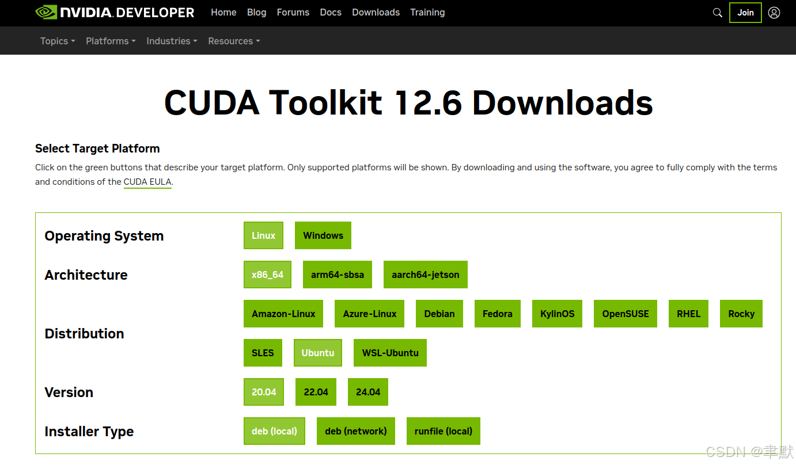

# Ubuntu20.04安装cuda12.6与显卡驱动

1. 安装cuda12.6

2. 安装显卡驱动

## 1.安装cuda12.6

https://developer.nvidia.com/cuda-toolkit-archive

https://developer.nvidia.com/cuda-12-6-0-download-archive?target_os=Linux&target_arch=x86_64&Distribution=Ubuntu&target_version=20.04&target_type=deb_local

wget https://developer.download.nvidia.com/compute/cuda/repos/ubuntu2004/x86_64/cuda-ubuntu2004.pin
sudo mv cuda-ubuntu2004.pin /etc/apt/preferences.d/cuda-repository-pin-600
wget https://developer.download.nvidia.com/compute/cuda/12.6.0/local_installers/cuda-repo-ubuntu2004-12-6-local_12.6.0-560.28.03-1_amd64.deb
sudo dpkg -i cuda-repo-ubuntu2004-12-6-local_12.6.0-560.28.03-1_amd64.deb
sudo cp /var/cuda-repo-ubuntu2004-12-6-local/cuda-*-keyring.gpg /usr/share/keyrings/
sudo apt-get update
sudo apt-get -y install cuda-toolkit-12-6
添加环境变量：

### 	修改环境变量
​		gedit ~/.bashrc

#### 		在~/.bashrc文件中添加：
​			export PATH=/usr/local/cuda/bin:$PATH
​			export LD_LIBRARY_PATH=/usr/local/cuda/lib64:$LD_LIBRARY_PATH

#### 		使环境变量生效
​			source ~/.bashrc

## 2.安装显卡驱动

sudo apt-get install -y cuda-drivers
由于通过电脑驱动安装的nvidia-driver不一定适配，所以要重新安装，安装好之后reboot后重启就可以了。
———————————————————————————————————————————————————————————

原文链接：https://blog.csdn.net/qq_35975447/article/details/142752993