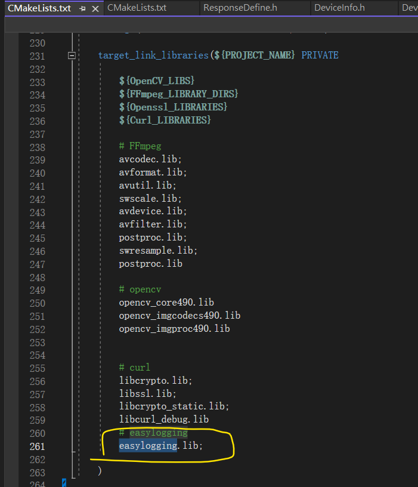

# 替換掉EasyLogging++

**X:\MediaGuardAppV31**   | GIT : MediaGuardAppV31

  

## 开发总结 

**2024-11-20** 

旧版 windows 运作正常, 现在目标是 Version 3.1 版本 ,目標是: linux 稳定版本.

现在缺余下工作:

1.openssl linux和windows 编译版本 

2.curl 版本需要linux编译 主要用于 libcurlhelper.cpp 需要加载 curl (curl 是一个http协议組件)

3.ffmpeg 问题:
	ffmpeg编译的时候,需要选择CUDA,如果激器没有就不选.

​         HardAndSoftDecode_Ref.md 参考软解和硬解码.

4.EasyLogging++ 這個組件去掉,使用spdlog日志 或者其他 目前 spdlog日誌需要用上boost 所以暫時不用.

​	參考 MediaGuard_DOC/spdlog日志.md

# 2024-12-6

Windows 編譯通過 但是 LINUX 的編譯需要 替換掉 EasyLogging++ 以及 curl需要編譯一個版本出來,目前只有Windows版本 

替換掉EasyLogging++

搜索" **LOG(** "

**所有LOG注釋掉後就可以刪除  easylogging.lib (3rdParty/windows/x64/easylogging)**

